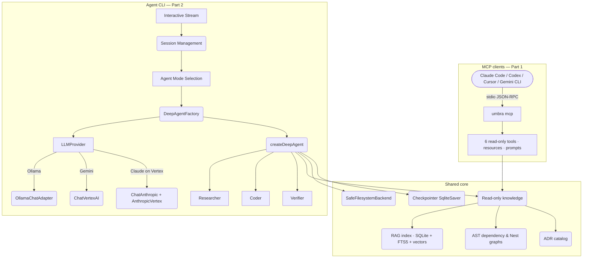

# Umbra

[](https://github.com/dastbal/umbra)
[](https://opensource.org/licenses/MIT)

> Built with ❤️ by **David Balladares**.

Umbra knows things about a **NestJS** repository that a text search cannot find:
a semantic index of the code, the decision records behind it, an AST-level
dependency graph, and the NestJS wiring graph — which module binds a token and
who injects it.

> **GraphRAG for code, not just vector search.** Umbra first finds grounded
> semantic and lexical evidence, then follows real, typed repository
> relationships — imports, re-exports, NestJS providers, injection tokens, and
> module bindings — under deterministic depth, node, relationship, chunk, and
> context budgets. Every result says whether it came from a semantic seed or a
> graph route, and why traversal stopped.

**It does two things with that knowledge, and they are independent.** Pick the
one you want; you do not need the other.

| | What it is | You need | Start at |
|---|---|---|---|
| **1. An MCP server** | Umbra exposes deterministic repo evidence and an optional persistent read-only advisor to Claude Code, Codex, Cursor, and Gemini CLI. | Node plus the providers used by the tools you choose. | [Part 1](#part-1--umbra-as-an-mcp-server) |
| **2. An agent CLI** | Umbra hosts its own model and does the work: analyzes, plans, writes, verifies, with subagents. | A chat provider — Ollama locally, or Gemini/Claude through Vertex AI. | [Part 2](#part-2--umbra-as-an-agent-cli) |

Most people want Part 1. It is the smaller commitment, it needs no credentials,
and it makes every agent you already use better at your codebase.

> Requires Node.js 20 or later. Umbra blocks agent access to credentials,
> `.git`, arbitrary shell commands, and paths outside the workspace.

---

## Table of Contents

**[Part 1 — MCP server](#part-1--umbra-as-an-mcp-server)**
- [What it publishes](#what-it-publishes)
- [GraphRAG, without a hidden agent](#graphrag-without-a-hidden-agent)
- [Connect it, in three commands](#connect-it-in-three-commands)
- [Semantic search without a cloud account](#semantic-search-without-a-cloud-account)
- [Verify it](#verify-it)
- [Flags](#flags)
- [Monorepos and unusual layouts](#monorepos-and-unusual-layouts)
- [Choosing the embedding provider](#choosing-the-embedding-provider)
- [Checking the index](#checking-the-index)
- [When something is wrong](#when-something-is-wrong)
- [Removing it](#removing-it)

**[Part 2 — Agent CLI](#part-2--umbra-as-an-agent-cli)**
- [Safe first run](#safe-first-run)
- [Choose a chat model](#choose-a-chat-model)
- [Reasoning — how hard the model thinks](#reasoning--how-hard-the-model-thinks)
- [The interactive session](#the-interactive-session)
- [Slash commands and mentor mode](#slash-commands-and-mentor-mode)
- [The three modes](#the-three-modes)
- [What one turn is allowed to spend](#what-one-turn-is-allowed-to-spend)
- [Project policy and model routing](#project-policy-and-model-routing)

**[Both parts](#both-parts)**
- [Architecture](#architecture)
- [Safety](#safety)
- [How retrieval works](#how-retrieval-works)
- [Project structure](#project-structure)
- [Shipped and planned](#shipped-and-planned)
- [License](#license)

---
---

# Part 1 — Umbra as an MCP server

`umbra mcp` publishes what Umbra knows about **one repository** to any Model
Context Protocol client, over stdio. It answers; the client thinks.

The evidence tools answer through deterministic code. `continue_conversation`
is the deliberate exception: it runs Umbra's own **read-only** advisor and
persists its checked context behind an opaque receipt; it cannot write files,
run commands, choose a path, or refresh the index. After Umbra has
validated a project root, its background warm-up may create that root's local
`.umbra/` cache, protect it in `.gitignore`, and call the configured embedding
provider; no MCP tool can select a path or request any of those writes.

When a client supplies an MCP progress token, every tool call confirms it began
and sends a liveness update every 15 seconds while it runs. The update reports
elapsed time, never a fabricated completion percentage. Background index warm-up
remains visible through `get_index_status` because it is not owned by a request.

Decided in [ADR-024](docs/adr/ADR-024-umbra-as-a-read-only-mcp-server.md).

## What it publishes

| Kind | Name | What it answers |
|---|---|---|
| Tool | `ask_codebase` | Grounded hybrid code search with the approved bounded GraphRAG policy, provenance, retrieval receipt, and a next read-only recommendation |
| Tool | `investigate_graphrag` | Compare the bounded hybrid, dependency, and NestJS retrieval plans without calling a chat model, saving a trace, or changing configuration |
| Tool | `query_dependency_graph` | *What breaks if I change this file* — inbound or outbound edges from the AST, each labelled with its kind: `import`, `re-export`, `require`, `dynamic-import` |
| Tool | `query_nest_graph` | *Which module provides this token, and who injects it* — NestJS wiring, including modules whose providers live in a `forRoot()` rather than in the `@Module` decorator |
| Tool | `list_adrs` | *Why* is the code shaped this way — path, title and status of every decision record, without their bodies |
| Tool | `run_integrity_check` | `tsc --noEmit` over the served repository |
| Tool | `get_index_status` | Live warm-up state plus durable discovery, chunk, vector, stamp and lease coverage |
| Tool | `continue_conversation` | Starts or resumes a read-only advisor conversation; retain its opaque `conversationId` between turns |
| Resource | `umbra://adr-index` | The ADR catalog |
| Resource | `umbra://index-status` | The same truthful index status as `get_index_status` |
| Prompt | one per `skills/*.md` | The working guides the package ships |

**What the graph tools are for.** They answer the two questions a text search
genuinely cannot. `@Inject('ICheckpointRepository')` binds a dependency by a
string, so no symbol search finds the link — `query_nest_graph` does, because it
recorded it from the AST. And a re-export barrel like `src/index.ts` passes a
module's whole surface through, so "what breaks if I change this" has to know
that edge exists.

`ask_codebase` is always visible in the catalog, but it cannot search until the
selected provider has produced durable vector coverage. Until then it returns a
retryable status directing the client to `get_index_status`; the other read-only
tools remain available once the project root is validated.

### GraphRAG, without a hidden agent

Umbra's retrieval pipeline is deliberately richer than “embed a question and
return similar text”:

```text
question
  → hybrid retrieval: semantic vectors + lexical grounding
  → grounded source seeds
  → bounded typed graph traversal in SQLite
  → selected source evidence with seed/graph provenance and a stop receipt
  → the calling assistant reasons from that evidence
```

`ask_codebase` performs the shared hybrid lookup once. The selected local
policy then chooses a deterministic plan — hybrid only, one-hop dependency,
two-hop dependency, NestJS wiring, or combined — and may follow SQLite
relationships such as imports, re-exports, providers, injections, and module
bindings. It is GraphRAG with production guardrails: no LLM chooses the route,
no traversal continues only because budget remains, and an unavailable or stale
graph falls back to grounded hybrid retrieval instead of claiming that a
relationship does not exist.

The response makes the work inspectable: configured `policy`, executed `plan`,
reached depth, visited nodes, inspected relationships, stop reason, and whether
each selected file arrived as a semantic `seed` or through the `graph`.

`investigate_graphrag(query, mode?)` is for diagnosis: it compares all eligible
plans from the same semantic seeds and returns source-free paths, routes,
budgets, timings, and stop receipts. It does not contain a chat model, retain
the question, promote a policy, or write configuration. Wait until
`get_index_status` reports `ready` before either retrieval tool; a temporary
unavailable result during provider probing is intentional and retryable.

## Connect it, in three commands

```bash
npm install -g @dastbal/umbra     # needs a published version; see the note below
ollama pull nomic-embed-text      # the embedding model — local, free, one time
umbra setup mcp                   # detects Codex and Claude, asks before changing anything
```

That is the whole setup, and it registers once for **every** repository you
later open. `setup mcp` shows the global `umbra mcp --auto-root` command it will
write, asks first, and then verifies its own entry. No install hook or
postinstall writes client configuration.

Run any piece of it again at any time:

```bash
umbra setup mcp       # both clients
umbra setup codex     # Codex only
umbra setup claude    # Claude only
```

**Needs 2.2.0 or later.** Earlier published versions have no `mcp` subcommand at
all. This repository's unpublished release candidate is not installed by
`npm install -g @dastbal/umbra` — pass a version that exists on npm.

### How it finds your project

When Claude starts Umbra it supplies the active project through
`CLAUDE_PROJECT_DIR`; Codex uses the directory it launched from. Umbra validates
that directory. If a globally configured client cannot supply a valid one, Umbra
requests exactly one MCP Root after the handshake, and rejects no root, multiple
roots, remote URIs, home directories, temporary roots and undeclared folders.
Only after a root is accepted does it create `<project>/.umbra/`, protect it in
`.gitignore`, and start indexing in the background. **A server never accepts a
path from a tool call.**

### Configuring another client by hand

Codex is configured through `codex mcp add` and verified with `codex mcp get
umbra` — restart an existing Codex session afterwards. Claude uses `claude mcp
add --scope user`, verified with `claude mcp get umbra`; on native Windows its
adapter uses the documented `cmd /c umbra` wrapper. Any other client gets this
definition to copy, rather than Umbra guessing its format:

```json
{
  "mcpServers": {
    "umbra": {
      "type": "stdio",
      "command": "umbra",
      "args": ["mcp", "--auto-root"]
    }
  }
}
```

A project-scoped entry stays available when a team deliberately wants to pin one
root: use `umbra mcp --root <absolute-project-root>`.

**Name the installed binary, not `npx`.** `npx -y` answers the install prompt; it
does not skip the registry lookup, so every launch depends on the network.
Measured spawn-to-`initialize` — the window a client's connect timeout watches —
`npx` ran between 11.7 s and 24 s and, in one run of six, never answered inside
60 s. The installed binary was steady, and 4.4 s once the indexer stopped
loading before the handshake. A 30-second client timeout therefore fails
*intermittently* through `npx`, which is harder to diagnose than failing every
time. See [ADR-024](docs/adr/ADR-024-umbra-as-a-read-only-mcp-server.md)
amendment 15. `npx -y @dastbal/umbra init` is still fine for initializing a
project by hand; it is not the launcher.

The MCP SDK is an exact production dependency, so the first handshake never
downloads a second package.

## Semantic search without a cloud account

`ask_codebase` needs an embedding provider, and **the default is local, free and
offline** ([ADR-027](docs/adr/ADR-027-the-default-is-the-one-that-costs-nothing.md)).
One pull and semantic search works:

```bash
ollama pull nomic-embed-text
```

**Google Vertex** is fully supported and one line away. It costs cents per query
and needs Application Default Credentials:

```bash
umbra auth login
```

```json
{ "rag": { "embeddings": "vertex" } }
```

in `.umbra/agent.config.json`, which is gitignored — so each person on a team
chooses without changing what the repository shares. `UMBRA_EMBEDDINGS=vertex`
and `--embeddings vertex` do the same for one run.

Switching is reversible and never destroys the other index. Each provider's
vectors are stored under their own identity, so switching back needs no
re-indexing, and querying an index built by the *other* provider raises an
explicit error naming the fix rather than answering from the wrong vectors
([ADR-025](docs/adr/ADR-025-embeddings-are-chosen-not-assumed.md),
[ADR-026](docs/adr/ADR-026-vectors-are-numbers-and-the-database-can-count.md)).

## Verify it

```bash
claude mcp list
```

`umbra` should read `✔ Connected`. Then ask the agent in that session *"list this
project's ADRs using Umbra"*.

To check it by hand, with no client at all:

```bash
umbra mcp --root .
```

It waits for a client and prints its startup to **stderr**:

```
[umbra mcp] umbra mcp — serving /path/to/repo
[umbra mcp] publishing 7 tools: ask_codebase, investigate_graphrag, get_index_status, list_adrs, query_dependency_graph, query_nest_graph, run_integrity_check
[umbra mcp] MCP transport connected; index warm-up continues in the background.
```

**The transport connects before it probes the provider or indexes anything**, so
a warming index never blocks the handshake. Use `get_index_status` while it
warms; Ctrl+C stops the manual check. During a cold index it prints per-file
progress, percentage, embedding batch and elapsed time, and if the provider is
still loading after 15 seconds a heartbeat names the exact file and batch. MCP
diagnostics always use `stderr`, never JSON-RPC `stdout`.

## Flags

| Flag | Meaning |
|---|---|
| `--root <path>` | Explicit repository to serve. Fixed at launch; no tool argument can change it |
| `--auto-root` | Resolve the trusted active client project, then pin it for this process. Used by global setup |
| `--embeddings <vertex\|ollama>` | Provider for semantic search. Defaults to `.umbra/agent.config.json`, else `ollama` |
| `--no-index` | Do not warm the semantic index at launch |

## Monorepos and unusual layouts

Umbra discovers TypeScript source from package `tsconfig.json` files and
workspace declarations, not from a guessed root `src/`. Under automatic
discovery, it also finds each authoritative `prisma/schema.prisma` under the
served root, because database constraints are executable business evidence
rather than incidental configuration. An explicit `indexing.sources` override
remains authoritative and replaces that automatic scope. Umbra ignores
dependency and build trees, indexes `.ts` and `.tsx` including classless utility
and configuration modules, and keeps every stored path relative to the fixed
root.

Prisma models are returned as labelled `prisma-schema` configuration evidence.
Umbra does **not** infer current truth from migration SQL, arbitrary `.prisma`
files, JSON, or YAML: those artifacts need their own authority and parser
contract before they enter the retrieval corpus.

If a repository's declared source boundary needs an explicit override, commit an
`umbra.json` at its root:

```json
{ "indexing": { "sources": ["apps/*/src/**/*.ts", "apps/web/features/**/*.tsx"] } }
```

`list_adrs` also discovers module catalogs such as `docs/payments/adr/`; its
optional `module` argument filters the result.

The `.umbra/` directory, `memory.db` included, is local root-bound cache state.
It is safe to delete and should be gitignored — `umbra init` adds that rule
without rewriting existing ones.

**Test files are deliberately out of scope.** Discovery excludes `.spec.ts`,
`.test.ts`, `.d.ts` and story files, which means a spec that imports a module is
not reported by `query_dependency_graph` — it was never indexed, so it cannot be
a source row. That is a recorded decision, and its consequence is recorded with
it ([ADR-030](docs/adr/ADR-030-discovery-based-indexing-and-decision-catalogs.md)).

## Choosing the embedding provider

Inside an interactive CLI session, use `/model` and select **Embeddings**. The
choice is stored only in `.umbra/agent.config.json`; it does not change your chat
model and it does not start a billable rebuild by itself.

For a one-off or scripted rebuild, choose explicitly:

```bash
umbra index --embeddings ollama
umbra index --embeddings vertex
```

The command checks the selected provider before writing vectors. It never
substitutes one for the other, so a missing local model or Google credential is
reported before any index changes.

Prefer putting the provider in `.umbra/agent.config.json` rather than making the
client's MCP configuration provider-specific:

```json
{ "rag": { "embeddings": "ollama" } }
```

## Checking the index

```bash
umbra doctor --index
```

It calls no provider. It reports the root's `.umbra/memory.db`, declared source
coverage, indexed and skipped file outcomes, chunks, vectors per provider/model
and dimension, missing or zero-chunk files, stale source paths, stamp
consistency, and a live or stale index lease. It exits non-zero when semantic
coverage is not durably proven.

Vectors live in `chunk_vectors`, keyed by `(chunk_id, provider, model)`.
`file_registry` alone only proves a file was seen, not that it is searchable.

## When something is wrong

| Symptom | Cause and fix |
|---|---|
| The client reports a connect timeout, sometimes | Launched through `npx`. Install the package and name the binary — see above |
| `ask_codebase` returns a retryable status | The index is still warming, or the provider has not produced coverage. Call `get_index_status`, which names the reason |
| A provider mismatch error | The index was built by the other provider. Set it in `.umbra/agent.config.json`, or let it re-embed |
| Connected, but every tool is root-gated | The client could not identify an active project. Nothing was written — no `.umbra/`, no database, no provider call. Open the client from the repository and reconnect |
| An answer looks out of date | It probably is, and the answer says so: every reply carries `indexedAt`. The gate serves a slightly stale index rather than refusing, because refusing mid-refactor is worse. `umbra index` refreshes it |

> **Upgrading from 2.1.x** with a Vertex-built index and no `rag.embeddings` in
> your config? The first query reports the mismatch and names both fixes.

## Removing it

`claude mcp remove umbra` or `codex mcp remove umbra`. There is nothing else to
undo: no daemon, no credentials handed out, and each project keeps only its own
gitignored `.umbra/` directory.

---
---

# Part 2 — Umbra as an agent CLI

This is the other product: Umbra hosting its own model, doing the work. It
analyzes, plans, writes and verifies code with specialized subagents through a
streaming CLI.

**It needs a chat provider.** Part 1 does not.

## Safe first run

```bash
npm install -g @dastbal/umbra

umbra init            # non-destructive local policy; never overwrites an existing one
umbra doctor          # checks Node, local binaries and configuration, no network
umbra doctor --live   # optional: one minimal `Reply only: OK` health prompt

umbra analyze "Summarize the project architecture"   # read-only, evidence-gated
```

`umbra metrics --since 7 --check` summarizes privacy-safe local telemetry and
exits non-zero when the configured health threshold fails.

## Choose a chat model

### Ollama — local, free, no API key 🦙

The fastest way to start, running entirely on your machine.

```bash
ollama pull gemma4        # ~10 GB, balanced
ollama pull gemma4:e2b    # ~7 GB, faster and lighter
ollama pull qwen3.6       # ~4 GB, strong reasoning, compact
```

```dotenv
# .env.development
AGENT_MODEL=ollama:gemma4

# Optional. The default is http://127.0.0.1:11434 — a literal IP on purpose,
# because resolving "localhost" on Windows costs a slow, erratic DNS lookup.
# Set this only if Ollama runs on another host, port, or IPv6 only:
# OLLAMA_BASE_URL=http://[::1]:11434
```

```bash
umbra deep
```

No Google account, no API key. Inside the session, `/model` switches provider
without losing context.

### Google Gemini through Vertex AI ⚡

For local development, authenticate once with your own Google account:

```bash
# Install the Google Cloud SDK: https://cloud.google.com/sdk/docs/install
umbra auth login --project YOUR_GCP_PROJECT_ID   # asks before opening the browser
umbra auth status                                 # confirms credentials without printing a token
```

```dotenv
AGENT_MODEL=gemini-2.5-flash-lite
```

For CI or production, use a service account with `roles/aiplatform.user`
(**IAM & Admin → IAM → Grant Access**):

```dotenv
GOOGLE_APPLICATION_CREDENTIALS=/absolute/path/to/service-account.json
AGENT_MODEL=gemini-2.5-flash-lite
```

### Anthropic Claude through Vertex AI 🟠

Claude uses the same Application Default Credentials as Gemini, but the model
must first be enabled for your project in Vertex AI Model Garden. Usage is
billed by Google Cloud — **a Claude web subscription does not cover Vertex API
use.**

```dotenv
GOOGLE_CLOUD_PROJECT=YOUR_GCP_PROJECT_ID
GOOGLE_CLOUD_LOCATION=global

AGENT_MODEL=vertex-anthropic:claude-haiku-4-5@20251001   # fast and economical
# AGENT_MODEL=vertex-anthropic:claude-sonnet-5
# AGENT_MODEL=vertex-anthropic:claude-opus-5
```

If `GOOGLE_CLOUD_PROJECT` is missing, the `/model` selector asks for the project
ID and saves it with the model before restarting the agent. Both the project and
the Vertex location are changeable from **Setup** at the bottom of the `/model`
provider list.

### The model tiers

| Alias | Model string | Provider | Best for |
| :--- | :--- | :--- | :--- |
| `gemma` | `ollama:gemma4` | 🦙 Local | General coding |
| `gemma-2b` | `ollama:gemma4:e2b` | 🦙 Local | Fast, low RAM (~7 GB) |
| `gemma-4b` | `ollama:gemma4:e4b` | 🦙 Local | Balanced (~9.6 GB) |
| `gemma-26b` | `ollama:gemma4:26b` | 🦙 Local | Max local quality (~17 GB) |
| `qwen` | `ollama:qwen3.6` | 🦙 Local | Strong reasoning, compact (~4 GB) |
| `local` | `ollama:llama3.2` | 🦙 Local | General purpose offline |
| `lite` | `gemini-3.1-flash-lite` | ⚡ Cloud | Quick edits and Q&A, cheapest |
| `flash` | `gemini-3.5-flash` | ⚡ Cloud | Balanced, recommended |
| `pro` | `gemini-2.5-pro` | ⚡ Cloud | Architecture, complex refactors |
| `3.5-lite` | `gemini-3.5-flash-lite` | ⚡ Cloud | Fast, high-volume |
| `claude-fast` | `vertex-anthropic:claude-haiku-4-5@20251001` | 🟠 Vertex | Fast, economical |
| `claude` | `vertex-anthropic:claude-sonnet-5` | 🟠 Vertex | Coding and agentic work |
| `claude-max` | `vertex-anthropic:claude-opus-5` | 🟠 Vertex | Architecture and hard problems |

Set one per run instead of editing `.env`:

```bash
AGENT_MODEL=ollama:gemma4 umbra deep
AGENT_MODEL=gemini-2.5-pro umbra orchestrate
GOOGLE_CLOUD_PROJECT=YOUR_ID AGENT_MODEL=vertex-anthropic:claude-sonnet-5 umbra deep
```

```powershell
# Windows PowerShell
$env:AGENT_MODEL="ollama:gemma4"; umbra deep
```

The `/model` menu displays **Claude Haiku 4.5** without its dated suffix; the
suffix is the Vertex transport version and is selected automatically.

> **Embeddings are a separate choice from your chat model.** The default
> embedding provider is local Ollama `nomic-embed-text` — free, offline, no
> credentials ([ADR-027](docs/adr/ADR-027-the-default-is-the-one-that-costs-nothing.md)).
> Switching chat models does not rebuild the index, because each embedding
> provider's vectors are stored under their own identity.

## Reasoning — how hard the model thinks

Every cloud model exposes a knob for reasoning depth, and no two providers name
it the same. Umbra calls it **Reasoning** everywhere and translates per model, so
the same levels read the same regardless of who serves the model.

The level is chosen at the end of `/model`, right after the model itself, and the
picklist offers **only the levels that model accepts** — which is what makes it
impossible to save a setting the model would reject
([ADR-016](docs/adr/ADR-016-one-reasoning-vocabulary-across-providers.md)).

```dotenv
# low | medium | high | xhigh | max | minimal — empty means the model default
AGENT_REASONING=xhigh

# Show the model's reasoning in the terminal (Claude 5 only)
AGENT_REASONING_DISPLAY=false
```

| Model family | Levels offered | Show reasoning |
|---|---|---|
| Claude Sonnet 5, Opus 5 | `low` `medium` `high` `xhigh` `max` | your choice |
| Claude Haiku 4.5 | `low` `medium` `high` | always on once a level is set |
| Gemini 3.5, 3.1 | `minimal` `low` `medium` `high` | not available |
| Gemini 2.5 | `low` `medium` `high` | always on once a level is set |
| Ollama | — | — |

Three things worth knowing before turning it up:

- Lower levels cost less and answer faster. `high` is the provider default.
- A level is **clamped down**, never up, when you switch to a model that lacks
  it — `max` on Claude Opus 5 becomes `high` on Gemini 3.5.
- On **Claude Haiku 4.5**, setting a level gives up `temperature: 0`. The API
  rejects both together.

## The interactive session

```
╭──────────────────────────────────────────────╮
│  Umbra · Deep    session auth-module         │
│  🟠 claude-opus-5  ·  reasoning xhigh        │
╰──────────────────────────────────────────────╯

You: Create a UsersModule following DDD principles.

  ⠋  Thinking...
╭─ 📋  write_todos
│  └─ Creating implementation plan...
╰─ ✓  done in 1.2s

╭─ 🔍  ask_codebase
│  └─ How is AuthModule structured for DDD?
╰─ ✓  done in 3.4s

Agent: I will create a UsersModule following the same DDD pattern as AuthModule...
       (tokens stream as they are generated)
```

Sessions carry conversation history in SQLite, so a named session reopens where
it left off.

| Command | Behavior |
| :--- | :--- |
| `umbra deep` | **Ephemeral** — a fresh session each time |
| `umbra deep --session auth` | **Persistent** — reopens or creates the `auth` session |
| `umbra deep "Your task"` | Ephemeral, with an initial message |
| `umbra deep --session auth "Your task"` | Named, with an initial message |
| `umbra orchestrate --session feature-x` | The same persistence for orchestrator mode |

Session data lives in `.umbra/deep_agent_history.db` and
`.umbra/orchestrator_history.db`.

## Slash commands and mentor mode

| Command | Description | State |
|---|---|---|
| `/model` | Switch the model, its reasoning level, the embedding provider, or the Google Cloud setup | — |
| `/mentor` | Toggle deep mentor mode | `[ON]` / `[OFF]` |
| `/help` | Every command with its current state | — |
| `Ctrl+C` | Exit cleanly | — |

`/model` walks provider → model → reasoning, saves to `.env`, and restarts the
agent with the new setting.

Mentoring has **two levels**. Level 1 is always on and built into the base
prompt: every fix or architectural decision carries the root cause, why this
approach over the alternatives, and the trade-off accepted. For changes touching
more than five files or a public API contract, the agent pauses and asks before
implementing.

Level 2 is `/mentor`, which loads `skills/mentor-mode.md`: a Forced Output
Contract with explicit rationale before every code block, an escalation gate that
presents rejected alternatives, a Socratic check before implementing concepts,
and the name of the design pattern being applied. Type `/mentor` again to return
to standard mode — Level 1 stays on. Saying `mentor`, `teach me`, `explain why`
or `trade-off` in a message triggers it too.

## The three modes

### `analyze` — read-only, evidence-gated, one shot

For architecture reviews, audits and performance questions:

```bash
umbra analyze "Evaluate the project purpose, flow, memory and bottlenecks"
```

It answers **only** from a machine-collected, path-and-line manifest. It launches
no semantic search and re-reads no files, and reports missing evidence as
`No verificado`. That is what makes it predictable and cheap. Use `deep` or
`orchestrate` when the task needs a real investigation.

### `deep` — one autonomous agent

Day-to-day work: debugging, analysis, single-file changes, quick questions,
medium features.

```bash
umbra deep
umbra deep --session my-feature
umbra deep "explain src/core/agent/deep-agent-factory.ts"
```

It sizes the task first. **Small** (1–2 files) executes directly with at most
three tool calls. **Medium** (3+ files, a new feature) writes a brief plan and
follows it. **Large** (a whole module, a major refactor) writes a detailed
step-by-step plan.

Its tools: `write_todos`, `list_files`, `safe_read_file`, `safe_write_file`,
`list_adrs`, `ask_codebase`, `refresh_project_index`, `run_integrity_check`,
`run_tests`.

**The graph tools are Part 1 only.** `query_nest_graph` and
`query_dependency_graph` are published over MCP and are not in this mode's
capability set, so the agent cannot call them. Ask your MCP client instead — that
is the division: Part 1 answers structural questions, Part 2 does the work.

### `orchestrate` — a supervisor with subagents

Entire modules, significant refactors, features spanning many files.

```bash
umbra orchestrate
umbra orchestrate --session big-refactor
```

The protocol is fixed: plan with `write_todos`, delegate analysis to the
**Researcher** (read-only), implementation to the **Coder** (the only writer,
tests first), verification to the **Verifier** (read-only, runs tests and the
TypeScript check), then at most `maxRetries` correction cycles before reporting a
blocker. Handoffs are compact structured artifacts, not full transcripts.

## What one turn is allowed to spend

Every interactive turn is bounded on four dimensions and stops at whichever it
reaches first. The defaults come from measured sessions, not from taste:

| Ceiling | Default | Why |
|---|---|---|
| Tool calls | 8 | 98 of 120 recorded turns used three or fewer |
| Tokens | 250,000 | prompt plus completion, across the whole turn |
| Wall clock | 300 s | above the 95th percentile of recorded turns (238 s) |
| Cost | unset | set `limits.maxCostUsd` in `.umbra/agent.config.json` to enforce it |

Reaching a ceiling does not abort the turn: the model loses its tools and is told
which ceiling ran out, so it answers with the evidence it has and states what it
could not verify.

The running total appears live on the wait indicator — `7 calls · 51.0k tok ·
$0.0846` — so a turn going wrong can be stopped while it happens. Cost shows only
when the active model has a published price; an unpriced model shows nothing
rather than a misleading `$0.00`.

A greeting, thank-you or farewell is answered by the CLI with no model call at
all. Affirmations like `ok`, `dale` or `seguí` are deliberately **not** treated as
small talk — they usually mean *proceed*, and answering one locally would refuse
work you just approved.

See [ADR-019](docs/adr/ADR-019-turn-cost-is-the-bound-not-tool-calls.md) and
[ADR-020](docs/adr/ADR-020-a-message-that-asks-for-nothing-costs-nothing.md).

Diagnostics: `UMBRA_BUDGET_PROBE=1` appends a shape-only record of what the
budget middleware observes to `.umbra/telemetry/budget-probe.jsonl`. Counts and
message types, never content. Off by default.

## Project policy and model routing

```bash
umbra init
```

Idempotent: it creates `.umbra/agent.config.json` only when missing. That file is
local runtime state and stays gitignored, so each project chooses its own model
routing and safety limits. The first iteration keeps one delegation level and one
writer — Researcher read-only, Coder the only writer, Verifier read-only.

`init` also offers to connect LangSmith. It explains that remote tracing can
include prompts, model responses, tool activity and metadata, then asks for the
key without echoing it. Choosing no changes nothing. Enable it later with `umbra
setup langsmith`. The credential is saved only in `.umbra/langsmith.env`, which
Umbra gitignores, and never in `agent.config.json` or local telemetry.

**Routing.** `AGENT_MODEL` selects the primary model for the current session. It
does **not** overwrite the specialized models inside the orchestrator: the
project policy keeps Researcher, Coder and Verifier on their own profiles. By
default the Coder uses `gemini-2.5-pro` while the other roles use
`gemini-2.5-flash-lite`, to keep cost down where quality matters least.

Precedence is `--model` > `AGENT_MODEL` > project role profile. For one
quality-sensitive run, leave `.env` alone and pass the model:

```bash
umbra analyze --model gemini-2.5-pro "Evaluate the architecture and bottlenecks"
umbra orchestrate --model gemini-2.5-pro --session architecture-review
```

Each interactive turn appends privacy-safe metrics to
`.umbra/telemetry/interactive-turns.jsonl` and adds its audit ID, model, mode and
budgets to the matching LangSmith trace. The local record never stores prompts,
tool arguments, response content, credentials or raw provider errors.

---
---

# Both parts

## Architecture

Umbra's domain does not move between the two products. They are two
**presentation adapters** over the same core, beside a third for HTTP.



- **MCP adapter** — `src/presentation/mcp/`. Publishes read-only knowledge. No
  model, no writes.
- **CLI adapter** — `src/presentation/cli/`. Interaction, `/model`, sessions.
- **Agent core** — `DeepAgentFactory` builds either one agent or the supervisor
  with subagents; `LLMProvider` routes to Ollama, Gemini or Vertex-hosted Claude.
- **Shared core** — the RAG index, the AST graphs, the ADR catalog, safe file
  operations and SQLite persistence.

## Safety

- **`safe_write_file`** creates a timestamped backup in `.umbra/backups/` before
  writing, so any change is revertible.
- **Root sandboxing.** The agent works strictly inside the project root and
  cannot reach outside it. The MCP server's root is pinned at launch and no tool
  argument can change it — the single security decision that mode depends on.
- **Human in the loop.** Destructive operations — deleting files, dropping
  tables, touching `docker-compose.yml` or `.env.production` — pause and ask.
- **No writes over MCP.** Approval suspends a LangGraph run, and MCP mode has no
  graph, therefore no approval channel, therefore nothing that writes is
  published.

## How retrieval works

1. **Indexing.** The indexer discovers declared TypeScript sources and
   authoritative Prisma schemas from the served root, monorepo packages
   included, and records durable file, chunk, vector and provider/model coverage
   in that root's `.umbra/` state.
2. **Hybrid search.** A question is answered by fusing two rankings: SQLite FTS5
   lexical matches and vector neighbours. Umbra returns source only when there is
   independent lexical evidence, and otherwise **abstains and names the term it
   could not find** ([ADR-028](docs/adr/ADR-028-hybrid-retrieval-requires-evidence.md)).
3. **Provenance on every answer.** Which provider and model produced the index,
   how many files it covers, and when it was built.

The abstention is the part worth knowing about. Asked about something this
repository has never contained, Umbra says so instead of returning the nearest
unrelated file — measured at 100% correct abstention for a 2.2% false-abstention
cost. Quality is scored on a committed corpus on every push; the reports live in
[`docs/benchmarks/results/`](docs/benchmarks/results/).

If the embedding model is unavailable, Umbra reports the retryable reason and
preserves the previous durable index rather than claiming a completed search
surface.

## Project structure

```
/umbra
├── src/
│   ├── bin/cli.ts                 # every subcommand: mcp, deep, orchestrate, analyze, init, doctor, setup, index
│   ├── core/
│   │   ├── agent/                 # DeepAgentFactory, kernel, middlewares, delegation
│   │   ├── config/                # runtime root, workspace discovery, agent.config.json
│   │   ├── llm/                   # provider routing, Ollama adapter, token counting
│   │   ├── rag/                   # the index: chunking, embeddings, hybrid ranking, integrity
│   │   ├── security/              # policy, path containment, approval
│   │   ├── state/                 # SQLite schema, checkpoints, file registry
│   │   ├── subagents/             # Researcher, Coder, Verifier
│   │   ├── tools/                 # what a model may call, plus the AST analyzers
│   │   ├── observability/         # telemetry, traces, cost
│   │   ├── interaction/           # human-in-the-loop surface
│   │   └── domain/ application/ infrastructure/ shared/
│   └── presentation/
│       ├── mcp/                   # ⭐ Part 1 — the MCP server
│       ├── cli/                   # ⭐ Part 2 — the interactive CLI
│       └── http/                  # HTTP adapter and its ports
├── skills/                        # keyword-triggered working guides, shipped with the package
├── scripts/                       # benchmark runners: retrieval, control arm, graph recall
├── docs/
│   ├── adr/                       # decision records, with an index to read first
│   ├── benchmarks/                # the corpus and committed measurement reports
│   ├── reports/                   # narrative measurement records
│   └── deferred-work.md           # scoped, investigated, deliberately not built
├── .umbra/                        # per-project local state — gitignored, safe to delete
│   ├── memory.db                  # chunks, vectors, FTS5, AST graphs
│   ├── index.identity.json        # which provider and model built the index
│   ├── deep_agent_history.db      # named session history
│   ├── telemetry/                 # privacy-safe local metrics
│   └── backups/                   # timestamped, written before every file change
├── AGENTS.md                      # project context for AI agents
└── package.json
```

## Shipped and planned

**Shipped.** One autonomous agent and a supervisor with three subagents. Local
Ollama, Gemini, and Claude through Vertex AI, with one reasoning vocabulary
across all of them. Interactive `/model` switching, persistent sessions, context
compression and self-healing recovery. A skills system that loads the right
guide per task, and two levels of mentoring. Turn budgets bounded on tool calls,
tokens, wall clock and cost. LangSmith tracing, opt-in. The MCP server, with
seven read-only tools, hybrid retrieval that abstains rather than guessing,
bounded deterministic GraphRAG, an AST dependency graph, the NestJS wiring
graph, and a retrieval quality gate that runs on every push with no provider.

**Planned.** An HTTP/streamable MCP transport, so one process can serve several
clients. MCP elicitation, which is the prerequisite for anything in that mode
that writes. Rendering the model's reasoning when the operator asks for it. Both
are scoped in [`docs/deferred-work.md`](docs/deferred-work.md) with the hazard
that decides whether they ship.

## License

MIT — see [LICENSE](LICENSE).
