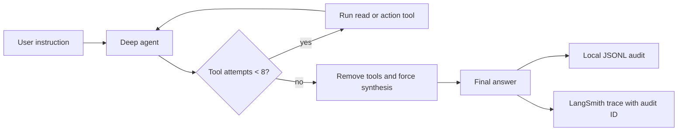

# ADR-008: Bound interactive Deep-agent iterations and join them to performance telemetry

Category: Runtime behavior and observability

Author: Codex
Date: 2026-08-25

## Status

Accepted — 2026-08-25

## Context

Five fresh Gemini 3.5 Flash Deep-agent investigations that required code
exploration reached the configured recursion limit of 30 before producing a
final answer. Raising only the limit to 50 was insufficient in an exploratory
measurement: one of five requests completed, while four continued issuing
searches and reads until the new limit.

The CLI already auto-instruments LangChain with LangSmith, but operators needed
a durable, privacy-safe way to correlate an interactive turn with its LangSmith
trace and to see outcome, tool count, duration, and budget consumption without
storing prompts or provider payloads.

## Decision

`parseAgentConfig` in `src/core/config/agent-config.ts` now defaults an
interactive request to 50 LangGraph transitions and rejects values above 60.

`createIterationBudgetMiddleware` in
`src/core/agent/iteration-budget.middleware.ts` derives the current tool-call
count from persisted messages after the latest human instruction. It allows at
most eight tool attempts. When the budget is exhausted, its `wrapModelCall`
removes tools and directs the model to synthesize the collected evidence into a
final answer. Identical prior tool requests receive a synthetic tool result
instead of running again.

`TurnAudit` in `src/presentation/cli/turn-audit.ts` appends one JSONL record per
interactive turn at `.agent/telemetry/interactive-turns.jsonl`. It stores an
audit UUID, hashed thread identifier, model, mode, recursion/tool budgets,
tool names and durations, text-output flag, elapsed time, outcome, and a coarse
error category. It does not store prompt content, responses, tool arguments,
raw error strings, credentials, or provider payloads.

`ChatSession#createStreamConfig` supplies the same audit UUID and static budget
metadata as LangSmith trace metadata, allowing the local JSONL line and remote
trace to be correlated without an agent-visible telemetry tool.

## Flow

## Alternatives considered

| Solution | Pros | Cons | Decision |
| --- | --- | --- | --- |
| Raise the recursion limit only | Small change | The 50-turn exploratory run still looped in 4/5 requests | Rejected |
| Let the model follow a prompt-only soft budget | No framework interception | The model continued equivalent RAG searches during measurement | Rejected |
| Persist raw prompts and tool arguments for audit | Maximum replay detail | Unnecessary data exposure | Rejected |
| Derive a tool budget from LangGraph state and join safe metrics to LangSmith | Stops loops, keeps an auditable outcome, preserves privacy | Complex requests may finish with explicit uncertainty instead of more research | Accepted |

## Consequences

### Positive

- A broad investigation has enough graph steps to finalize after normal work.
- Repeated exploration cannot consume all 50 transitions indefinitely.
- Operators can query local outcome metrics and inspect the matching LangSmith
  trace by audit ID.

### Neutral

- The middleware is applied to the single-agent `DeepAgentFactory#create` path.
  The orchestrated multi-agent path keeps its separate delegation and retry
  controls.

### Negative

- A task that truly needs more than eight tool attempts must be narrowed or
  continued in a new instruction; the model is expected to state what remains
  unverified.
- The final low-cost validation did not consume the eight-tool ceiling, so the
  middleware's live forced-synthesis path is validated by unit tests and must
  continue to be observed in LangSmith on a future complex request.

## Verification Evidence

- `node node_modules/typescript/bin/tsc --noEmit --pretty false` passed after
  the implementation.
- `node node_modules/jest/bin/jest.js --runInBand --forceExit` passed: 21
  suites and 75 tests. The known `--forceExit` open-handles warning was emitted
  after the successful run.
- Focused coverage includes the 50/60 configuration bounds, persisted-turn
  counting, equivalent-call detection, privacy-safe JSONL output, LangSmith
  metadata, and 400 recovery telemetry.
- Two real read-only Deep sessions ran with `gemini-3.1-flash-lite`, the local
  cheapest cloud tier. Both emitted a final answer: 3 tools in 9.44 seconds and
  2 tools in 7.39 seconds. Their audit records have `outcome=completed` and
  `textOutput=true`.
- Earlier exploratory evidence, before this final middleware design: 0/5 broad
  Gemini 3.5 Flash requests completed at 30 transitions; at 50 transitions,
  1/5 completed and 4/5 reached the limit. These are diagnostic measurements,
  not a performance benchmark.

## Related Files

- `src/core/config/agent-config.ts` — `limitsSchema`, `parseAgentConfig`.
- `src/core/agent/iteration-budget.middleware.ts` —
  `createIterationBudgetMiddleware`, `countCurrentTurnToolCalls`,
  `hasPriorEquivalentToolCall`, `shouldForceFinalResponse`.
- `src/core/agent/deep-agent-factory.ts` — `DeepAgentFactory.create`,
  `DeepAgentFactory.buildSystemPrompt`.
- `src/presentation/cli/chat-session.ts` — `ChatSession.sendMessage`,
  `ChatSession.createStreamConfig`.
- `src/presentation/cli/turn-audit.ts` — `TurnAudit`, `TurnAuditRecord`.
- `src/core/agent/iteration-budget.middleware.spec.ts` — persisted-turn budget
  tests.
- `src/presentation/cli/turn-audit.spec.ts` — telemetry privacy and metadata
  tests.
