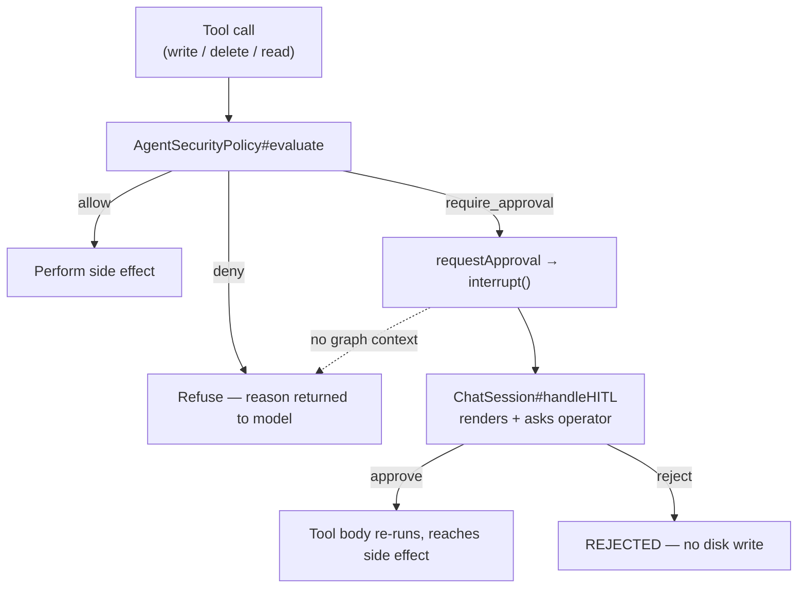

# ADR-011: Contain the final path component and give `require_approval` a consumer

**Category:** Agent security and tool authorization
**Author:** Claude (audit and implementation), directed by David Balladares
**Date:** 2026-08-25

## Status

Accepted — amended 2026-08-27

## Context

An audit of the v2.0.0 release found that the authorization introduced by
[ADR-009](./ADR-009-executable-agent-security-policy.md) did not hold in three
ways. All three were reproduced before any code was changed.

1. **A link in the final path component escaped the workspace.**
   `resolveWorkspacePath` resolved the real path of the *containing directory*
   and returned the requested path unresolved. `nearestExistingParent` returns
   `path.dirname(candidate)` whenever the candidate resolves to a file, so a link
   such as `src/notes.txt -> ../../.env` kept a legitimate parent, cleared the
   protected-name check on its own harmless name, and was then followed by
   `readFileSync`. The existing test covered a directory junction in *parent*
   position, which the old code did handle.

2. **A tool read the disk with no authorization call at all.**
   `analyzeCodeStructureTool` resolved and read any path without consulting the
   policy. No link was needed: `../` was enough.

3. **`require_approval` had no consumer.** Every tool formatted the verdict as an
   error string, so `deleteFileTool` could never succeed and writes outside
   `src|test|docs` always failed. The tools stayed advertised to the model, which
   called them, received an error, and retried.

A fourth, unrelated defect surfaced while reproducing (2): `analyze_code_structure`
returned `[object Object]` for every input, because `NestChunker.analyze` returns
`skeleton` as an object and the tool interpolated it into a template string. That
bug was masking the disclosure channel of (2) — fixing the rendering without
fixing the guard would have turned a latent leak into an active one.

## Decision

### Containment resolves the final component

`resolveWorkspacePath` now resolves the candidate itself when it exists and
returns the **real** path, so callers act on the location the policy inspected.
`evaluate` computes its path segments from that real path, which is what makes
the protected-name check meaningful: previously it inspected the name the model
asked for.

Existence is probed with `lstat`, not `existsSync`. `existsSync` follows links,
so a dangling link read as "absent" and was treated as a file to create — writing
through it would have landed outside the workspace.

### Every disk-touching tool shares one authorization path

`src/core/tools/utils/authorize.ts` holds the single policy instance and the
verdict helpers. `analyzeCodeStructureTool` now calls it. Tools that cannot ask a
human use `authorizeFileAction`; tools that can inspect the verdict directly.

### `require_approval` raises the interrupt the CLI already renders

`requestApproval` in `src/core/tools/utils/approval.ts` raises a LangGraph
`interrupt()` carrying LangChain's own HITL payload shape, which
`ChatSession#handleHITL` already consumed for the middleware-driven case. The
policy decides *whether* a human is needed; this delivers the question.

`deleteFileTool` is now registered in `DeepAgentFactory.create()`. It previously
existed in no Deep Agent tool list, so the mode could not delete a file even with
approval.

Because the interrupt travels as a **thrown value**, any `catch` between the gate
and the graph can silently disarm it. `rethrowIfSuspension` is mandatory as the
first statement of any such handler; `safeWriteFileTool` needs it, and the
Verification Evidence below records what happened when it was missing.

### File content is framed as untrusted data, and the frame is stripped on write

`safeReadFileTool` and `analyzeCodeStructureTool` wrap their output with
`wrapUntrustedFileContent`. A README from a dependency is indirect model input;
without a frame its text is indistinguishable from the operator's request.

Framing a read creates a second-order hazard, found in a live session rather than
in review: on a read-modify-write the model treated the whole tool result as the
file and wrote the marker lines back into the source, breaking compilation of
`src/presentation/http/agent-http.contracts.ts`. The frame now says the markers
are not part of the file, but the instruction is only an ask —
`safeWriteFileTool` calls `stripUntrustedFrame` on the content before writing,
which makes the corruption impossible regardless of what the model returns. The
markers are a fixed sentinel that does not occur in legitimate source.



## Trade-offs actually evaluated

| Decision point | Options considered | Chosen | Why the other lost |
|---|---|---|---|
| How to gate approval | deepagents `interruptOn` (per tool name) vs conditional `interrupt()` inside the tool | Conditional `interrupt()` | `interruptOn` fires on *every* call of a named tool. The policy is conditional — `src/x.ts` is allowed, `package.json` is not — so `interruptOn` would prompt on every write and make the flow unusable. |
| Writes outside approved roots | Hard `deny` vs interactive approval | Interactive approval | A hard deny is simpler and avoids re-execution, but the agent could then never touch CI or configuration, pushing that work back to a human for no security gain once a real gate exists. Decided by David. |
| Where to fix the `[object Object]` rendering | In `NestChunker` vs in the tool | In the tool | `skeleton` is persisted as JSON in `file_registry.skeleton_signature` and injected into RAG context by `RetrieverService`. Changing the chunker's return shape would change what is stored and retrieved for every indexed file. |
| Default pricing source | Ship `llm-pricing.json` in `files` vs a TypeScript constant | TypeScript constant | `tsc` does not copy `.json` into `dist/`; shipping the JSON would have required a build step and `resolveJsonModule` for no benefit. |

## Consequences

### Positive

- A link, a `../`, or a dangling link in the final component can no longer move a
  read or a write outside the workspace.
- `delete_file` and configuration writes work for the first time, behind an
  explicit operator prompt, and the model stops burning turns on tools that
  always failed.
- Cost tracking reports real numbers in a fresh clone (see the pricing decision
  in the table above and `DEFAULT_LLM_PRICING`).

### Neutral

- `umbra "<instruction>"` and `umbra chat` now route to the Deep Agent. The legacy
  pipeline stays reachable as `umbra graph`, `umbra classic`, and
  `umbra chat --legacy`, each printing a deprecation notice. See the amendment to
  [ADR-010](./ADR-010-umbra-public-package-and-cli.md).
- Resuming from an approval re-executes the tool body from the top. Every gated
  tool performs its side effect *after* the gate, and `createBackup` only adds
  another timestamped `.bak`. Moving a write above the gate would break this.

### Negative — accepted limits

- **Hardlinks defeat real-path containment entirely.** A hardlink has no target;
  `realpath` returns the path itself. This is not exploitable by the agent, which
  has no way to create one (`execute_command` is disabled and there is no link
  tool), only by a workspace that was already hostile. Recording it here so the
  next reader does not assume the containment fix covers it.
- **No approval channel means refusal, not escalation.** Outside a checkpointed
  graph run — unit tests, embedded library use — `requestApproval` returns
  `false`. Embedders who want gated writes must supply their own channel.
- **RAG output is still unframed.** `askCodebaseTool` returns chunks without the
  untrusted-content frame, because the frame would be paid for on every query.
  The chunks come from the indexed workspace rather than arbitrary paths, which is
  a weaker argument than a frame, and this is left open deliberately.
- Four escape tests require real file symlinks and are skipped on Windows, which
  refuses them without elevation. They run in CI (`ubuntu-latest`, Node 20 and
  22). One platform-independent test drives the same branch by intercepting
  `realpathSync.native`, so the guarantee is not CI-only.

## Verification Evidence

Reproduced **before** the change:

```
analyze_code_structure("../outside_dummy.ts")  ->  ✅ STRUCTURE FOR ../outside_dummy.ts
AgentSecurityPolicy on the same path           ->  {"decision":"deny"}
```

The same escape scenario run against both revisions of the policy, with the
resolver intercepted so it does not need symlink privileges:

```
código VIEJO (HEAD)    -> allow
código NUEVO           -> deny
```

Pricing from a directory with no `llm-pricing.json`, before and after:

```
before: gemini-2.5-flash-lite -> undefined   (all 10 models)
after:  gemini-2.5-flash-lite -> 1.0e-7 USD/token prompt, 4.0e-7 completion
```

After the change:

- `npx tsc --noEmit` — clean.
- `npx jest --runInBand` — 27 suites, 112 passed, 4 skipped (the symlink cases
  above), 0 failed. Baseline before this work was 25 suites and 89 tests.
- `npx ts-node src/bin/cli.ts --help` — lists `classic`, `graph`, `chat`, `deep`,
  `orchestrate`, `analyze`, `init`, `doctor`, `auth`, `metrics`.

### The gate driven by a real graph, and the bug that found

The approval path was exercised against a real `ToolNode` and `MemorySaver`
running the compiled `safeWriteFileTool` from `dist/`, with no model in the loop.
The first run **failed**, and the failure is worth recording because the unit
tests could not have caught it:

`requestApproval` raised the interrupt correctly, but `safeWriteFileTool`'s own
pre-existing `try/catch` caught the thrown `GraphInterrupt` and returned it as
`❌ Error writing file: …`. The graph never suspended, the operator was never
asked, and the tool reported an ordinary failure. The hazard was documented in
`requestApproval`'s own TSDoc and still missed at the call site — the throw has to
survive **every** frame between the gate and the graph, not just the helper.

`rethrowIfSuspension` now guards that catch. After the fix, on the same harness:

| Target | Policy verdict | Interrupt | Decision | File on disk |
|---|---|---|---|---|
| `src/app.ts` | allow | none raised | — | written straight through |
| `package.json` | require_approval | raised | `approve` | `ORIGINAL CONTENT` → written |
| `package.json` | require_approval | raised | `reject` | `ORIGINAL CONTENT`, untouched |

The interrupt payload observed on the wire matched what `ChatSession#handleHITL`
reads: `actionRequests[0].name = "safe_write_file"`, its `args` and `description`,
and `reviewConfigs[0].allowedDecisions = ["approve","reject"]`.

### The read frame, round-tripped

A live `umbra` session run by David surfaced the write-back corruption described
under the Decision. Reproduced and then re-verified with the real tools:

```
read  src/a.ts     -> frame + "export interface A { id: string; }"
write (model echoes the whole read result back, plus its edit)
  [TOOL] Stripped read-frame markers echoed back into src/a.ts.
on disk            -> "export interface A { id: string; }" + "// nuevo comentario"
markers present    -> no
original intact    -> yes
```

Still not run: the full operator loop through `umbra deep` for the *approval*
prompt specifically, which needs a live provider session. What remains unproven
there is only the model choosing a gated tool call and `ChatSession` printing the
prompt — the suspension, the payload shape, the resume, and the disk outcome are
covered above.

## DDD layer mapping

| Layer | Component / File Path | Impact / Role |
|---|---|---|
| Domain | `src/core/security/agent-security-policy.ts` — `AgentSecurityPolicy`, `resolveWorkspacePath`, `isInsideRoot`, `pathExistsWithoutFollowing` | The authorization rules and path containment; no I/O beyond path resolution. |
| Infrastructure | `src/core/tools/utils/authorize.ts`, `src/core/tools/utils/approval.ts`, `src/core/tools/utils/untrusted-content.ts` | Adapters between the policy verdict and the tool runtime. |
| Infrastructure | `src/core/infrastructure/config/default-pricing.ts` — `DEFAULT_LLM_PRICING` | Packaged pricing so a clean install prices models. |
| Presentation | `src/bin/cli.ts` — `runGraphMode`, `runGraphChat`, `warnDeprecatedMode` | Command routing and deprecation notices. |
| Presentation | `src/presentation/cli/chat-session.ts` — `handleHITL` | Unchanged; it already consumed the payload this ADR now produces. |

## Related Files

- `src/core/security/agent-security-policy.ts` — `AgentSecurityPolicy#evaluate`,
  `resolveWorkspacePath`, `isInsideRoot`, `pathExistsWithoutFollowing`,
  `nearestExistingParent`, `isProtectedSegment`.
- `src/core/security/agent-security-policy.spec.ts` — `canSymlinkFiles`,
  `itWithFileSymlinks`.
- `src/core/tools/utils/authorize.ts` — `evaluateFileAction`,
  `formatAuthorizationFailure`, `authorizeFileAction`.
- `src/core/tools/utils/approval.ts` — `requestApproval`, `rethrowIfSuspension`.
- `src/core/tools/utils/untrusted-content.ts` — `wrapUntrustedFileContent`, `stripUntrustedFrame`.
- `src/core/tools/file-tools.ts` — `safeWriteFileTool`, `safeReadFileTool`,
  `deleteFileTool`, `createBackup`.
- `src/core/tools/analysis-tools.ts` — `analyzeCodeStructureTool`,
  `formatSkeleton`.
- `src/core/tools/ast/chunker.ts` — `NestChunker#analyze`,
  `NestChunker#generateSkeleton` (read, deliberately not changed).
- `src/core/agent/deep-agent-factory.ts` — `DeepAgentFactory#create` (tool list).
- `src/core/infrastructure/config/llm-pricing.config.ts` —
  `LlmPricingConfig#loadPricing`, `LlmPricingConfig#getPricingForModel`.
- `src/core/infrastructure/config/default-pricing.ts` — `DEFAULT_LLM_PRICING`.
- `src/bin/cli.ts` — `runGraphMode`, `runGraphChat`, `warnDeprecatedMode`.
- `.gitignore` — the blanket `*.json` rule replaced by explicit patterns.

---

## Amendment — 2026-08-26

This record treated `deleteFileTool` — a tool the prompt instructed and no tool
list contained — as an isolated defect. It was an instance of a pattern, and the
pattern had four:

| Instance | State |
|---|---|
| `delete_file` | Fixed here |
| `ask_human` | Registered nowhere; recorded in `docs/deferred-work.md`, and its prompt mentions removed 2026-08-26 |
| `task` | Worse: *excluded* from the provider's declarations while three prompts ordered delegation through it. See [ADR-013](./ADR-013-subagent-tool-exclusion-and-provider-diagnostics.md) |
| `orchestrator` / `analysis` prompts | Still name tools those modes do not declare; in `docs/deferred-work.md` |

Nothing above changes what this ADR decided. What it adds is the reason the class
of defect kept recurring: **nothing checked that the tools a prompt advertises are
the tools the model actually receives.**
`src/core/agent/prompt-tool-contract.spec.ts` now does, for the `simple` mode.

Related files added by the amendment:

- `src/core/agent/prompt-tool-contract.spec.ts` — the prompt/declaration contract.

---

## Amendment — 2026-08-27: the interrupt was raised, and the CLI never rendered it

The section *"`require_approval` raises the interrupt the CLI already renders"*
is half right, and the wrong half was load-bearing.

**What this record verified:** that `requestApproval` raises the interrupt, that
the payload matches what `ChatSession#handleHITL` reads, and that `approve` and
`reject` produce the right effect on disk. The evidence table above stands
untouched; every row of it is still true.

**What it did not verify:** that the interrupt ever reaches `handleHITL` through
the path the CLI actually uses. That was inferred from the payload matching, and
the inference was false.

`ChatSession#sendMessage` drives the agent with
`streamEvents(..., { version: 'v2' })` and looked for `__interrupt__` on
`on_chain_end`. Measured on 2026-08-27 with a spike over a real graph, no
provider involved:

- a tool that suspends emits `on_tool_start` and then `on_tool_error` — **never
  `on_tool_end`**;
- `__interrupt__` appears on **no event at all**;
- meanwhile `getState` reports the graph waiting, with one pending interrupt.

So an approval-gated write suspended the run correctly and then sat there: the
operator was never asked, the spinner never resolved, and the session looked
hung. The same measurement over a delegated subagent produced the same result and
is recorded in
[ADR-014](./ADR-014-delegation-mandate-shared-budget-and-question-channel.md).

**Fixed by** `src/presentation/cli/pending-interrupts.ts` and
`ChatSession#settlePendingInterrupts`: the turn now ends by reading suspensions
from the graph's own state, which is the authority, instead of from an event
stream that omits them. Nothing in the gate itself changed.

The lesson is narrower than "test more". A payload matching a consumer's expected
shape proves the consumer *could* handle it. It says nothing about whether the
message is ever delivered — and **delivery is where this defect lived.**
