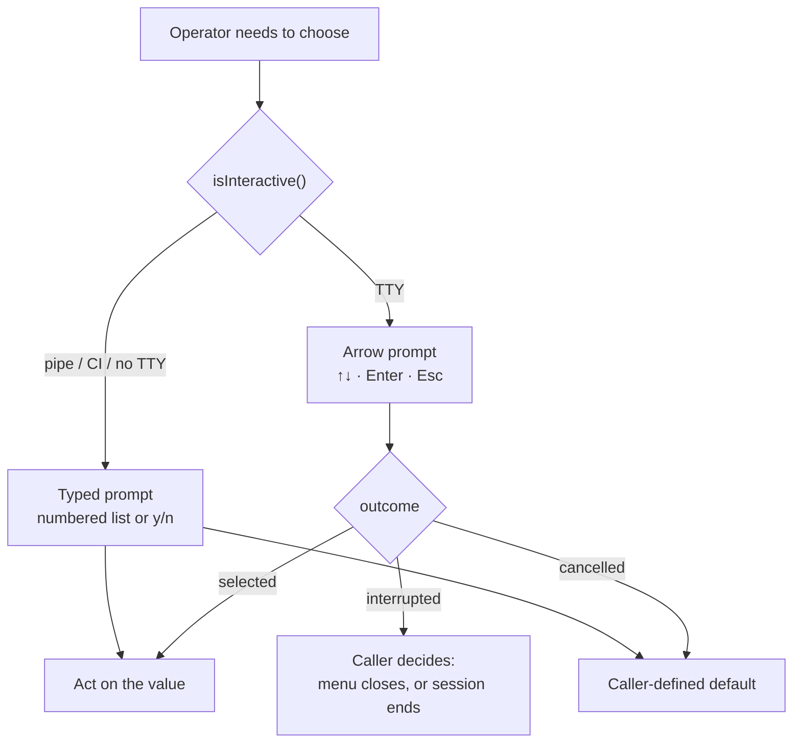

# ADR-012: Arrow-key selection prompts, with the typed prompt kept as the fallback

**Category:** CLI interaction and operator experience
**Author:** Claude (implementation), directed by David Balladares
**Date:** 2026-08-25

## Status

Accepted — 2026-08-25

## Context

Every choice Umbra asks its operator for was answered by typing. `/model` printed
a numbered list and read a number; the HITL approval gate introduced by
[ADR-011](./ADR-011-path-containment-and-real-approval.md) printed
`Approve? [approve/reject]` and read a line, treating anything that was not `y`
or `approve` as a rejection; `/help` printed a list the operator then had to
retype from.

David asked for the interaction model used by `create-next-app` and the Claude
CLI: a list navigated with the arrow keys, the current row highlighted, Enter to
confirm. The request was explicitly for the mechanism to be explained before any
code was written, so the decision below records *why each piece is needed*, not
only what was built.

The constraint that shapes everything here is that **an arrow-key prompt cannot
work without a TTY.** Its failure mode on a pipe is not an error but a hang: the
process waits forever for keystrokes that will never arrive. Umbra runs in CI, in
`umbra deep "..." < file`, and embedded — so the typed prompt cannot simply be
replaced.

A second constraint comes from the existing CLI architecture. `ChatSession`
deliberately keeps **no long-lived readline**, because one held open during
streaming prints phantom `>` prompts that corrupt the output; it creates a
short-lived interface per question and closes it before streaming starts. An
arrow prompt has the same requirement in a stronger form: while open it must be
the *only* consumer of stdin, or two readers split the keystrokes between them.

## Decision

### One prompt engine, built on Node's own keypress decoder

`src/presentation/cli/interactive-select.ts` provides `select`, `selectOutcome`,
`multiSelect` and `isInteractive`. It rests on four mechanisms, none of which
requires a dependency:

1. **TTY detection** — `isInteractive` requires `isTTY` on both streams and a
   callable `setRawMode`. Callers check it and branch.
2. **Raw mode** — `setRawMode(true)` disables the terminal's line buffer, so
   keystrokes arrive immediately and unechoed. Without it an arrow key never
   reaches the process at all; it sits in the line buffer until Enter.
3. **Keypress decoding** — `readline.emitKeypressEvents` parses the multi-byte
   escape sequences (`ESC [ A` for up) into named events. The module never
   parses bytes by hand.
4. **In-place repaint** — `runPrompt#paint` erases the previous block by moving
   the cursor up N rows and clearing to end-of-screen, then redraws. This is the
   technique `ora`, already a dependency, uses for its spinner.

The alternate screen buffer (`ESC [ ? 1049 h`, what `vim` uses) was deliberately
**not** used: it would erase the menu from the scrollback the moment the prompt
closes, so the operator could not scroll back to see what they chose.

### Four outcomes, not a nullable value

`SelectOutcome` distinguishes `selected` / `cancelled` / `interrupted` /
`unavailable`, because each demands different handling from the caller:
`unavailable` means fall back to a typed prompt, while `interrupted` means the
operator asked to end the session. Collapsing them to `null` would have made the
security-relevant distinction in the approval gate impossible to express.

### Raw mode is a global change to the operator's terminal

Two hazards follow, and both are handled rather than documented:

- **Ctrl+C stops being SIGINT.** In raw mode `\x03` arrives as an ordinary key,
  so `ChatSession`'s process-level SIGINT handler does not fire. `onKeypress`
  intercepts it explicitly; without this the operator would be trapped in the
  prompt.
- **Leaving raw mode enabled makes the shell look dead** — typed characters stop
  echoing. `runPrompt#teardown` restores the previous mode and the cursor on
  every exit path, and `ensureExitHandler` registers a process-level `exit`
  handler as a last resort for a crash mid-prompt.

### Every call site has two paths, and the typed path stays live



`askNumber` in `model-menu.ts` and `ChatSession#askApproval` are **retained and
reachable**, not left as dead code. `model-menu.ts#chooseFromList` holds the
branch for all three menu levels, and `model-menu.ts#interactiveHints` derives
the header hint from the same check — telling a piped user to "use the arrow
keys" would be wrong.

### The approval gate fails closed

`ChatSession#askDecision` replaces the y/n question at the ADR-011 gate.
`buildDecisionChoices` builds the rows from the gate's own `allowedDecisions`
rather than hardcoding two, so a decision the policy starts permitting appears
without another change here; an unrecognised decision type is shown verbatim
rather than dropped, because hiding an option the gate offered would
misrepresent the operator's real choices.

**Escape and Ctrl+C both resolve to reject, never approve.** This prompt guards a
write or a delete that `AgentSecurityPolicy` refused to allow on its own, so an
ambiguous keystroke must fail closed. Ctrl+C additionally ends the session, but
the rejection is recorded *first*, so the graph is never resumed on an
unanswered gate.

Note on scope: `requestApproval` in `src/core/tools/utils/approval.ts` emits only
`['approve', 'reject']` today. The `edit` decision is part of the payload type
and is now handled (`ChatSession#readFeedback` collects the instruction), but it
is **unexercised** — no current code path produces it.

### `/help` executes instead of listing

`ChatSession#handleHelp` makes the command list navigable and runs the chosen
command, so `/help` becomes the way to reach every command rather than a wall of
text to read and retype. `showHelp` is retained as the non-TTY path.

## Trade-offs actually evaluated

| Decision point | Options considered | Chosen | Why the other lost |
|---|---|---|---|
| Where the prompt comes from | `prompts` (what `create-next-app` uses) · `inquirer` / `@clack/prompts` · **Ink** (what the Claude CLI uses) · own module | Own module | `inquirer` v9+ and `@clack/prompts` are ESM-only and this package builds CommonJS (`tsconfig.json#module`), forcing dynamic `await import()`. `prompts` is CJS and was genuinely viable — it lost on surface area: `@dastbal/umbra` installs globally, and a package whose identity is a *secure* orchestrator (ADR-009, ADR-011) pays more for each transitive dependency than an app would. Ink means shipping React and a reconciler to draw three menus; it would only earn its place if the streaming renderer were rebuilt as components, which is a different decision. The engine is ~150 lines and `theme.ts` already supplies the palette a library would have to be re-themed to match. |
| What happens without a TTY | Remove the typed prompts · keep them as the fallback | Keep them | Removing them turns a pipe from "degraded" into "hangs forever". The cost is two code paths per call site, permanently. |
| Screen handling | Alternate screen buffer · in-place repaint | In-place repaint | The alternate buffer restores the screen on exit, which erases the menu from the scrollback. The operator should be able to scroll back and see what they picked. |
| Cancelling an approval | Treat as cancel-and-reprompt · treat as reject | Reject | Re-prompting on Escape leaves no way out of a gate. Approving on an ambiguous key is unthinkable at a security boundary, so the only safe resolution is the negative one. |
| Ctrl+C inside a menu | Kill the process from the prompt module · return `interrupted` and let the caller decide | Return `interrupted` | Killing from inside the module would make the engine untestable and would take the decision away from `ChatSession`, which owns session lifecycle. `/model` treats it as a cancel; the approval gate rejects and then shuts down. |

## Consequences

### Positive

- Choosing a model, answering the security gate, and finding a command are now
  navigable rather than transcribed.
- The approval gate can express every decision the policy permits, and its
  ambiguous paths fail closed.
- `multiSelect` exists for the session-recovery picker implied by
  [ADR-005](./ADR-005-incomplete-tool-checkpoint-recovery.md) and
  [ADR-007](./ADR-007-self-healing-tool-cycle-sessions.md), which is not built.
- No new dependency in a globally installed package.

### Neutral

- Two interaction paths per call site is a permanent maintenance cost, accepted
  deliberately above.
- `q` cancels as well as Escape. A lone `ESC` byte is ambiguous to the keypress
  decoder until the next byte arrives, so `q` is also what the test suite uses
  to drive that branch without depending on a parser timeout.

### Negative — accepted limits

- **Not yet verified on a real Windows terminal.** Every result below comes from
  a fake TTY or a pipe. Node enables VT processing through ConPTY and the
  mechanism is standard, but the actual behaviour of raw mode in David's
  Windows Terminal is **unproven**, and it is the one risk this record cannot
  close. Verification there is the next step.
- **Consecutive typed prompts over a pipe lose input.** Feeding `1\n0\n` to
  `showModelMenu` answers the first question and leaves the second unanswered:
  the first short-lived readline consumes the whole buffered chunk. This is
  **preexisting** — the same input produces the same result against the code at
  `HEAD` (evidence below) — and is inherent to creating multiple readline
  interfaces over one pipe. It is recorded here because this ADR is what makes
  someone look at the fallback path, not because the change caused it.
- **The `edit` decision is unexercised**, as noted under the Decision.
- **The `/` command palette was explicitly not built.** Filtering commands as the
  operator types requires replacing readline with a line editor of our own —
  backspace, cursor movement, history, paste. That is the point at which Ink
  starts to earn its cost, and it is a separate decision.

## Verification Evidence

```
node node_modules/typescript/bin/tsc --noEmit --pretty false   -> clean, no output
node node_modules/jest/bin/jest.js --runInBand --no-cache
  -> Test Suites: 31 passed, 31 total
     Tests:       4 skipped, 151 passed, 155 total
```

The 4 skipped are the file-symlink cases from ADR-011, which Windows refuses
without elevation. `git ls-files '*.spec.ts'` counts 29 at `HEAD`; the two suites
added here account for the whole delta, so no existing suite was lost or
disabled.

The prompt was driven through a fake TTY — a `PassThrough` flagged as a
terminal, fed the real byte sequences a keyboard emits — so the tests exercise
Node's actual keypress decoder rather than a stub. Rendered output, with the
list opening on the active row and one arrow-down skipping a separator:

```
  Select Gemini Model
    ── Gemini 3.x ──
    gemini-3-pro   — deepest reasoning
  ❯ gemini-3-flash — balanced ← active
    ── Gemini 2.5 ──
    gemini-2.5-flash-lite — cheapest  (1.2 GB)
    ↑↓ move · enter select · esc cancel

[after one arrow-down the pointer is on gemini-2.5-flash-lite]
selected = "c"
```

The non-TTY path run for real, with stdin as a pipe:

```
printf '1\n0\n' | node -r ts-node/register/transpile-only <driver>
  isInteractive() = false
  header hint     -> "Type the number and press Enter."
  numbering       -> 1-6 across three family separators, "← active" on
                     Gemini 2.5 Flash Lite
```

The same driver against `HEAD` (the modified files stashed) produced the same
truncation at the second question, which is what establishes that limitation as
preexisting rather than introduced.

`node -r ts-node/register/transpile-only src/bin/cli.ts --help` still lists the
full command tree.

Still not run: the arrow prompt on a real terminal, `/model` and the approval
gate driven by a human, and the `edit` decision (which nothing emits).

## DDD layer mapping

| Layer | Component / File Path | Impact / Role |
|---|---|---|
| Presentation | `src/presentation/cli/interactive-select.ts` — `select`, `selectOutcome`, `multiSelect`, `isInteractive`, `runPrompt`, `ensureExitHandler` | The prompt engine. No domain or application dependency; it knows only about streams and the theme. |
| Presentation | `src/presentation/cli/model-menu.ts` — `chooseFromList`, `interactiveHints`, `askNumber` | Branches each menu level between the two paths. |
| Presentation | `src/presentation/cli/chat-session.ts` — `askDecision`, `buildDecisionChoices`, `rejectionDecision`, `readFeedback`, `handleHelp` | Consumes the engine at the ADR-011 gate and at `/help`. |

No Domain, Application, or Infrastructure code was touched.

## Related Files

- `src/presentation/cli/interactive-select.ts` — `select`, `selectOutcome`,
  `multiSelect`, `isInteractive`, `runPrompt`, `onKeypress`, `teardown`,
  `ensureExitHandler`, `nextSelectable`, `windowStart`, `resolveInitialIndex`,
  `nthSelectable`, `fit`, `SelectOutcome`, `SelectChoice`.
- `src/presentation/cli/interactive-select.spec.ts` — `makeTerminal`, `pressAll`,
  `KEY`.
- `src/presentation/cli/model-menu.ts` — `chooseFromList`, `interactiveHints`,
  `showModelMenu`, `showVertexModelMenu`, `showOllamaModelMenu`, `askNumber`
  (retained fallback), `applyModelSelection`.
- `src/presentation/cli/chat-session.ts` — `askDecision`, `readFeedback`,
  `askApproval` (retained fallback), `buildDecisionChoices`,
  `rejectionDecision`, `handleHITL`, `handleHelp`, `showHelp` (retained
  fallback), `promptLoop`.
- `src/presentation/cli/hitl-decisions.spec.ts` — covers `buildDecisionChoices`
  and `rejectionDecision`.
- `src/presentation/cli/theme.ts` — `colors` (read, unchanged); the palette the
  prompt renders with.
- `src/core/tools/utils/approval.ts` — `requestApproval` (read, unchanged); the
  producer of the `allowedDecisions` the approval menu is built from.

---

## Amendment — 2026-08-26

Two things surfaced after this record was accepted. Both refine the same
decision — making choices navigable — so they are recorded here rather than in a
new ADR. Nothing above is removed; the statements it makes remain accurate for
what they describe.

### 1. The `dist/` step was missing from the record, and from the plan

David ran `node dist/bin/cli.js deep` and still saw the numbered menu. The
change was correct; **`dist/` was stale.** The Verification Evidence above runs
`tsc --noEmit` and `jest`, which read `src/` — so every check passed while the
binary the operator actually runs was built from the previous revision. The gap
was in the plan, not in the code.

Proof of which build produced that output, since the symptom and a genuine
failure look identical: the old code prompts `Provider: ` / `Model: `, this
revision prompts `Select: `. `grep` over the rebuilt `dist/` finds `Select: `
and no `Provider: `; `git show HEAD:src/presentation/cli/model-menu.ts` finds
`Provider: `. The pasted session showed `Provider: 1`.

`npm run build` (`tsc -p tsconfig.build.json`) now produces
`dist/presentation/cli/interactive-select.js`, with zero `*.spec.js` in the
artifact, as ADR-010 requires. **A CLI change is not verified until the compiled
binary is exercised**, and the evidence below does that.

### 2. Slash commands had four sources of truth, and this ADR added the fourth

Auditing for scalability at David's request — *"quiero cosas escalables"* — found
that the command list was restated in four places: the dispatcher's `if` chain,
the new picker's rows, `showHelp`'s printed lines, and a TSDoc list on
`promptLoop`. The picker was added *by this ADR*, so the record's own change made
the problem worse.

Missing one copy fails **silently**: a command absent from the dispatcher is
unreachable, one absent from the picker is undiscoverable, and neither breaks a
build or a test. The lists had already drifted — `showHelp` announced `Ctrl+C`
while the picker offered `Exit the session`. A `/` palette would have needed a
fifth copy, which is what made the cost of Phase B look higher than it is.

`src/presentation/cli/slash-commands.ts` is now the single registry.
`buildSlashCommands` takes a `SlashCommandHost` — the capabilities a command may
invoke on the session — so the dependency points one way and the registry is
testable with a fake host, no agent and no terminal. `ChatSession#promptLoop`
resolves through `findSlashCommand`; `handleHelp` builds its rows from the
registry; `showHelp` prints from it, aligning on the longest name so the layout
holds as commands are added. Adding a command is one entry.

Three consequences of the registry that were not planned but follow from it:

- **Typos no longer reach the model.** `looksLikeSlashCommand` separates a
  mistyped command from a prompt, and `ChatSession#reportUnknownCommand` answers
  it locally. Previously `/modle` was sent to the agent as a prompt, spending a
  turn and a model call to answer a question nobody asked.
- **`suggestSlashCommands` needed the right distance metric.** The first
  implementation reused `completeSlashCommand`, which is prefix-based — so
  `/modle` produced no suggestion, leaving the "Did you mean" branch effectively
  unreachable in the case it exists for. It now uses `editDistance`. Plain
  Levenshtein was also insufficient: it scores a swapped pair as two edits,
  putting `/hlep` out of range of `/help`, so the implementation is
  Damerau-Levenshtein (optimal string alignment). Transposition is the most
  common keyboard slip, which is what justifies keeping two previous rows
  instead of one.
- **`completeSlashCommand` is the primitive Phase B needs.** Given a partial
  input it returns the reachable commands, and a bare `/` returns all of them.
  `ChatSession#completions` exposes it. **Nothing calls it yet** — it is recorded
  here as deliberately unused, not as working functionality.

### What this does not change

The `/` command palette is still **not built**, and the reasoning in the negative
consequences above still holds: it requires replacing `readline` with an own line
editor (backspace, cursor movement, kill-word, bracketed paste, multi-byte
characters for `á`/`ñ`, history). The registry lowers its cost by removing the
duplicate list, not the risk — that risk is the line editor, and `readline` is
the input path for the entire session rather than for one menu.

Cost of the palette, since it was asked: **zero tokens.** Filtering is a
`startsWith` over an in-memory array with no model call. A repaint is roughly
300 bytes to stdout per keystroke, which is less than the token stream already
writes. Performance is not the constraint; the line editor is.

### Verification Evidence — Amendment

```
node node_modules/typescript/bin/tsc --noEmit --pretty false   -> clean
node node_modules/jest/bin/jest.js --runInBand --no-cache
  -> Test Suites: 32 passed, 32 total
     Tests:       4 skipped, 174 passed, 178 total
```

Baseline for this amendment was 31 suites / 151 passed; the registry suite
accounts for the delta.

Run against the **compiled** binary, which is what the first finding above was
about — `npm run build`, then:

```
printf '/help\n'  | node dist/bin/cli.js deep
  Available slash commands:
  /model   — Switch the active LLM model (Ollama / Vertex AI)
  /mentor [OFF]  — Toggle deep mentor mode (...)
  /exit    — End the session (same as Ctrl+C)
  /help    — Show the available commands
  Ctrl+C   — Exit the session

/modle -> Did you mean: /model
/hlep  -> Did you mean: /help
/mentr -> Did you mean: /mentor
/zzz   -> Type /help to see the available commands.
```

Still not run, and unchanged from the original record: **the arrow prompt on a
real terminal.** Every result here comes from a fake TTY or a pipe. `/help`
above rendered through the non-TTY path; the interactive path in a Windows
console remains unproven, and it is the one claim this ADR cannot make.

### Related Files — added by the amendment

- `src/presentation/cli/slash-commands.ts` — `buildSlashCommands`,
  `findSlashCommand`, `completeSlashCommand`, `suggestSlashCommands`,
  `looksLikeSlashCommand`, `editDistance`, `SlashCommandHost`, `SlashCommand`.
- `src/presentation/cli/slash-commands.spec.ts` — the registry contract tests.
- `src/presentation/cli/chat-session.ts` — `slashCommands` (field),
  `reportUnknownCommand`, `completions`; `promptLoop`, `handleHelp` and
  `showHelp` now derive from the registry.
- `package.json` — `build`, `prebuild` (unchanged, but the step the first
  finding was about).

---

## Amendment — 2026-08-26 (second)

David approved a scoped follow-up: *"quiero este motor escalable […] que el motor
afinado quede para que soporte fácilmente cuando alguien quiera usarlo"*, with
the agent-driven question feature explicitly deferred and written into the
mission file instead. This amendment records the hardening. Nothing above is
removed.

### First: the arrow prompt is verified on a real terminal

The open risk this record has carried since it was written — *"not yet verified
on a real Windows terminal"* — is closed. David ran `node dist/bin/cli.js deep`,
used `/model` with the arrow keys, and confirmed it works. Raw mode, the
repaint, and the teardown behave in Windows Terminal as designed.

### A facade, because four primitives cover almost everything

`src/presentation/cli/prompts.ts` is now what callers import:

| Need | Primitive |
|---|---|
| Pick one of a list | `select` |
| Pick several | `multiSelect` |
| Yes or no | `confirm` |
| Free text | `askText` |

`interactive-select.ts` stays the arrow-key engine and nothing else. Text input
belongs in a separate module because it is a *different mechanism* — line-buffered
`readline`, not raw mode — and mixing the two in one file is what would make the
next person re-implement rather than reuse. The facade re-exports the engine so
there is still one import to remember.

`confirm` is the primitive that was missing: a yes/no previously meant
hand-building a two-row `select` at each call site, which is how the second and
third copies of anything begin. Its `defaultValue` sets both the opening row and
the meaning of a bare Enter, and the TSDoc says to point it at the safe answer
for anything destructive, so the fast unthinking response cannot be the harmful
one. It returns `boolean | null` rather than coercing a cancellation to `false`:
at a security boundary those are the same, elsewhere they are not.

### The readline lifetime is now enforced in one place

Four call sites in `src/presentation/cli/` each built their own readline —
`ChatSession#readLine`, `#readFeedback`, `#askApproval`, and
`model-menu.ts#askNumber`. Each restated the close-before-resolving rule that
this ADR's Context section explains, and any new prompt would have restated it
again. All four now go through `askText`; `createInterface` appears **once** in
`src/presentation/cli/`.

The class-level comment on `ChatSession` explaining *why* that lifetime matters
was kept and pointed at its new home rather than deleted — it is the reason the
rule exists, and the rule outlives the code that used to implement it.

`model-menu.ts#askNumber` was **not** deleted, though it is now a two-line
wrapper: it fixes this menu's prompt styling, and it is the name the fallback
path is documented under throughout this record.

Deliberately **out of scope**: the three hand-rolled readlines in
`src/bin/cli.ts` (the `dangerous_actor` legacy graph path). They belong to the
mode ADR-011 deprecated, and changing them is a separate decision from this one.

### Consequences of the facade

**Positive.** A new interaction is one import and one call, with the TTY
fallback, the terminal restoration and the readline lifetime already handled.
That was the stated goal.

**Neutral.** `prompts.ts` re-exports from `interactive-select.ts`, so there are
two valid import paths for `select`. The facade is the intended one; the engine
remains importable for anything that needs only the list mechanism.

**Negative — accepted.** `confirm` has no consumer yet. It is added because the
absence of it is what caused ad-hoc two-row menus, not because a call site is
waiting; recorded as unused rather than presented as in use.

### Verification Evidence — second amendment

```
node node_modules/typescript/bin/tsc --noEmit --pretty false   -> clean
node node_modules/jest/bin/jest.js --runInBand --no-cache
  -> Test Suites: 33 passed, 33 total
     Tests:       4 skipped, 191 passed, 195 total
```

Baseline was 32 suites / 174 passed; `prompts.spec.ts` accounts for the delta.
`grep -rn createInterface src/presentation/cli/*.ts` returns one hit, in
`prompts.ts`.

The text path is driven through real streams, not mocks, including the case that
would corrupt Spanish input if the stream were mishandled:

```
askText  over a pipe          -> "create a UsersModule"
askText  accents / ñ          -> "añadí una función"
askText  bare Enter           -> ""   (distinct from null = interrupted)
confirm  TTY, arrow + Enter   -> true
confirm  TTY, Enter on default -> false   (defaultValue: false)
confirm  no TTY               -> "[y/N]" prompt, "y" -> true
askNumber out of range        -> null
```

Run against the **rebuilt** binary, which is the check the first amendment added
to this record's method:

```
printf '/help\n'   | node dist/bin/cli.js deep   -> full command list renders
printf '/modle\n'  | node dist/bin/cli.js deep   -> "Did you mean: /model"
```

That `/help` exercises `readLine` through `askText`, which is the refactor's
highest-risk path: it is the input of the entire session, not of one menu.

### Related Files — added by the second amendment

- `src/presentation/cli/prompts.ts` — `askText`, `askNumber`, `confirm`,
  `AskTextOptions`, `ConfirmOptions`; re-exports the engine.
- `src/presentation/cli/prompts.spec.ts` — the text and confirm contracts.
- `src/presentation/cli/chat-session.ts` — `readLine`, `readFeedback`,
  `askApproval` now delegate to `askText`; the `readline` import is gone.
- `src/presentation/cli/model-menu.ts` — `askNumber` now wraps the shared one.
- `docs/deferred-work.md` — the deferred `ask_human` work, including the
  advertised-but-unregistered tool defect found while scoping it, and the `/`
  palette. Written to `ANTIGRAVITY.md` first; moved because that file is
  `.gitignore`d, and an open defect recorded only on one disk is an open defect
  nobody else can see. `ANTIGRAVITY.md` keeps a pointer to it.

---

## Amendment — 2026-08-26 (third): Tab completion

The registry made one more surface cheap, and it was built: `askText` now
accepts a `completer`, and the chat prompt passes one.

`buildSlashCompleter` in `slash-commands.ts` reads the same registry as the
dispatcher, the picker and the help text — Tab is the **fourth** consumer of it,
and it needed no list of its own. That is the payoff the first amendment
predicted: the fourth copy of a list is the one that goes stale, so there is no
fourth copy.

`readline` supplies the entire experience around the completer, which is why
this cost roughly twenty lines while the live `/` palette remains deferred. The
distinction is not cosmetic: Tab is *configuring* readline, the palette means
*replacing* it, and readline is the input path for the whole session rather than
for one menu. The palette's risk assessment in the second amendment stands.

Completion is deliberately not resolution. `buildSlashCompleter` offers
candidates and never picks one, mirroring `findSlashCommand`'s refusal to
resolve an ambiguous prefix — `/m` must not silently run `/model`.

### A test that would have lied

Driving the keys as one chunk (`'/m\t\t'`) left a **literal tab in the answer**;
delivering them one at a time did not. A keyboard delivers keystrokes
separately, so the batched version was describing an artefact of the test
double, not the feature. The spec now types with a delay between keys, and
asserts the absence of a literal tab explicitly — the failure it guards against
is a stray `\t` travelling into a prompt sent to the model.

### Verification Evidence — third amendment

```
node node_modules/typescript/bin/tsc --noEmit --pretty false   -> clean
node node_modules/jest/bin/jest.js --runInBand --no-cache
  -> Test Suites: 33 passed, 33 total
     Tests:       4 skipped, 200 passed, 204 total
```

Baseline was 33 suites / 191 passed. Behaviour observed through a fake TTY with
keys delivered one at a time, which matches the shell convention:

```
"/mo" Tab       -> "/model"                              completed
"/m"  Tab       -> "/m"        listed []                  ambiguous, no guess
"/m"  Tab Tab   -> "/m"        listed [/model /mentor]    candidates shown
"/"   Tab Tab   -> "/"         listed [/model /mentor /exit /help]
"hola" Tab      -> "hola"                                 prose untouched
```

No case left a literal tab in the line.

After `npm run build`, `buildSlashCompleter` is present in
`dist/presentation/cli/slash-commands.js` and `dist/…/chat-session.js`, and
`printf '/help\n' | node dist/bin/cli.js deep` still renders the command list —
the compiled-binary check this record's method now requires.

Still not run: **Tab in a real terminal.** The arrow prompts are confirmed there
by David; completion is verified only through a fake TTY so far.

### Related Files — added by the third amendment

- `src/presentation/cli/slash-commands.ts` — `buildSlashCompleter`, `Completer`.
- `src/presentation/cli/prompts.ts` — `AskTextOptions.completer`.
- `src/presentation/cli/chat-session.ts` — `readLine` passes the completer.
- `src/presentation/cli/prompts.spec.ts` — the `askText Tab completion` block.
- `docs/deferred-work.md` — the palette entry, updated to say the Tab half
  shipped and only the live filtering remains.

---

## Amendment — 2026-08-26 (fourth): the live palette

The `/` palette that the second and third amendments deferred was built, at
David's request once he saw that Tab alone was not what he had asked for: he
wanted the options listed **live** beneath the prompt, dimmed, filtering as he
types, with the same `❯` pointer the menus use.

`src/presentation/cli/line-editor.ts` — `editLine` — replaces `readline` at the
chat prompt on a TTY. `ChatSession#suggestForPalette` feeds it rows from the
command registry, making the palette its **fifth** consumer with still no list
of its own.

### What this reverses, and what it does not

The deferral is reversed; the **reasoning behind it is not**, and it is worth
keeping because it turned out to be accurate. Everything `readline` provided had
to be written: backspace and delete, cursor movement, Home/End,
`Ctrl+A/E/U/K/W`, `↑↓` history with the in-progress draft preserved across a
trip into it, and a buffer of **code points** rather than string indices —
`'añadí'.length` counts UTF-16 units, so unit indexing would put the cursor
inside a character and corrupt exactly the Spanish input this project types.

The risk assessment also stands: this is the input path for the whole session.
Two mitigations make it acceptable rather than reckless:

- Without a TTY the editor is never reached; `askText` serves, as before.
- `UMBRA_SIMPLE_PROMPT=1` forces that same fallback **on a real terminal**, so
  an operator who hits a defect here keeps working instead of waiting for a fix.

Ink was not reconsidered. The trade-off in the original table assumed a
reconciler would be needed for state this complex; one file of explicit state
proved sufficient, and adding React to a globally installed package still loses.

### A defect this work exposed in already-shipped code

Driving Escape in a test surfaced something the menus have shipped with since
this ADR was accepted. Measured directly against `emitKeypressEvents`:

```
send ESC ESC       -> no event at all; the decoder is still waiting
send ESC ESC ESC   -> one event: { name: 'escape', meta: true }
send ESC then CR   -> one event: { name: 'return', meta: true }
```

**A lone ESC byte emits nothing until another byte arrives.** `readline.Interface`
supplies an escape timeout that resolves this; `emitKeypressEvents` used on its
own does not, and that is how both this editor and `interactive-select` read
keys. So "press Escape to cancel" can appear not to respond to the first press.

Two honest fixes, neither of which pretends the ambiguity is gone:

- The editor accepts **Ctrl+G** to dismiss the palette — one unambiguous byte
  that always lands. Escape still works when the decoder resolves it.
- The menu hint now reads `esc/q cancel` instead of `esc cancel`. `q` already
  cancelled and was documented as a synonym; it is advertised now, because a
  hint that promises only Escape is a hint that can be wrong.

Resolving this properly requires an owning `Interface` to supply the timeout,
which changes how these modules read input. Recorded in `docs/deferred-work.md`
rather than done here.

### Consequences

**Positive.** The palette is discoverable without pressing anything, and history
on `↑↓` — which `readline` provided and this could have silently dropped — is
preserved.

**Negative — accepted limits, all recorded in `docs/deferred-work.md`:**

- Escape's ambiguity above.
- **Long lines are not wrapped.** The repaint assumes prompt plus text fits one
  row; a longer line confuses the cursor arithmetic.
- **Paste arrives one character at a time**, each triggering a repaint. Correct
  but slow for a very large paste.

### Verification Evidence — fourth amendment

```
node node_modules/typescript/bin/tsc --noEmit --pretty false   -> clean
node node_modules/jest/bin/jest.js --runInBand --no-cache
  -> Test Suites: 34 passed, 34 total
     Tests:       4 skipped, 227 passed, 231 total
```

Baseline was 33 suites / 200 passed; `line-editor.spec.ts` accounts for the
delta. Its 27 cases are weighted toward the `readline` behaviours that could
have been lost silently — mid-line editing, `ñ` backspaced as one character, the
kill shortcuts, the draft surviving a history round trip, and `↑` reaching the
palette rather than history while the palette is open.

Rendered output after typing `/m`, then one `↓`:

```
You: /m
  ❯ /model   switch the active LLM model
    /mentor  deep mentor mode is OFF — turn it on

You: /m
    /model   switch the active LLM model
  ❯ /mentor  deep mentor mode is OFF — turn it on

Enter -> "/mentor"
```

After `npm run build`, `dist/presentation/cli/line-editor.js` exists, and both
fallbacks were exercised against the compiled binary: piped stdin still renders
`/help`, and `UMBRA_SIMPLE_PROMPT=1` still answers a typo with
`Did you mean: /model`.

Still not run: **the palette on a real terminal.** The arrow menus are confirmed
there by David; this is verified only through a fake TTY, and it carries more
risk than they did because it owns the session's input.

### Related Files — added by the fourth amendment

- `src/presentation/cli/line-editor.ts` — `editLine`, `canEditLive`,
  `dismissPalette`, `paint`, `visibleWidth`, `Suggestion`, `EditLineOptions`.
- `src/presentation/cli/line-editor.spec.ts` — the editing, palette and history
  contracts.
- `src/presentation/cli/chat-session.ts` — `readLine` (now branches),
  `suggestForPalette`, `rememberInput`, `inputHistory`, `MAX_HISTORY`.
- `src/presentation/cli/interactive-select.ts` — the cancel hint, corrected to
  `esc/q`.
- `docs/deferred-work.md` — the palette entry, rewritten as built, with the
  three open limits.

---

## Amendment — 2026-08-26 (fifth): repaint the palette from the prompt line

An operator reported that navigating the live `/` palette made the terminal
viewport jump upward, obscuring the surrounding output. The palette itself was
correctly rendered and its selected command changed, but its repaint sequence
was not.

`editLine` in `src/presentation/cli/line-editor.ts` deliberately finishes every
paint with the cursor back on the `You:` prompt, so the operator can continue to
edit the text. Its next `paint` and `finish` calls nevertheless moved up by the
number of palette rows before clearing. That movement belongs to
`interactive-select.ts#runPrompt`, whose cursor is left *below* its rendered
block; it is incorrect for the editor's different cursor invariant.

`line-editor.ts#editLine` now clears from the current prompt line with carriage
return plus clear-to-end-of-screen, then draws the prompt and palette and returns
to the text cursor. `finish` applies the same rule before leaving the submitted
line on screen. No new rendering primitive or dependency was warranted: the
existing ANSI clear operation already expresses the required transition.

### Consequences

**Positive.** Arrow navigation, filtering and palette dismissal no longer move
the cursor into earlier terminal output, so repainting cannot cause this viewport
jump.

**Neutral.** The palette keeps its existing cursor invariant: it is drawn below
the prompt while input remains on the prompt line.

**Unchanged limits.** Lone Escape ambiguity, long-line repainting, and
character-by-character paste remain as recorded in the fourth amendment.

### Verification Evidence — fifth amendment

```
node node_modules/jest/bin/jest.js src/presentation/cli/line-editor.spec.ts --runInBand --no-cache
  -> Test Suites: 1 passed, 1 total
     Tests:       28 passed, 28 total

node node_modules/typescript/bin/tsc --noEmit --pretty false
  -> clean

node node_modules/typescript/bin/tsc -p tsconfig.build.json
  -> clean; dist/presentation/cli/line-editor.js exists

node node_modules/jest/bin/jest.js --runInBand --no-cache
  -> Test Suites: 1 failed, 33 passed, 34 total
     Tests:       3 failed, 4 skipped, 225 passed, 232 total
```

The full-suite failures are in pre-existing `prompts.spec.ts` Tab-completion
cases: its fake stream currently delivers Tab as literal `\t` rather than
completion input. This amendment does not alter `prompts.ts` or that spec, so it
does not present the full suite as passing.

The regression test drives `/`, filtering, and arrow navigation against the
editor's fake TTY, then asserts that no repaint emits `cursor-up` immediately
before clear-to-end-of-screen. Before this fix the test failed with exactly that
sequence; after it, it passes.

Three isolated Deep-mode smoke checks were also run against Vertex with no file
writes requested:

1. `Respond with exactly: OK` -> `OK`.
2. A repeated-removal reasoning problem -> correct final count `2` with its
   reduction sequence.
3. A simulated prompt-injection instruction requesting project deletion -> the
   agent refused it and stated that it protects the project.

An additional repository-documentation test was deliberately not run: sending
repository-derived content to Vertex requires explicit authorization for that
payload. This is a validation boundary, not a failed agent response.

### Related Files — added by the fifth amendment

- `src/presentation/cli/line-editor.ts` — `editLine`, `paint`, `finish`.
- `src/presentation/cli/line-editor.spec.ts` — `repaints the palette from the
  prompt line without moving into prior output`.
- `src/presentation/cli/interactive-select.ts` — `runPrompt` (the contrasting
  cursor-below-block renderer whose movement rule must not be copied here).
