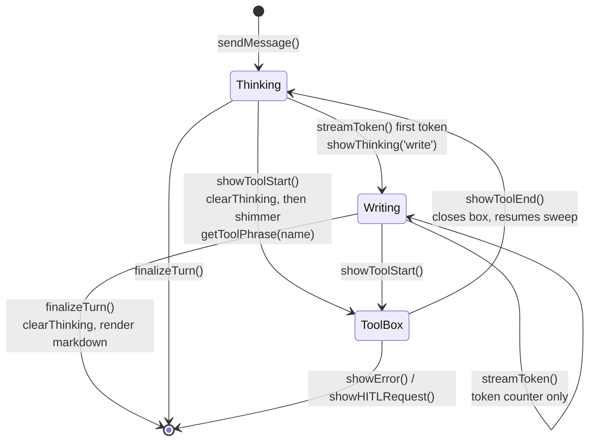

# ADR-012: Give the CLI a live wait indicator, and every transient line a width contract

**Category:** CLI presentation and terminal rendering
**Author:** Claude (implementation), directed by David Balladares
**Date:** 2026-08-25

## Status

Accepted — 2026-08-25

## Context

The CLI went visually silent whenever the agent was busy, and on long responses
it corrupted its own output. Both symptoms came from the same root cause: the
renderer wrote transient lines without knowing how wide they were.

Three defects, all reproduced before any code changed.

1. **The wait indicator never animated.** `StreamRenderer#showThinking` performed
   a single `process.stdout.write` of `'\n  ⠋  Thinking...\r'`. No interval ever
   repainted it, so the braille frame sat frozen for the entire wait. It read as
   a static grey line, not as a spinner. The matching `clearThinking` erased it
   with 27 literal spaces.

2. **A fixed 80-column clear overwrote the response.** `streamToken` printed one
   muted `.` per token as a placeholder, and `finalizeTurn` erased that line with
   `'\r' + ' '.repeat(80) + '\r'` before printing the styled markdown. A response
   of 300 tokens produces a 300-character line, which on a 100-column terminal
   has already wrapped across four rows. `\r` returns to column zero of the
   **last** row only, so the clear reached one row and stranded three. Replaying
   a 300-dot stream through a screen emulator at width 100 leaves exactly three
   full rows of dots sitting above the rendered answer.

3. **The label never described the work.** The indicator always read
   `Thinking...`, whether the agent was reading a file, querying the RAG index,
   or generating tokens. The information was already present — `on_tool_start`
   carries the tool name — and was discarded.

A fourth defect surfaced *during* implementation, and is recorded here because it
belongs to the same class and is the reason this ADR specifies a width contract
rather than just an animation: **a narrower repaint stranded the tail of the
previous frame.** The tool spinner line embeds an elapsed counter. When that
counter shrank from `990ms` (5 characters) to `1.0s` (4), the new frame was one
character shorter and left the final `s` on screen, producing
`╰─ ✓  done in 1.2s                s`. Erasing by the *current* frame's width is
not sufficient; the erase must cover the widest frame drawn so far.

## Decision

### One mechanism: a phrase with a highlight sweeping across it

The wait indicator is a phrase repainted every `SHIMMER_TICK_MS` (60 ms) with a
bright head travelling across it, trailing over `SHIMMER_TAIL` (6) characters
from `#6B7280` to `#E5E7EB`. Because the animation surface is the whole phrase
rather than one spinner character, the same animation carries the status text —
which is what makes defect (3) fixable without adding a second UI element.

`StreamRenderer#shimmer` paints **only the seven characters under the band** and
emits the unlit remainder as two flat runs, and `shimmerRamp` in `theme.ts`
pre-builds the seven chalk functions at module load rather than instantiating
them per character per frame. This is not premature optimisation — the measured
difference is in *Verification Evidence*, and the naive form emits 21.6 KB/s to
the terminal for output that is byte-identical after ANSI stripping.

### Every transient line declares its printable width

A *transient* line is one written with a leading `\r`, meaning it will be
repainted or erased in place. Static lines are excluded deliberately: they scroll
away harmlessly if they wrap.

`StreamRenderer#writeLine` records the printable width of what it wrote and pads
out to the previous frame's width, so `lastLineLen` is monotonic within a line's
life and a narrower frame cannot strand a tail. `StreamRenderer#clearLine` erases
exactly that width. `StreamRenderer#lineWidth` caps every transient line at
`process.stdout.columns - 2`, and `renderThinking` truncates the phrase with `…`
to fit — a transient line that wraps is unerasable by construction, so it is
never allowed to exist.

### The renderer owns the turn's visual transitions

`chat-session.ts#sendMessage` previously tore the indicator down on the first
event of the stream, which would have killed the sweep before it was visible.
That teardown is removed. The renderer drives its own state machine, so the
indicator now covers the dead air *between* events rather than only the gap
before the first one — which is where most of a turn's waiting actually happens.

### Token streaming shows a count, not dots

`streamToken` no longer prints a placeholder dot per token. It buffers the token,
increments a counter, and lets the shimmering `Writing the response  142 tokens`
line carry the feedback. The response is still rendered once, with full markdown
styling, in `finalizeTurn` — that has not changed.

This removes an unbounded transient line, which is what made defect (2) possible
in the first place. It is also a visible behaviour change and is recorded as such
in *Consequences*.

### Off a TTY, nothing animates

`StreamRenderer` reads `process.stdout.isTTY` once in its constructor. When
stdout is a pipe, a CI log, or a test harness, every transient line degrades to a
single plain write with no escape sequences and no timer. Carriage-return
repainting produces garbage in a log file, not animation. Every interval is
`unref()`'d: an animation must never hold the event loop open.

`chat-session.ts#shutdown` calls `clearThinking()` before its farewell. The
process exits via `process.exit(0)` regardless, so an orphan timer cannot hang
it — the risk being closed here is cosmetic, `Session ended` landing on top of a
half-painted line.

## Alternatives evaluated

| Solution | Pros | Cons | Decision |
|---|---|---|---|
| Repair the existing single-character spinner | Smallest diff; no new concepts | A spinner occupies one character and carries no text, so defect (3) would need a second UI element beside it | **Rejected** |
| Shimmer across the whole phrase | The animation surface *is* the status text, so one mechanism fixes (1) and (3); reuses the same engine for the tool box line | Costs a per-frame repaint, and needs the width contract to be safe | **Chosen** |
| Keep the per-token dots as the streaming feedback | Zero behaviour change for users used to it | Keeps the unbounded transient line that caused (2); the dots convey progress but not *what* is happening | **Rejected** |
| Stream real markdown text incrementally | Best possible feel — text appears as generated | Requires incremental markdown rendering: half-open code fences, unterminated lists, tables mid-row. A different size of problem | **Deferred**, see below |

Incremental token rendering was evaluated and explicitly deferred rather than
dismissed. It is the natural successor to this decision: the shimmer would shrink
to covering only the pauses between tokens. It was not taken now because the
markdown-fragment problem is independent of everything else in this ADR and would
have blocked the defect fixes behind it. A future record superseding this one on
that point is expected.

## Consequences

### Positive

- The three reproduced defects are fixed, and a fourth of the same class was
  caught during implementation by the screen-level test.
- Dead air between a tool finishing and the next decision — previously rendered
  as nothing at all — is now visible.
- The tool box states what the tool is doing (`Searching the codebase`) rather
  than only its name.
- Terminal bandwidth during a wait dropped from 21.6 KB/s to 4.4 KB/s versus a
  naive per-character implementation.
- The width contract is now testable in isolation and is pinned by tests, so this
  class of defect fails loudly instead of silently corrupting output.

### Neutral

- The sweep costs **zero model tokens**. It is `stdout` only: it never enters the
  prompt, never returns to the LLM, never touches conversation history.
- `theme.ts` gains `toolPhrases` beside the existing `toolIcons`, following the
  same keyed-by-tool-name convention.

### Negative

- **Per-token dots are gone.** Anyone reading the CLI's progress by dot count no
  longer has that signal; the token counter replaces it. This is a deliberate,
  user-visible change, approved before implementation.
- **`toolPhrases` must be maintained.** A new tool without an entry falls back to
  `Working` via `getToolPhrase`. The fallback is graceful but generic.
- **The response still appears all at once** at the end of the turn. This ADR
  does not improve perceived latency of the answer itself, only of the wait.
- `lastLineLen` is monotonic within a line's life, so a line that was once wide
  is always erased at that width until `clearLine` resets it. Bounded by
  `lineWidth`, so the cost is at most one terminal row of spaces.

## Verification Evidence

**Build** — `npx tsc --noEmit -p tsconfig.build.json` → clean, no output.

**Tests** — `npx jest` → **29 suites, 126 passed, 4 skipped, 130 total**. Of the
CLI suites, 13 tests pre-existed this work and were not modified; 13 are new
across the two specs added here.

**Defect (2) reproduced** — a 300-character dot stream plus the original
`'\r' + ' '.repeat(80) + '\r'`, replayed through the screen emulator at width
100, leaves rows 0–2 fully populated with dots and clears only row 3. The same
turn replayed against the current renderer leaves no row containing `....`.

**Shimmer cost measured** — a 53-character phrase, banded repaint versus
per-character, both run 20 000 times:

| | Per-character | Banded + precomputed ramp |
|---|---|---|
| Bytes per frame | 1329 | 273 (−79%) |
| Terminal bandwidth at 60 ms | 21.6 KB/s | 4.4 KB/s |
| CPU, 20 000 frames | 536 ms | 10 ms (−98%) |
| Plain text after ANSI stripping | identical | identical |

**Two levels of test, deliberately.** `stream-renderer.spec.ts` asserts what the
renderer *writes*; `stream-renderer-screen.spec.ts` replays the byte stream
through `renderScreen` — a minimal emulator honouring `\r`, `\n` and wrapping —
and asserts what a terminal is left *showing*. The distinction is not academic:
defect (4) is invisible at the write level and obvious at the screen level, and
was found by the second spec after the first was already green.

**Jest worker warning is pre-existing.** The full suite emits
`A worker process has failed to exit gracefully`. Isolated: it still appears with
both new specs excluded (`--testPathIgnorePatterns`), and does not appear when
running the new specs alone. Not caused by this work; the intervals added here
are `unref()`'d.

## DDD layer mapping

| Layer | Component / File Path | Impact / Role |
|---|---|---|
| Presentation | `src/presentation/cli/stream-renderer.ts` | Owns the transient-line contract, the shimmer engine, and the turn's visual state machine |
| Presentation | `src/presentation/cli/theme.ts` | Design tokens: the precomputed ramp and the phrase maps |
| Presentation | `src/presentation/cli/chat-session.ts` | Routes stream events; no longer manages indicator lifecycle |

The decision is confined to the Presentation layer. No domain, application, or
infrastructure code was touched.

## Related Files

- `src/presentation/cli/stream-renderer.ts` — `StreamRenderer#shimmer`,
  `StreamRenderer#writeLine`, `StreamRenderer#clearLine`,
  `StreamRenderer#lineWidth`, `StreamRenderer#showThinking`,
  `StreamRenderer#setThinkingPhase`, `StreamRenderer#clearThinking`,
  `StreamRenderer#renderThinking`, `StreamRenderer#streamToken`,
  `StreamRenderer#showToolStart`, `StreamRenderer#showToolEnd`,
  `StreamRenderer#finalizeTurn`, `SHIMMER_TICK_MS`, `SHIMMER_PAUSE`
- `src/presentation/cli/theme.ts` — `shimmerRamp`, `SHIMMER_TAIL`,
  `thinkingPhrases`, `ThinkingPhase`, `toolPhrases`, `getToolPhrase`
- `src/presentation/cli/chat-session.ts` — `ChatSession#sendMessage`,
  `ChatSession#shutdown`
- `src/presentation/cli/stream-renderer.spec.ts` — `widestTransientLine`, `strip`
- `src/presentation/cli/stream-renderer-screen.spec.ts` — `renderScreen`,
  `playTurn`

## Commit

`613442b` — `feat(cli): replace the frozen wait line with a shimmering indicator`
