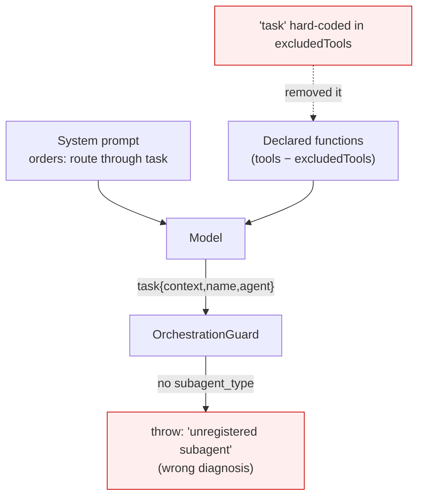

# ADR-013: Hide the delegation tool only from agents without subagents, and make provider rejections diagnosable

**Category:** Orchestration and provider observability
**Author:** Claude (investigation and implementation), directed by David Balladares
**Date:** 2026-08-26

## Status

Accepted — 2026-08-26

> **On the number:** this is 013 because **012 is taken three times** —
> `ADR-012-arrow-key-selection-prompts`, `ADR-012-cli-wait-indicator-and-transient-line-contract`
> and `ADR-012-shipped-working-guides-and-consumer-decision-records`, written in
> parallel sessions. Renumbering them is deliberately not done: it would rewrite
> cross-references inside published records. See the note in the index.

## Context

Two failures surfaced while running Umbra by hand, and they turned out to be
unrelated to each other.

`umbra orchestrate` died with *"Orchestration guard rejected an unregistered
subagent. Only researcher, coder, and verifier are allowed."* The message was
false: the model **had** asked for `researcher`.

Three sessions of `umbra deep` died with *"Google request failed with status code
400"* after a successful tool call, with no further detail.

Reading the LangSmith traces answered the first and exposed a third problem: the
failing runs of the day had left **no trace at all**. The most recent trace in
the project predated them, so the sessions worth debugging were exactly the ones
with nothing to read.

## Decision

### `task` is hidden only from an agent that has no subagents

The rejection had four links, each verified in trace
`01a03ac3-135c-7663-92a8-ae5c9428faa8`:

1. The functions declared to Vertex were `ask_codebase`,
   `refresh_project_index`, `run_integrity_check`, `write_todos`. **`task` was
   absent.**
2. Vertex said so: `finish_reason: UNEXPECTED_TOOL_CALL`,
   `finish_message: "Model tried to call an undeclared function: task"`.
3. The model called it regardless — the prompt orders it to route
   `researcher -> coder -> verifier` — and, having never seen the declaration,
   guessed the argument names: `{context, name, agent}` instead of
   `{description, subagent_type}`.
4. `getGuardedSubagent` reads `args.subagent_type`, found nothing, and threw.

The cause is link 1, and it was two lines: `'task'` was hard-coded into
`excludedTools` for **both** providers — `registerGeminiHarnessProfile` and the
Ollama profile — so `orchestrate` could never delegate, on any provider, by
construction. deepagents removes those names through `_ToolExclusionMiddleware`,
which filters `request.tools` by name before every model call.

The exclusion protected nothing: `task`'s schema is
`{description: string, subagent_type: string}`, two plain strings, and it
converts cleanly through the Gemini converter (verified directly). And it was
never the intent — the comment above it says *"we still exclude `task` for the
simple agent (same reason as Gemini: no subagent delegation)"*. The rule was
always about the simple agent; it was applied to all three modes.

`bootstrap` now takes `hasSubagents`, default `false`, and only
`createOrchestrator` passes `true`.

**Accepted limit:** `registerHarnessProfile` is global and keyed by model, so the
last registration for a given model wins within one process. Each CLI command is
its own process, but a library consumer that builds `create()` and
`createOrchestrator()` with the same model in one process gets the second one's
profile. Recorded rather than solved.

### The guard says which of the two things went wrong

`getGuardedSubagent` returns `undefined` both when `subagent_type` is missing and
when its value is not one of the three, and a single sentence covered both. That
sentence sent a real investigation to the wrong place. `describeSubagentRejection`
now names the missing argument and lists the keys that did arrive, or names the
rejected value. **The policy is unchanged; only the diagnosis is.**

### Trace batches are flushed before the process exits

`flushPendingTraces` waits for `Client.awaitPendingTraceBatches()`, bounded by a
short timeout, and only when tracing is actually configured. Both exit paths call
it: `cleanupAndExit` in `src/bin/cli.ts` (SIGINT/SIGTERM) and
`ChatSession#shutdown`, which is reached from six places including the Ctrl+C of
the approval gate.

Two ordering details matter and are load-bearing:

- The farewell is written **before** the wait, so the session visibly ends and
  the bounded pause happens behind a finished screen.
- The flush prints nothing. Any line it printed would have to declare its
  printable width under the transient-line contract of
  [ADR-012 (wait indicator)](./ADR-012-cli-wait-indicator-and-transient-line-contract.md);
  printing nothing keeps it out of that contract entirely.

`shutdown()` became `async`; every call site was already an event handler
discarding the return value.

### A rejected provider request is captured, redacted, in its own file

The 400 is **not diagnosed**. What is known: the rejected history was
`[System 13281 chars] [Human 112] [AIMessageChunk 0 chars, 1 tool_call] [ToolMessage 618]`;
the called function was `list_files` and it **was** declared, so this is not the
defect above; the history carries `"signatures":["AY89a184I9CT…"]`, Gemini 3.x
thought signatures; and it is not the model — in the same window
`gemini-3.5-flash` shows 11 successes and 0 failures.

`VertexChatAdapter` already carries **two** patches for this area
(`disableStreaming` for the signatures, and the function-response role rewrite
for Gemini 3.5). A third hypothesis without evidence is how a third patch that
also does not close it gets written. So this ADR instruments instead of guessing.

The message is empty of detail because `_throwRequestError` in
`@langchain/google-common` includes the response body only when it is non-empty,
and here it was empty. The request context, however, is attached as
`error.details = { url, opts, fetchOptions }`.

⚠️ **That object is credential-bearing.** `ApiKeyGoogleAuth.request()` injects
`X-Goog-Api-Key` into `fetchOptions.headers`, and the service-account client
injects `Authorization: Bearer …`. `extractProviderDiagnostic` therefore copies
named fields out — url, method, status, body — and **never** spreads `details`
and never touches headers. A test asserts the credential appears in no field.

The snapshot goes to `.agent/diagnostics/<auditId>.json`, **not** into
`interactive-turns.jsonl`. That file hashes the thread id, excludes payloads and
is read by `umbra metrics`; it is meant to be shareable. A request body carries
the system prompt and the content of every file the agent read. Only the path
crosses into the audit record, as `providerDiagnosticFile`.

### A prompt may not name a tool the model cannot call

`docs/deferred-work.md` had recorded that `ask_human` is instructed in the prompt
and registered in no tool list, and called it *"the same shape as the
`deleteFileTool` defect"* of [ADR-011](./ADR-011-path-containment-and-real-approval.md).
It is a pattern, and it had four instances: `delete_file` (fixed in ADR-011),
`ask_human`, and `task` in all three modes.

`src/core/agent/prompt-tool-contract.spec.ts` closes it for the `simple` mode:
every tool name that prompt uses must be a tool the mode declares. The names come
from the tool objects, not retyped, so a rename cannot desynchronise the check.
The six `ask_human` mentions were rewritten to describe what actually happens —
the security policy stops the gated action and raises the operator prompt itself,
with no tool call involved.

**Scoped to `simple` on purpose.** The three modes share one base prompt written
for that mode. `orchestrator` declares three tools and `analysis` declares none
(`tools: []`, manifest-only by design), so both inherit instructions for tools
they do not have — and `analysis` also names tools deliberately to *forbid* them,
which no textual check can distinguish from an instruction to use one. Splitting
the base per mode changes what the model reads and is recorded as its own item in
`docs/deferred-work.md`, with the evidence, rather than guessed at here.



## Trade-offs actually evaluated

| Decision point | Options | Chosen | Why the other lost |
|---|---|---|---|
| The 400 | Patch the adapter on the thought-signature hypothesis vs instrument and wait for evidence | Instrument | The adapter already holds two patches for this area; a third without evidence is how they accumulate. Decided by David. |
| Where the diagnostic is stored | Inside `interactive-turns.jsonl` vs its own file | Its own file | The JSONL hashes the thread id, excludes payloads and is read by `umbra metrics`. A request body carries the system prompt and file contents. |
| `task` in the simple mode | Never exclude it vs exclude only where there are no subagents | Exclude where there are none | Declaring a delegation tool with no subagents behind it invites a call that cannot work. Decided by David. |
| The contract test's reach | All three modes with an exception list vs `simple` only | `simple` only | Five documented exceptions is how a guard becomes decoration. Decided by David. |

## Consequences

### Positive

- `orchestrate` can delegate, on Gemini and on Ollama.
- A guard rejection names the actual defect.
- A failing session leaves a trace, which is the precondition for diagnosing
  anything that involves the provider.
- The next 400 arrives with the request that caused it.

### Neutral

- Exit takes up to the flush timeout longer when tracing is on; usually zero.
- `.agent/diagnostics/` is a new directory. It is inside the already-ignored
  `.agent/`, so nothing new reaches git.

### Negative — accepted

- **The 400 is still open.** This ADR does not fix it; it makes the next one
  legible.
- **The orchestrator still does not complete its route.** With the declaration
  fixed, a live run reached the *delegation policy* and stopped there with
  *"Researcher already ran for this request; use its handoff."* That is a
  different layer from the one this ADR touches, and it is unproven whether it is
  a defect or the recursion limit of the probe. Recorded, not fixed.
- **Two prompts still name tools they cannot call** (`orchestrator`, `analysis`).
  In `docs/deferred-work.md` with the evidence.
- `registerHarnessProfile`'s per-model global remains, as described above.

## Verification Evidence

Before the change, from the trace and from a simulation that reproduced it
exactly:

```
excludedTools                : grep, glob, ls, read_file, write_file, edit_file, task
declared to Vertex (trace)   : ask_codebase, refresh_project_index, run_integrity_check, write_todos
```

After the change, per mode, by intercepting the registration:

```
deep / analysis (no subagents) : task excluded      → correct
orchestrate, Gemini            : task NOT excluded  → correct
orchestrate, Ollama            : task NOT excluded  → correct
```

**A live orchestrator run** in a throwaway workspace, with the route classifier
marking `implementation=true`:

```
Required route: researcher -> coder -> verifier
tools called   : write_todos
error          : "Researcher already ran for this request; use its handoff."
guard rejected an unregistered subagent? NO
```

The old message is gone and the run now reaches the delegation policy — which is
only reachable once `task` has been declared, called, and accepted by the
subagent check. Confirmed in the trace of that run:

```
FUNCIONES DECLARADAS: ask_codebase, refresh_project_index, run_integrity_check, write_todos, task
```

Suite and build:

- `npx tsc --noEmit` — clean.
- `npm run build` — clean.
- `npx jest --runInBand` — 38 suites, 261 passed, 4 skipped, 0 failed. Baseline
  before this work was 34 suites and 228 tests.

**Not proven end to end:** the flush. Its contract is covered by unit tests
(waits when tracing is on, no-ops when off, gives up at the timeout, survives a
failing or unconstructible client) and the mechanism is unambiguous, but the live
probe used here exited without calling it, so it is not evidence. The honest
end-to-end check is a Ctrl+C during a real session followed by looking for the
trace.

## DDD layer mapping

| Layer | Component / File Path | Impact / Role |
|---|---|---|
| Application | `src/core/agent/deep-agent-factory.ts` — `bootstrap`, `registerGeminiHarnessProfile`, `createOrchestrator` | Decides what each mode declares to the provider. |
| Application | `src/core/agent/orchestration-guard.middleware.ts` — `describeSubagentRejection` | Diagnosis of a refused delegation. |
| Infrastructure | `src/core/observability/trace-flush.ts` — `flushPendingTraces`, `isTracingEnabled` | Makes observability survive process exit. |
| Presentation | `src/presentation/cli/provider-diagnostics.ts` — `extractProviderDiagnostic`, `writeProviderDiagnostic` | Redacted capture of a rejected request. |
| Presentation | `src/presentation/cli/turn-audit.ts` — `TurnAudit#record` | Carries the diagnostic's path, never its payload. |
| Presentation | `src/bin/cli.ts` — `cleanupAndExit`; `src/presentation/cli/chat-session.ts` — `shutdown` | The two exit paths. |

## Related Files

- `src/core/agent/deep-agent-factory.ts` — `bootstrap`, `registerGeminiHarnessProfile`, `detectGeminiIncompatibleTools`, `createOrchestrator`, `buildSystemPrompt`.
- `src/core/agent/deep-agent-factory.spec.ts` — the two exclusion tests.
- `src/core/agent/orchestration-guard.middleware.ts` — `describeSubagentRejection`, `getGuardedSubagent`.
- `src/core/agent/prompt-tool-contract.spec.ts` — the prompt/declaration contract.
- `src/core/observability/trace-flush.ts` — `flushPendingTraces`, `isTracingEnabled`.
- `src/presentation/cli/provider-diagnostics.ts` — `extractProviderDiagnostic`, `writeProviderDiagnostic`.
- `src/presentation/cli/turn-audit.ts` — `TurnAudit#record`, `TurnAuditRecord.providerDiagnosticFile`.
- `src/bin/cli.ts` — `cleanupAndExit`.
- `src/presentation/cli/chat-session.ts` — `shutdown`.
- `docs/deferred-work.md` — the `ask_human` amendment and the per-mode prompt entry.
