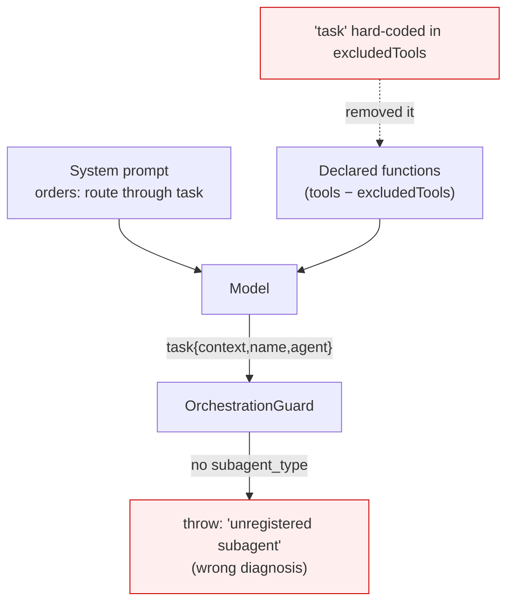

# ADR-013: Hide the delegation tool only from agents without subagents, and make provider rejections diagnosable

**Category:** Orchestration and provider observability
**Author:** Claude (investigation and implementation), directed by David Balladares
**Date:** 2026-08-26

## Status

Accepted — amended 2026-08-28

> **On the number:** this is 013 because **012 is taken three times** —
> `ADR-012-arrow-key-selection-prompts`, `ADR-012-cli-wait-indicator-and-transient-line-contract`
> and `ADR-012-shipped-working-guides-and-consumer-decision-records`, written in
> parallel sessions. Renumbering them is deliberately not done: it would rewrite
> cross-references inside published records. See the note in the index.

## Context

Two failures surfaced while running Umbra by hand, and they turned out to be
unrelated to each other.

`umbra orchestrate` died with *"Orchestration guard rejected an unregistered
subagent. Only researcher, coder, and verifier are allowed."* The message was
false: the model **had** asked for `researcher`.

Three sessions of `umbra deep` died with *"Google request failed with status code
400"* after a successful tool call, with no further detail.

Reading the LangSmith traces answered the first and exposed a third problem: the
failing runs of the day had left **no trace at all**. The most recent trace in
the project predated them, so the sessions worth debugging were exactly the ones
with nothing to read.

## Decision

### `task` is hidden only from an agent that has no subagents

The rejection had four links, each verified in trace
`01a03ac3-135c-7663-92a8-ae5c9428faa8`:

1. The functions declared to Vertex were `ask_codebase`,
   `refresh_project_index`, `run_integrity_check`, `write_todos`. **`task` was
   absent.**
2. Vertex said so: `finish_reason: UNEXPECTED_TOOL_CALL`,
   `finish_message: "Model tried to call an undeclared function: task"`.
3. The model called it regardless — the prompt orders it to route
   `researcher -> coder -> verifier` — and, having never seen the declaration,
   guessed the argument names: `{context, name, agent}` instead of
   `{description, subagent_type}`.
4. `getGuardedSubagent` reads `args.subagent_type`, found nothing, and threw.

The cause is link 1, and it was two lines: `'task'` was hard-coded into
`excludedTools` for **both** providers — `registerGeminiHarnessProfile` and the
Ollama profile — so `orchestrate` could never delegate, on any provider, by
construction. deepagents removes those names through `_ToolExclusionMiddleware`,
which filters `request.tools` by name before every model call.

The exclusion protected nothing: `task`'s schema is
`{description: string, subagent_type: string}`, two plain strings, and it
converts cleanly through the Gemini converter (verified directly). And it was
never the intent — the comment above it says *"we still exclude `task` for the
simple agent (same reason as Gemini: no subagent delegation)"*. The rule was
always about the simple agent; it was applied to all three modes.

`bootstrap` now takes `hasSubagents`, default `false`, and only
`createOrchestrator` passes `true`.

**Accepted limit:** `registerHarnessProfile` is global and keyed by model, so the
last registration for a given model wins within one process. Each CLI command is
its own process, but a library consumer that builds `create()` and
`createOrchestrator()` with the same model in one process gets the second one's
profile. Recorded rather than solved.

### The guard says which of the two things went wrong

`getGuardedSubagent` returns `undefined` both when `subagent_type` is missing and
when its value is not one of the three, and a single sentence covered both. That
sentence sent a real investigation to the wrong place. `describeSubagentRejection`
now names the missing argument and lists the keys that did arrive, or names the
rejected value. **The policy is unchanged; only the diagnosis is.**

### Trace batches are flushed before the process exits

`flushPendingTraces` waits for `Client.awaitPendingTraceBatches()`, bounded by a
short timeout, and only when tracing is actually configured. Both exit paths call
it: `cleanupAndExit` in `src/bin/cli.ts` (SIGINT/SIGTERM) and
`ChatSession#shutdown`, which is reached from six places including the Ctrl+C of
the approval gate.

Two ordering details matter and are load-bearing:

- The farewell is written **before** the wait, so the session visibly ends and
  the bounded pause happens behind a finished screen.
- The flush prints nothing. Any line it printed would have to declare its
  printable width under the transient-line contract of
  [ADR-012 (wait indicator)](./ADR-012-cli-wait-indicator-and-transient-line-contract.md);
  printing nothing keeps it out of that contract entirely.

`shutdown()` became `async`; every call site was already an event handler
discarding the return value.

### A rejected provider request is captured, redacted, in its own file

The 400 is **not diagnosed**. What is known: the rejected history was
`[System 13281 chars] [Human 112] [AIMessageChunk 0 chars, 1 tool_call] [ToolMessage 618]`;
the called function was `list_files` and it **was** declared, so this is not the
defect above; the history carries `"signatures":["AY89a184I9CT…"]`, Gemini 3.x
thought signatures; and it is not the model — in the same window
`gemini-3.5-flash` shows 11 successes and 0 failures.

`VertexChatAdapter` already carries **two** patches for this area
(`disableStreaming` for the signatures, and the function-response role rewrite
for Gemini 3.5). A third hypothesis without evidence is how a third patch that
also does not close it gets written. So this ADR instruments instead of guessing.

The message is empty of detail because `_throwRequestError` in
`@langchain/google-common` includes the response body only when it is non-empty,
and here it was empty. The request context, however, is attached as
`error.details = { url, opts, fetchOptions }`.

⚠️ **That object is credential-bearing.** `ApiKeyGoogleAuth.request()` injects
`X-Goog-Api-Key` into `fetchOptions.headers`, and the service-account client
injects `Authorization: Bearer …`. `extractProviderDiagnostic` therefore copies
named fields out — url, method, status, body — and **never** spreads `details`
and never touches headers. A test asserts the credential appears in no field.

The snapshot goes to `.agent/diagnostics/<auditId>.json`, **not** into
`interactive-turns.jsonl`. That file hashes the thread id, excludes payloads and
is read by `umbra metrics`; it is meant to be shareable. A request body carries
the system prompt and the content of every file the agent read. Only the path
crosses into the audit record, as `providerDiagnosticFile`.

### A prompt may not name a tool the model cannot call

`docs/deferred-work.md` had recorded that `ask_human` is instructed in the prompt
and registered in no tool list, and called it *"the same shape as the
`deleteFileTool` defect"* of [ADR-011](./ADR-011-path-containment-and-real-approval.md).
It is a pattern, and it had four instances: `delete_file` (fixed in ADR-011),
`ask_human`, and `task` in all three modes.

`src/core/agent/prompt-tool-contract.spec.ts` closes it for the `simple` mode:
every tool name that prompt uses must be a tool the mode declares. The names come
from the tool objects, not retyped, so a rename cannot desynchronise the check.
The six `ask_human` mentions were rewritten to describe what actually happens —
the security policy stops the gated action and raises the operator prompt itself,
with no tool call involved.

**Scoped to `simple` on purpose.** The three modes share one base prompt written
for that mode. `orchestrator` declares three tools and `analysis` declares none
(`tools: []`, manifest-only by design), so both inherit instructions for tools
they do not have — and `analysis` also names tools deliberately to *forbid* them,
which no textual check can distinguish from an instruction to use one. Splitting
the base per mode changes what the model reads and is recorded as its own item in
`docs/deferred-work.md`, with the evidence, rather than guessed at here.



## Trade-offs actually evaluated

| Decision point | Options | Chosen | Why the other lost |
|---|---|---|---|
| The 400 | Patch the adapter on the thought-signature hypothesis vs instrument and wait for evidence | Instrument | The adapter already holds two patches for this area; a third without evidence is how they accumulate. Decided by David. |
| Where the diagnostic is stored | Inside `interactive-turns.jsonl` vs its own file | Its own file | The JSONL hashes the thread id, excludes payloads and is read by `umbra metrics`. A request body carries the system prompt and file contents. |
| `task` in the simple mode | Never exclude it vs exclude only where there are no subagents | Exclude where there are none | Declaring a delegation tool with no subagents behind it invites a call that cannot work. Decided by David. |
| The contract test's reach | All three modes with an exception list vs `simple` only | `simple` only | Five documented exceptions is how a guard becomes decoration. Decided by David. |

## Consequences

### Positive

- `orchestrate` can delegate, on Gemini and on Ollama.
- A guard rejection names the actual defect.
- A failing session leaves a trace, which is the precondition for diagnosing
  anything that involves the provider.
- The next 400 arrives with the request that caused it.

### Neutral

- Exit takes up to the flush timeout longer when tracing is on; usually zero.
- `.agent/diagnostics/` is a new directory. It is inside the already-ignored
  `.agent/`, so nothing new reaches git.

### Negative — accepted

- **The 400 is still open.** This ADR does not fix it; it makes the next one
  legible.
- **The orchestrator still does not complete its route.** With the declaration
  fixed, a live run reached the *delegation policy* and stopped there with
  *"Researcher already ran for this request; use its handoff."* That is a
  different layer from the one this ADR touches, and it is unproven whether it is
  a defect or the recursion limit of the probe. Recorded, not fixed.
- **Two prompts still name tools they cannot call** (`orchestrator`, `analysis`).
  In `docs/deferred-work.md` with the evidence.
- `registerHarnessProfile`'s per-model global remains, as described above.

## Verification Evidence

Before the change, from the trace and from a simulation that reproduced it
exactly:

```
excludedTools                : grep, glob, ls, read_file, write_file, edit_file, task
declared to Vertex (trace)   : ask_codebase, refresh_project_index, run_integrity_check, write_todos
```

After the change, per mode, by intercepting the registration:

```
deep / analysis (no subagents) : task excluded      → correct
orchestrate, Gemini            : task NOT excluded  → correct
orchestrate, Ollama            : task NOT excluded  → correct
```

**A live orchestrator run** in a throwaway workspace, with the route classifier
marking `implementation=true`:

```
Required route: researcher -> coder -> verifier
tools called   : write_todos
error          : "Researcher already ran for this request; use its handoff."
guard rejected an unregistered subagent? NO
```

The old message is gone and the run now reaches the delegation policy — which is
only reachable once `task` has been declared, called, and accepted by the
subagent check. Confirmed in the trace of that run:

```
FUNCIONES DECLARADAS: ask_codebase, refresh_project_index, run_integrity_check, write_todos, task
```

Suite and build:

- `npx tsc --noEmit` — clean.
- `npm run build` — clean.
- `npx jest --runInBand` — 38 suites, 261 passed, 4 skipped, 0 failed. Baseline
  before this work was 34 suites and 228 tests.

**Not proven end to end:** the flush. Its contract is covered by unit tests
(waits when tracing is on, no-ops when off, gives up at the timeout, survives a
failing or unconstructible client) and the mechanism is unambiguous, but the live
probe used here exited without calling it, so it is not evidence. The honest
end-to-end check is a Ctrl+C during a real session followed by looking for the
trace.

## DDD layer mapping

| Layer | Component / File Path | Impact / Role |
|---|---|---|
| Application | `src/core/agent/deep-agent-factory.ts` — `bootstrap`, `registerGeminiHarnessProfile`, `createOrchestrator` | Decides what each mode declares to the provider. |
| Application | `src/core/agent/orchestration-guard.middleware.ts` — `describeSubagentRejection` | Diagnosis of a refused delegation. |
| Infrastructure | `src/core/observability/trace-flush.ts` — `flushPendingTraces`, `isTracingEnabled` | Makes observability survive process exit. |
| Presentation | `src/presentation/cli/provider-diagnostics.ts` — `extractProviderDiagnostic`, `writeProviderDiagnostic` | Redacted capture of a rejected request. |
| Presentation | `src/presentation/cli/turn-audit.ts` — `TurnAudit#record` | Carries the diagnostic's path, never its payload. |
| Presentation | `src/bin/cli.ts` — `cleanupAndExit`; `src/presentation/cli/chat-session.ts` — `shutdown` | The two exit paths. |

## Related Files

- `src/core/agent/deep-agent-factory.ts` — `bootstrap`, `registerGeminiHarnessProfile`, `detectGeminiIncompatibleTools`, `createOrchestrator`, `buildSystemPrompt`.
- `src/core/agent/deep-agent-factory.spec.ts` — the two exclusion tests.
- `src/core/agent/orchestration-guard.middleware.ts` — `describeSubagentRejection`, `getGuardedSubagent`.
- `src/core/agent/prompt-tool-contract.spec.ts` — the prompt/declaration contract.
- `src/core/observability/trace-flush.ts` — `flushPendingTraces`, `isTracingEnabled`.
- `src/presentation/cli/provider-diagnostics.ts` — `extractProviderDiagnostic`, `writeProviderDiagnostic`.
- `src/presentation/cli/turn-audit.ts` — `TurnAudit#record`, `TurnAuditRecord.providerDiagnosticFile`.
- `src/bin/cli.ts` — `cleanupAndExit`.
- `src/presentation/cli/chat-session.ts` — `shutdown`.
- `docs/deferred-work.md` — the `ask_human` amendment and the per-mode prompt entry.

---

## Amendment — 2026-08-26

Two statements in the Negative section are now settled, and running the fixed
orchestrator produced a third finding. The original text stands; this records
what the live runs proved.

### The route failure was a defect, and it is fixed

The record said *"it is unproven whether it is a defect or the recursion limit of
the probe"*. It was a defect, reproduced on the first turn of a real session with
no delegation history at all:

```
You: quiero que mejorar los ksills tuyos ...
  write_todos ✓
  ✗ Researcher already ran for this request; use its handoff.
```

`evaluateDelegation` allows a researcher only while `researcherCalls === 0`, and
LangGraph appends the assistant message holding a tool call **before** the tool
runs. So the guard read its own pending request as history, counted one, and
refused. Proven deterministically against the real functions:

```
with the in-flight message in the list : researcherCalls 1 → rejected
without it                            : researcherCalls 0 → allowed
```

`readDelegationHistory` now takes the in-flight `tool_call_id` and excludes it.
Counting *attempts* rather than completed calls is unchanged and deliberate — a
subagent that crashed without a result must not be retried forever — so only the
call under authorization is skipped.

**Why no test caught it:** every fixture in
`orchestration-guard.middleware.spec.ts` hands `readDelegationHistory` a history
assembled by hand, as if the turn had ended. None passed what the middleware
actually receives. The tests and reality differed precisely in the message that
causes the bug. The new cases drive `createOrchestrationGuard().wrapToolCall`
directly, with the in-flight assistant message present.

### The orchestrator delegates, verified live

Same throwaway workspace, `implementation=true` route, `dist/` rebuilt:

```
write_todos ✓
task ✓                                    ← researcher, completed
task {subagent_type:"coder"} →
    list_files ✓  safe_read_file ✓  safe_write_file ✓  safe_read_file ✓  run_integrity_check ✓
task ✓                                    ← coder, completed
run_integrity_check ✓
"already ran"? NO
```

The researcher handed off, the coder wrote the file and verified it. That path had
never executed.

### New finding: harness exclusions do not reach subagents

That run then died on something else:

```
Error invoking tool 'read_file' with kwargs {"path":"src/app.ts"}:
Received tool input did not match expected schema
```

`read_file` is in `detectGeminiIncompatibleTools`' baseline exclusion list, and no
subagent spec declares it — `createCoderSubAgent` lists only
`safe_write_file`, `safe_read_file`, `list_files`, `run_tests`,
`run_integrity_check`. It reached the subagent from deepagents' own filesystem
middleware, and the exclusion never applied there: `_ToolExclusionMiddleware`
wraps the **main** agent's model call, while each subagent is a separate graph
with its own middleware stack.

It is the mirror image of this ADR's main defect. There, a tool the prompt
demanded was withheld from the model. Here, a tool withheld from the main agent
*for being broken* is handed to the subagents, where nothing checks. Both come
from the same blind spot: **the set of tools the model can call is assembled in
more than one place, and only one of them is verified.**

Not fixed here — it is a change to what the subagents can call, which is its own
decision. Recorded in `docs/deferred-work.md` with this evidence.

Related files added by the amendment:

- `src/core/agent/orchestration-guard.middleware.ts` — `readDelegationHistory` (in-flight exclusion), `createOrchestrationGuard`.
- `src/core/agent/orchestration-guard.middleware.spec.ts` — the cases that drive `wrapToolCall` directly.

---

## Amendment — 2026-08-28: the exclusion returns, for the opposite reason

This record reversed a `task` exclusion because the tool was withheld from the
provider while three prompts ordered the model to delegate through it. That
diagnosis was right and the fix was right.

`task` is now excluded from the orchestrator again, and the reason is the
opposite one. The orchestrator declares its own `delegate`, whose schema is the
delegation order itself
([ADR-023](./ADR-023-interlocking-triage-readback-and-balanced-books.md)), so
`task` would be a second way to do one thing rather than the only way to do it.
The rule this record established is unchanged and is what makes the new exclusion
safe: the prompt names only tools the mode declares, and a contract test now
fails if the orchestrator prompt orders a `task` call — which it immediately did
for four route instructions.

---

## Amendment — 2026-09-21: the flush awaited a queue that was empty by construction

This record states that flushing pending traces makes observability survive
process exit, and its own Verification Evidence admits the property was never
proven end to end. It was never proven because it did not hold.

`flushPendingTraces` in `src/core/observability/trace-flush.ts` constructed
`new Client()` and awaited *that instance's* `awaitPendingTraceBatches()`. A
LangSmith client's pending-batch state is per instance — `_pendingDrains` is
defined on `this` in `langsmith/dist/client.js` — while the tracer posts through
the module singleton, `getDefaultLangChainClientSingleton()` in
`@langchain/core/dist/tracers/tracer_langchain.js`. A freshly constructed client
has an empty queue by definition, so the flush returned immediately while the
real batch was still in flight, and the runs worth debugging were exactly the
ones missing from the project.

It now awaits `awaitAllCallbacks()` from `@langchain/core/callbacks/promises`,
which settles both halves that matter: the background callback queue a tracer
enqueues into (`queue.onIdle()`) and that singleton's pending batches. Everything
else this record decided is kept — the `isTracingEnabled` gate, the 2 s bound,
the catch that swallows a failed flush, and the rule that this path prints
nothing.

The visible consequence is real and intended: Ctrl+C can now genuinely wait up to
the bound, because there is now something to wait for. This record's own ordering
— the farewell is printed before the wait — already absorbs it.

Note for a future reader: the comment near `DeepAgentFactory` claiming
`deepagents` vendors its own copy of `@langchain/core` is false. There is exactly
one `@langchain/core` in this tree, which is why this fix reaches the singleton
the tracer uses. Had it been true, it would not.

### Verification evidence

`npx jest --runInBand src/core/observability/trace-flush.spec.ts` — 8 passed. The
suite's mock target moved from the `langsmith` module to the callback barrier,
which is the point: mocking the client was mocking the wrong object.

---

## Amendment — 2026-09-23: the delegate contract assumed the tool it should have checked

This record's contract test stops a prompt naming a tool its model cannot call.
For the deep prompt it worked. For the delegates it could not, because it
supplied its own answer.

The delegate block of `src/core/agent/prompt-tool-contract.spec.ts` built each
delegate's declared set as its tools **plus `write_todos`**, under the comment
*deepagents contributes the todo list to every subagent*. It does not. Umbra's
delegates are compiled by `compile` in
`src/core/agent/delegation/subagent-registry.ts` with plain `createAgent`, which
installs no todo middleware. Compiled and listed, neither delegate holds the
tool:

- Coder — `safe_write_file, safe_read_file, list_files, run_tests,
  run_integrity_check, list_adrs, ask_delegator`
- Researcher — `ask_codebase, inspect_project, search_workspace,
  refresh_project_index, safe_read_file, list_files, list_adrs, ask_delegator`

Yet step 1 of the Coder's mandatory protocol was *Call write_todos with the
complete implementation steps*, the Researcher's was *Call write_todos with your
investigation steps*, and the Researcher's tool list advertised it. Both were
told, as their first instruction, to call a tool they do not have. The test
passed because it declared the tool it was meant to be checking.

It also misled a review. An external audit of 2026-09-16, verified by two
adversarial passes, planned around delegates that *had* `write_todos` — it read
the prompts and believed them. A prompt is an assertion about a tool; the
compiled agent is the fact.

### What changed

- The delegate test now reads `declaredToolNames` — the compiled delegate's
  tools, nothing added by assumption. It was run first and failed for the Coder
  and the Researcher, which is the reason it exists; the Verifier, whose prompt
  never named the tool, passed.
- `CODER_SYSTEM_PROMPT` and `RESEARCHER_SYSTEM_PROMPT` keep the discipline and
  drop the tool: list the steps before writing, state the investigation before
  calling anything, never count a step done without disk confirmation.

The Coder and the Researcher were therefore **not** given `write_todos`. They
have run without it since they were written, so whatever they achieve they
achieve without it; adding it would add cost for a benefit no measurement
supports. `UNBUDGETED_TOOLS` in `subagent-budget.middleware.ts` still exempts
`write_todos` from the attempt count — correct should a delegate ever receive it,
and unreachable until one does.

---

## Amendment — 2026-09-23 (second): a builtin nobody declared, and a prompt nobody checked

Two more cases of the defect this record exists to prevent, both surfaced by
upgrading deepagents to 1.14 and measuring the real agent.

### `delete` reached every provider

deepagents 1.14 contributes a `delete` tool — "Permanently removes the file or
directory... recursively... This cannot be undone" — and it was not in
`REPLACED_BUILTIN_TOOLS` in `src/core/agent/deep-agent-factory.ts`, so the
harness profiles of all three providers let it through.

Umbra passes no `backend`, so deepagents' default `StateBackend` applies and the
tool removes only a virtual file. That is its own defect: the model is told a
real file is gone when it is not. `SafeFilesystemBackend` extends the real
`FilesystemBackend` and is used only inside Umbra's own tools; were it ever
passed as the agent's `backend`, `delete` would remove directories recursively
without passing through `AgentSecurityPolicy`. It is now excluded alongside the
other builtins Umbra replaces — `delete_file` is the guarded replacement.

No type check and no unit test saw it: every test that builds a deep agent
mocks `deepagents`. It surfaced as a tool name in `npm run bench:floor`.

### The MCP advisor's prompt was the orchestrator's

`DeepAgentFactory#buildSystemPrompt` had branches for `simple` and `analysis`,
and everything else fell through to the orchestrator's prompt — `mcp`
included. The read-only advisor behind the published `continue_conversation`
tool resolves seven read tools and has nothing to delegate to, and on every
conversation turn it was told that it coordinates a researcher, a coder and a
verifier through `delegate` and plans with `write_todos`.

`prompt-tool-contract.spec.ts` now covers the `mcp` prompt against the tools
`createMcpAdvisorRoleProfile` resolves. It was run first and failed for the
right reasons — it named `refresh_project_index`, `run_integrity_check` and
`write_todos`, and called itself ORCHESTRATOR. A second assertion checks the
delegation instruction directly, because `delegate` lives in
`src/core/agent/delegation/` and is not in the vocabulary the first check
recognises; without it the advisor could still read "delegate to the coder"
and pass.

The prompt's own tool list is derived from the advisor's profile when the
prompt is built, so it cannot drift from what the advisor holds. The decision
itself is recorded in ADR-036.
