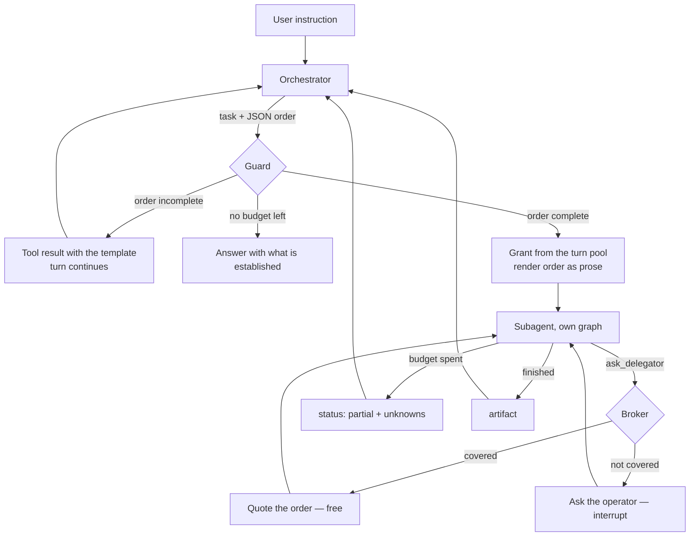

# ADR-014: Give a delegation an order, a shared budget, and a way to ask

Category: Orchestration and runtime behavior

Author: Claude, with David

Date: 2026-08-27

## Status

Accepted — 2026-08-27

## Context

An `umbra orchestrate` session on 2026-08-27 failed twice in a row, in two
different ways, on the same user request: *"quiero que mejores los skills tuyos,
revisalos y sugerime cambios"*.

The first attempt died immediately on `Researcher already ran for this request;
use its handoff.` — with no researcher having run. That symptom had a known
cause, fixed in commit `5c0e476`: the guard was counting the delegation it was
authorizing.

The second attempt got past the guard and died differently. The Researcher
issued six semantic searches — architecture, modules, repositories, DTOs, error
handling, authentication — interleaved with `write_todos`, and ended on
`Recursion limit of 50 reached without hitting a stop condition`. Eighteen tool
calls, no handoff, nothing usable.

Reading the source of `deepagents@dist/index.js` explained all of it, and none
of the explanations were about the guard.

**A subagent receives one message, and it is not the conversation.**
`createTaskTool` builds the delegate's state and then overwrites its history:

```js
subagentState.messages = [new HumanMessage({ content: description })];
```

Everything the delegate can ever know is the `description` string. In the failed
run that string was `"List all files in the skills/ directory"` — the
orchestrator's own narrowing of the request. The Researcher never saw what the
user actually asked, had no channel to ask about it, and did the only thing left:
it explored, looking for the intent it had not been given.

**The recursion limit is not a turn budget.** The same function spreads the
parent's config into the delegate's invocation and starts a fresh graph run:

```js
const subagentConfig = { ...config, configurable: { ...config.configurable, ls_agent_type: "subagent" } };
const result = await subagent.invoke(subagentState, subagentConfig);
```

`recursionLimit` travels in that spread, and a fresh `invoke` means a fresh
allowance. A turn configured for 50 transitions can spend 50 in the orchestrator
plus 50 in each delegation. The Researcher did not overrun a shared ceiling; it
consumed an entire private one while the orchestrator learned nothing until the
exception surfaced.

[ADR-008](./ADR-008-bounded-interactive-iteration-audit.md) bounded the
single-agent path and recorded, as a neutral consequence, that *"the orchestrated
multi-agent path keeps its separate delegation and retry controls"*. Those
controls bound how often work is delegated. Nothing bounded what a delegate spent
once it started.

**A crashed delegate consumed the turn permanently.** `evaluateDelegation`
permits a Researcher only while `researcherCalls === 0`, and the count was of
*requests*, not of results. A Researcher killed by the recursion limit had
therefore spent the turn's only researcher slot, and the orchestrator asking
again was refused with the same sentence that opened this record — this time
legitimately, and with no way forward.

Two capabilities that would have limited the damage did not exist. There was no
way to return an unfinished investigation: `researchArtifactSchema` admitted only
`ready` and `blocked`, so an interrupted delegate could produce nothing at all.
And there was no way for a delegate to ask a question: `task` is one call, a
prompt in and an artifact out.

## Decision

Four mechanisms, one principle. The principle, in David's words, is that a
delegation is not a *Message to Garcia*: the agent that delegates hands over
everything it knows, and the agent that executes can ask when that is not enough.

### 1. Every delegation carries a mandate

`src/core/agent/delegation/mandate.ts` defines the order: the user's request
**verbatim**, the orchestrator's objective, what is already known, what is in
scope, what is explicitly out of scope, the definition of done, and the
conventions that constrain the work.

`assertMandateComplete` refuses a delegation missing `userRequest`, `objective`,
`definitionOfDone`, `knownContext` or `inScope` — the fields no amount of
searching can recover. `outOfScope` and `conventions` are encouraged by the
prompt and **not** required: a model forced to fill `outOfScope` on a delegation
with no real exclusions invents a boundary, and an invented boundary is worse
than an absent one because the delegate obeys it.

The `task` schema belongs to `deepagents` and has no field to add, so the order
travels inside `description`. The orchestrator writes it as JSON, which a model
emits reliably inside a string field; the guard renders it into headed prose,
which a model reads; the structured original stays in the turn ledger. The guard
is the translator between the two.

A refused order is returned as a **tool result carrying the template**, not
thrown. Throwing is correct for a protocol violation the model cannot fix and
wrong for a message it can rewrite.

### 2. One budget for the turn

`budget-pool.ts` holds a single pool sized by `limits.maxAgentTurns`, split
28/36/16 between Researcher, Coder and Verifier with **20% held in reserve**. The
reserve is what guarantees the turn can always produce an answer; without it a
greedy delegate consumes everything and the run ends with nothing to say.

An unfinished grant is returned to the pool when a delegation ends, which is what
keeps a correction cycle affordable.

`subagent-budget.middleware.ts` enforces the grant inside the delegate's own
graph. `ask_delegator` and `write_todos` are not charged: charging a delegate for
asking pushes it back toward guessing, and `write_todos` writes to a state key
subagents do not even share with the parent.

### 3. A delegate can ask

`delegation-broker.ts` answers a delegate's question in a fixed order: from the
mandate, **quoted verbatim**; failing that, from the operator through
`interrupt()`; failing that, with an explicit statement that the question went
unanswered.

Relevance against the mandate is decided by word overlap — a heuristic that can
be wrong. It therefore **quotes and never synthesizes**: a wrong match costs a
few tokens, while a synthesized answer from a wrong match would be a confident
fabrication the delegate could not detect.

The interrupt payload carries `kind: 'delegate_question'`. `ChatSession#handleHITL`
assumed every interrupt was an approval, and without a discriminator a question
would render as an authorization to act. Cancelling is not an answer: the
delegate is told the operator declined and records an unknown.

Each mandate allows two questions. That ceiling is inherited from the analysis in
`docs/deferred-work.md` and is **unproven** — the risk is a model that asks about
everything, and no trace has yet shown how a delegate really uses this.

### 4. A failure and an attempt are different things

`delegation-outcome.ts` classifies each ending as `decided`, `partial`,
`refused`, or `infrastructure-failure`. Only `decided` and `partial` spend one of
a role's permitted attempts.

The runaway-retry protection the old rule provided now sits with the budget: a
retry is granted from the same turn allowance, so a failure that repeats runs out
of money without a counter of its own.

`researchArtifactSchema` gains `partial`, `unknowns` and `openQuestions`. A
`ready` handoff still requires a citation; a `partial` one must state its gaps,
because a partial result whose gaps are unstated is indistinguishable from a
complete one. A partial research handoff never authorizes implementation.

### 5. Two smaller corrections found on the way

`list_adrs` is now declared by the Coder and the Verifier. It had been the
Researcher's alone, which left the agent that writes code unable to consult the
decision records of the project it writes in — including a consumer project that
received `docs/adr/` from `umbra init` ([ADR-012](./ADR-012-shipped-working-guides-and-consumer-decision-records.md)).

`prompt-tool-contract.spec.ts` now covers the subagents, closing half of the gap
`docs/deferred-work.md` recorded as *"the set of tools a model can call is
assembled in more than one place, and only one of those places is verified"*.

## Flow



## Alternatives considered

| Solution | Pros | Cons | Decision |
| --- | --- | --- | --- |
| Raise `recursionLimit` again | One-line change | ADR-008 already measured this: at 50, four of five broad requests still reached the limit. It also multiplies per delegation | Rejected |
| Bound only the Researcher, the delegate that failed | Smallest fix | The Coder and Verifier have the same unbounded private allowance; the next failure would be identical with a different name | Rejected |
| A third LLM agent between orchestrator and delegate, holding context (David's first shape of the idea) | Could interpret a question rather than match it | Costs tokens and latency, can hallucinate, and becomes a fourth agent to bound. What the intermediary needs is memory and a budget, not intelligence | Rejected as first step; kept open for when the deterministic broker is measured to be insufficient |
| Merge the Researcher into the orchestrator, which already declares `ask_codebase` | Removes the whole class of problem: a delegate that does not exist cannot be lost | Contradicts ADR-001, and the context isolation it defends is real — a large investigation would flood the orchestrator's window | Rejected. The inconsistency it exposed — the orchestrator holding a research tool its prompt forbids it to use — is recorded as deferred work |
| Require every mandate field, `outOfScope` included | Maximum context for the delegate | Produces fabricated boundaries, which the delegate then obeys | Rejected |
| Let the broker synthesize an answer from the mandate | Reads better for the delegate | A wrong relevance match becomes an undetectable fabrication | Rejected in favour of verbatim quotation |
| Mandate as headed markdown written directly by the model | The delegate reads it unchanged | Heading-exact output from a flash-tier model is brittle; a missed heading loses a field silently | Rejected in favour of JSON in, prose out |
| Keep counting crashed delegations as attempts | Prevents infinite retries | Observed live: it makes a crash permanent for the turn. The budget pool bounds retries by cost instead | Reversed deliberately |

## Consequences

### Positive

- A delegate that runs out of budget hands back what it verified instead of
  raising an exception that discards it.
- A crashed delegation can be retried, and the retry is paid for out of the same
  turn budget rather than being free.
- The cost of a turn is bounded end to end for the first time, and a reserve
  guarantees the turn can answer.
- A delegate with a genuine question reaches the operator without spending an
  orchestrator turn.
- Findings from one delegation are inherited by the next, so work is not
  repeated across a turn.

### Neutral

- The shared workspace `deepagents` already provides — every state key except
  `messages`, `todos`, `structuredResponse`, `skillsMetadata` and
  `memoryContents`, merged back on return — is used for file-shaped work and left
  otherwise unchanged. Live accounting lives in the process-local ledger because
  a subagent's message state is invisible to its parent.
- Modes that do not delegate (`umbra deep`, `umbra analyze`, embedded use) open
  no ledger and behave exactly as before. Absence of a budget is never an error.
- The ledger is process-local and keyed by thread and turn, bounded to 32
  threads. It is not persisted: a resumed session starts a fresh budget.

### Negative

- A single `activeDelegationId` pointer assumes one delegation runs at a time,
  which holds while `maxDelegationDepth` is 1. Enabling parallel delegation
  without replacing this pointer would let two delegates spend each other's
  budget. Stated in the field's TSDoc.
- The two-question allowance is unproven. A model that asks about everything
  would burn operator attention instead of budget.
- Mandate relevance matching is crude by construction. It will sometimes quote a
  section that does not answer the question.
- The split is fixed at 28/36/16 with a 20% reserve and has not been tuned
  against real runs.

## Verification Evidence

- `node node_modules/typescript/bin/tsc --noEmit --pretty false` — clean.
- `npm run build` — clean, `dist/` rebuilt. ADR-012 records that a CLI change is
  not verified until this runs.
- Unit and contract suites: **43 suites, 350 tests, 4 skipped** — from 334 before
  this work. New coverage: mandate completeness and parsing, pool grants and
  reserve, ledger turn scoping and eviction, outcome classification for every
  observed failure signature, broker resolution order, guard refusal paths, and
  the subagent prompt/tool contract.
- The `deepagents` behaviours this record depends on were read from
  `node_modules/deepagents/dist/index.js` at the lines quoted above, not
  inferred: `createTaskTool` (message replacement, config spread, fresh
  `invoke`), `EXCLUDED_STATE_KEYS`, `filterStateForSubagent`,
  `returnCommandWithStateUpdate`, and `SubAgent.middleware` in `index.d.ts`.

**Not yet verified:** no live `umbra orchestrate` run has exercised this. Every
behaviour above is covered by unit tests against fixtures, and the failure that
motivated it only surfaced in a real run. The mandate prompt in particular is a
change to what the model reads, and `docs/deferred-work.md` states the rule this
record follows: a prompt change is verified by what the model then does, not by a
unit test. The forced-partial path, the operator question channel, and the
budget's effect on real exploration must be observed in a LangSmith trace before
this record's positive consequences are treated as measured.

## Related Files

- `src/core/agent/delegation/mandate.ts` — `Mandate`, `assertMandateComplete`,
  `parseMandateOrder`, `renderMandate`, `MANDATE_TEMPLATE`.
- `src/core/agent/delegation/budget-pool.ts` — `BudgetPool`,
  `DEFAULT_BUDGET_SPLIT`.
- `src/core/agent/delegation/delegation-registry.ts` — `openTurn`,
  `currentTurn`, `nextDelegationId`, `recordFinding`, `activeDelegationId`.
- `src/core/agent/delegation/delegation-broker.ts` — `answerDelegateQuestion`,
  `AskOperator`.
- `src/core/agent/delegation/delegation-outcome.ts` —
  `classifyDelegationOutcome`.
- `src/core/agent/delegation/subagent-budget.middleware.ts` —
  `createSubagentBudgetMiddleware`.
- `src/core/agent/orchestration-guard.middleware.ts` —
  `createOrchestrationGuard`, `readDelegationHistory`, `readTurnKey`.
- `src/core/agent/contracts.ts` — `researchArtifactSchema` with `partial`.
- `src/core/tools/interaction/ask-delegator.tool.ts` — `askDelegatorTool`,
  `DELEGATE_QUESTION_KIND`.
- `src/core/subagents/{researcher,coder,verifier}.subagent.ts` — declarations,
  middleware, prompts.
- `src/core/agent/deep-agent-factory.ts` — `createOrchestrator`,
  `buildSystemPrompt`.
- `src/presentation/cli/chat-session.ts` — `handleDelegateQuestion`,
  `resumeAgent`.
- `src/core/agent/prompt-tool-contract.spec.ts` — the subagent contract.
