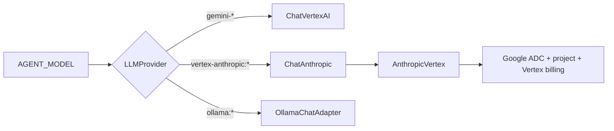

# ADR-015: Route Claude partner models through Vertex AI

## Status

Accepted

## Date

2026-08-28

## Deciders

David Balladares, with Codex

## Context

Umbra supported Gemini through Google Vertex AI and local Ollama models. David
enabled Claude Haiku 4.5, Claude Sonnet 5, and Claude Opus 5 in the Google Cloud
Model Garden and wanted those models available through the same `/model` flow.

A Claude web subscription is not an API credential and does not cover partner
model usage on Vertex AI. Vertex-hosted Claude uses Google Application Default
Credentials, a Google Cloud project where the model is enabled, and Google Cloud
billing. It also uses Anthropic's message and tool protocol rather than Gemini's
transport.

The first interactive implementation exposed a configuration gap: `/model`
saved `AGENT_MODEL` and restarted the agent before ensuring that
`GOOGLE_CLOUD_PROJECT` existed. That left a persisted Claude selection which
could not start.

## Decision

Use the explicit model prefix `vertex-anthropic:` for Claude partner models
served by Google Vertex AI. The prefix is part of Umbra's routing contract; it
distinguishes Google credentials and billing from any future direct Anthropic
API integration.

The supported Claude presets are:

| Alias | Model identifier | Intended use |
|---|---|---|
| `claude-fast` | `vertex-anthropic:claude-haiku-4-5@20251001` | Fast, economical work |
| `claude` | `vertex-anthropic:claude-sonnet-5` | Coding and agentic workflows |
| `claude-max` | `vertex-anthropic:claude-opus-5` | Architecture and hard problems |

`LLMProvider` constructs a real `ChatAnthropic` instance with Anthropic's
official `AnthropicVertex` client. Keeping the concrete LangChain class lets
DeepAgents recognize Anthropic and retain its provider-specific message and
prompt-cache handling. Gemini's `VertexChatAdapter` is not reused.

The provider and LangChain layers both use `maxRetries: 0`. A failed request is
visible to the operator and cannot silently multiply paid model attempts.

DeepAgents receives a provider-wide Anthropic harness profile. Umbra's guarded
filesystem tools replace the built-in filesystem tools, while the `task` tool is
excluded only for a simple agent with no subagents.

Claude requires `GOOGLE_CLOUD_PROJECT`; `GOOGLE_CLOUD_LOCATION` defaults to
`global`. When `/model` cannot resolve a valid project ID, it asks the operator
before saving or restarting. The model and project are then written together to
`.env`, preserving unrelated variables.

### Amendment: Haiku 4.5 requires its dated Vertex version

On 2026-08-28, the project's live Vertex endpoint accepted the stable Sonnet 5
and Opus 5 identifiers but rejected the stable Haiku 4.5 identifier. Google's
free token-count endpoint confirmed that `claude-haiku-4-5@20251001` is the
available Haiku version for this project. Umbra therefore pins only Haiku 4.5
to that dated provider ID while keeping its menu label provider-neutral.

Pricing lookup removes a terminal Vertex `@YYYYMMDD` version before consulting
the stable price table, so the pinned transport ID does not silently lose cost
tracking.

### Amendment: the Claude 5 generation rejects `temperature`

On 2026-08-28, the first interactive Claude 5 request failed with HTTP 400
`` `temperature` is deprecated for this model ``. `LLMProvider` sent
`temperature` unconditionally, and its default of `0` meant no caller had to ask
for it. Live probes against the project's Vertex endpoint confirmed the split:
`claude-sonnet-5` and `claude-opus-5` reject the parameter, while
`claude-haiku-4-5@20251001` still accepts it.

`rejectsTemperature` in `model-resolver.ts` matches the Claude 5 generation —
`claude-<family>-5`, with or without a trailing `@YYYYMMDD` — and
`createVertexAnthropicModel` omits the parameter for those models only. Claude
4.5 keeps receiving `temperature: 0`, so deterministic sampling is preserved
wherever the provider still honors it.

Sending the parameter and retrying on the 400 was rejected: the failure is fully
predictable from the model identifier, and a retry would spend a second paid
request to learn what the identifier already says. Dropping `temperature` for
every Claude model was rejected because it would silently surrender determinism
on Claude 4.5.

### Amendment: `count-tokens` is not an availability probe

The Validation section below claims that the free count-tokens endpoint
"accepts all three configured transport IDs". That reading was too strong, and
it is why the Opus 5 gap reached an interactive session.

Verified on 2026-08-28: count-tokens validates only that the name exists in
Anthropic's catalogue. It returned `200` for `claude-opus-5` while
`:rawPredict` on the same project and location returned `404 Publisher model
... was not found`, and it returned `400 ... is not supported for token
counting` only for a name Anthropic does not publish at all. It cannot tell
whether a model is enabled for a given project, so it must not be used as
evidence that a preset will start.

The original claim is left in place above; this amendment corrects its meaning
rather than rewriting the record.

### Amendment: all three presets confirmed live

After Opus 5 was enabled in the project's Model Garden, a minimal generation
request succeeded for all three presets through the real `LLMProvider` route in
location `global`. `us-east5` returned `429` for Opus 5 on
`online_prediction_input_tokens_per_minute_per_base_model`, which confirms
`global` as the correct default location for this project rather than a fallback.

## Alternatives considered

### Use a direct Anthropic API key

Rejected for this feature. The enabled models and intended billing boundary are
in Google Cloud. Direct Anthropic access would require a separate credential,
account, and provider identifier.

### Send Claude through the Gemini adapter

Rejected because Vertex is the hosting boundary, not a common message protocol.
Claude requires Anthropic's message conversion, tool-call handling, and Vertex
partner-model endpoint.

### Pass a model string to DeepAgents and let it instantiate the provider

Rejected because DeepAgents cannot infer Umbra's Google project, ADC boundary,
or custom Vertex client from a direct Anthropic model string. Umbra must provide
the prebuilt model instance.

## Consequences

- Users can select Haiku 4.5, Sonnet 5, and Opus 5 from `/model` or aliases.
- Claude usage is charged to Google Cloud, not to a Claude web subscription.
- A project ID is mandatory and becomes non-secret project configuration in
  `.env`.
- Hidden retry resilience is deliberately traded for predictable paid request
  counts and explicit failures.
- The packaged pricing registry tracks the published global Vertex input/output
  rates for the three presets and accepts both bare and routed model names.
- Direct `anthropic:*` model strings remain reserved and unsupported.

## Validation

- The full Jest suite passes: 48 suites and 390 tests, with the gated live suite
  and four unrelated tests skipped.
- TypeScript type-check and the distributable build pass.
- The built `LLMProvider` instantiates `ChatAnthropic` through the new route, and
  `npm pack --dry-run` includes the compiled provider, menu, and configuration.
- The Agent Platform API is enabled, both available credentials have
  `aiplatform.endpoints.predict`, and the free count-tokens endpoint accepts all
  three configured transport IDs.
- The first controlled Haiku request exposed the missing dated version. After
  pinning it, the second and final allowed provider request returned exactly one
  forced tool call with the expected name, ID, and synthetic argument. The
  opt-in two-request live spec remains available for a separately authorized
  full tool-result round trip; this validation does not claim that second leg.

## Related files

- `src/core/llm/provider.ts` — `LLMProvider.createVertexAnthropicModel`
- `src/core/config/model-resolver.ts` — Claude aliases, routing predicates,
  `rejectsTemperature`
- `src/core/config/model-switcher.ts` — presets and combined `.env` persistence
- `src/presentation/cli/model-menu.ts` — provider/model/project selection
- `src/core/agent/deep-agent-factory.ts` — Anthropic harness profile
- `src/core/infrastructure/config/default-pricing.ts` — packaged global pricing
