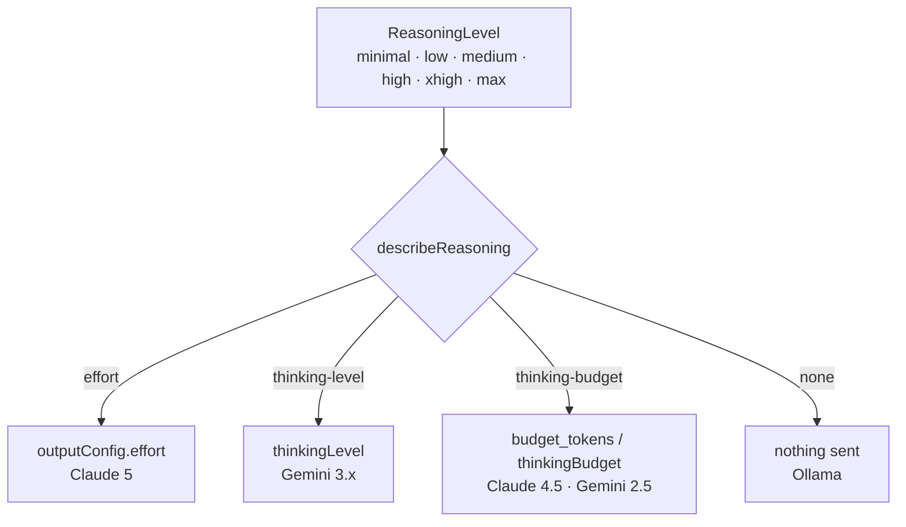

# ADR-016: One reasoning vocabulary across providers

## Status

Accepted

## Date

2026-08-28

## Deciders

David Balladares, with Claude

## Context

Every model Umbra routes to now exposes a knob for how hard it should think,
and the parameter that had covered this ground before — `temperature` — was
removed from the Claude 5 generation (ADR-015). The question was whether Umbra
should expose the new knob, and under whose vocabulary.

The first assumption was that this splits by vendor: `effort` for Claude,
`thinkingLevel` for Gemini. Probing the project's live Vertex endpoint showed
that assumption is wrong in a way that matters. The split is **named levels
versus token budget**, and it crosses both vendors:

| Model family | Reasoning parameter | Shape |
|---|---|---|
| Claude Sonnet 5, Opus 5 | `output_config.effort` | five named levels |
| Claude Haiku 4.5 | `thinking.budget_tokens` | a token count |
| Gemini 3.5, 3.1 | `thinkingConfig.thinkingLevel` | four named levels |
| Gemini 2.5 (flash, flash-lite, pro) | `thinkingConfig.thinkingBudget` | a token count |
| Ollama | none | — |

Claude Haiku 4.5 behaves like Gemini 2.5, not like the other Claude models. An
`if (isClaude)` branch would therefore have been wrong on its first reading.

The negative cases were confirmed rather than inferred. Haiku 4.5 rejects
`output_config.effort` with `Extra inputs are not permitted`; Gemini 2.5 rejects
`thinkingLevel` with `thinking_level is not supported by this model`; and
`effort: minimal` is rejected on Claude 5 with the accepted set named in the
error. `effort: xhigh` returns HTTP 200 even though
`@langchain/anthropic`'s `OutputConfig` type omits it.

Showing the reasoning is a second, independent axis, and it turned out not to be
uniformly controllable — see the decision below.

## Decision

Reasoning is modeled as a domain concept with one operator-facing vocabulary,
**Reasoning**, and per-model capability descriptions in
`src/core/config/reasoning-profile.ts`. That module answers *what a model
supports*; translating a level into request fields stays in the provider, in
Infrastructure.

### The picklist appears when the model is chosen

`/model` gains a Reasoning step after model selection, and it offers **only the
levels that model accepts**. This placement is the point of the design, not a
convenience: it is the only moment in the flow where the legal levels are known,
so a selection cannot persist a level the model would reject. A separate
`/effort` command — the first proposal — would have allowed exactly that
combination, producing the same class of failure as a saved model with no
project: valid when written, broken on the next start.

A saved level that does not exist on a newly selected model is **clamped
downward** to the nearest supported one, never upward, so a carried-over setting
cannot silently escalate cost.

### Named levels cover the budget-based models too

`low`, `medium` and `high` map to 1024, 4096 and 16384 thinking tokens. These
numbers are Umbra's choice, not a provider mapping. The floor is 1024 because
Anthropic rejects a smaller `budget_tokens`, which is also why `minimal` is not
offered on budget-based models — it cannot be expressed, and Gemini 2.5 Pro
additionally refuses to have thinking disabled.

### Showing the reasoning has three states, not two

A boolean would have been a lie. The observed behavior is:

- **`controllable`** — Claude 5, via `thinking.display: "summarized"`.
- **`forced-on`** — the reasoning comes back whenever a level is set and cannot
  be suppressed. Claude 4.5 always returns its thinking text.
  `@langchain/google-common` derives `includeThoughts` from the token budget
  (`utils/gemini.js`:896) rather than accepting it as a parameter, so any
  Gemini 2.5 request with a level shows its reasoning.
- **`unavailable`** — no reasoning is returned at all. Gemini 3.x reached
  through `thinkingLevel` gets no `includeThoughts` from the library, so the
  thoughts never arrive even though the API supports them.

The last two are **library** limitations, not API limitations, and they are
recorded as they behave rather than as they should behave. The menu row is
rendered in all three states — filled and locked, empty and locked, or an
actual checkbox — because a toggle that silently does nothing is worse than one
that says it cannot.

### Setup holds only what nothing else can reach

A Setup entry at the end of the provider list carries the Google Cloud project
ID and the Vertex location. The project was previously asked for only when
missing, so an ID entered wrongly once could be corrected only by editing `.env`
by hand; the location was never reachable from the CLI at all.

Reasoning is deliberately **not** in Setup. It is chosen when a model is chosen,
and a second path to the same value is how two paths drift apart.

### Temperature and thinking are mutually exclusive on Claude 4.5

Found by live verification, not by any unit test: Haiku 4.5 accepts
`temperature`, accepts `thinking`, and rejects the pair with `temperature is not
supported when thinking is enabled`. A Claude 4.5 selection with a reasoning
level therefore gives up deterministic sampling. The provider computes the
reasoning fields first and drops `temperature` when a thinking block is present.

### The session banner reports the level

The banner is where the operator learns what they are about to spend. It shows
the **clamped** level rather than the stored one, so what is displayed is what
the next request will carry.

It also shrank from five content lines to two. It reprints on every model
switch, so the lines that never change — the subtitle restating the mode, the
"type your task" hint — cost attention on each reprint without adding anything
after the first read. The model name drops its routing prefix and dated Vertex
suffix in favor of a provider glyph.

Fixing the width exposed that the box border had never been aligned: the lines
were padded with literal trailing spaces rather than measured, so styled text
and two-column emoji both pushed the right edge out of place.

## Alternatives considered

### A separate `/effort` command

Rejected. It cannot know which model the level will apply to, so it permits a
persisted level the active model rejects. The failure surfaces on the next
message, not at the moment of the mistake.

### One `if` per provider inside the menu

Rejected. It puts provider protocol knowledge in Presentation, and the observed
matrix shows the branch would have been wrong anyway — Haiku 4.5 does not group
with the other Claude models.

### Six levels shown for every model

Rejected. Half of them would be fabricated per model, and a fabricated level is
either silently clamped or a `400`. Rendering the model's real levels is both
more honest and the mechanism that makes an invalid save impossible.

### Ask for a raw token count on the budget-based models

Rejected. It exposes the implementation detail the level abstraction exists to
hide, and it differs per model family, which is exactly the inconsistency this
record removes.

### Send the parameter and retry on the 400

Rejected, for the same reason as in ADR-015. Every rejection here is fully
predictable from the model identifier, so a retry would spend a second paid
request to learn what is already known before the first one is built.

### Expose `includeThoughts` on Gemini anyway

Rejected. `@langchain/google-common` does not accept it; a passed value is
silently dropped. Sending it would have produced a toggle that appears to work
and does nothing — the worst of the three outcomes.

## Consequences

- One vocabulary — **Reasoning** — covers four different provider mechanisms.
- A persisted level can never be invalid for the active model: it is either
  supported, clamped down, or omitted.
- The reasoning-display control is honest about being unavailable on Gemini and
  forced on for the budget-based models. If the library later accepts
  `includeThoughts`, only `describeReasoning` changes.
- Selecting a reasoning level on Gemini 2.5 adds `reasoning` blocks to every
  response whether or not they were asked for.
- Selecting a reasoning level on Claude Haiku 4.5 gives up `temperature: 0`.
- `AGENT_REASONING` and `AGENT_REASONING_DISPLAY` join `AGENT_MODEL` as
  non-secret project configuration, written in the same pass as the model so a
  cleared level cannot linger from a previous selection.
- Umbra keeps `xhigh`, which `@langchain/anthropic`'s type rejects and the API
  accepts, behind a single documented cast.

## Validation

- The full Jest suite passes: 50 suites and 426 tests, with the gated live suite
  and five unrelated tests skipped. TypeScript type-check and the build pass.
- Twelve model/level/display combinations were exercised against the live Vertex
  endpoint **through the compiled `dist/`**, and every one returned a
  generation. The response block shapes matched the three display states
  exactly: Gemini 3.x returned no reasoning blocks even with display requested,
  Gemini 2.5 returned them with display off, Claude Haiku 4.5 returned them
  whenever a level was set, and Claude Sonnet 5 returned them on request.
- `effort: xhigh` and the rejection of `effort: minimal` were both confirmed on
  `claude-sonnet-5`.
- The `temperature`-with-thinking conflict was found by that live pass after the
  unit tests were already green, and is the reason this record claims live
  verification rather than test coverage alone.

## Related files

- `src/core/config/reasoning-profile.ts` — the capability model and env resolution
- `src/core/config/model-resolver.ts` — `isClaude5Generation`, shared with `rejectsTemperature`
- `src/core/llm/provider.ts` — `anthropicReasoningFields`, `geminiReasoningFields`
- `src/core/config/model-switcher.ts` — `saveSelectionToEnv`, `saveVertexSettingsToEnv`
- `src/presentation/cli/model-menu.ts` — the Reasoning picklist and Setup screen
- `src/presentation/cli/theme.ts` — `buildWelcomeBanner`, measured box width
- `src/presentation/cli/chat-session.ts` — `activeReasoningLevel` for the banner
