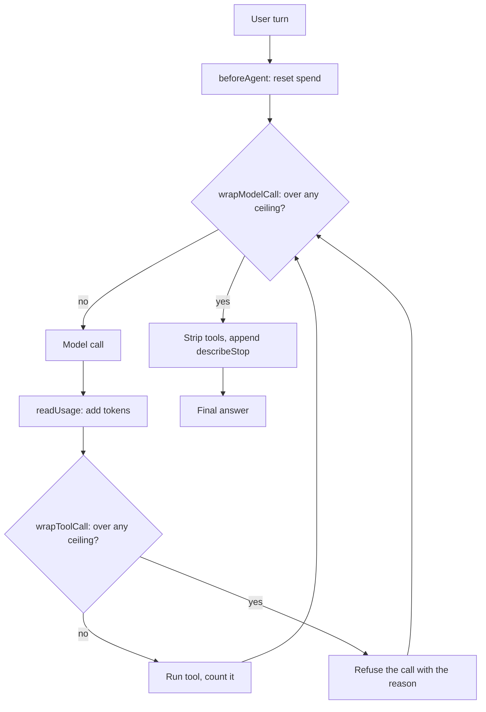

# ADR-019: A turn is bounded by what it costs, not by how many tools it calls

Category: Runtime behavior and cost control

Author: Claude

Date: 2026-08-28

## Status

Accepted — amended 2026-08-28

## Deciders

David Balladares, with Claude

## Context

David typed `hey` into `umbra deep`. The agent listed two directories, read
seven files, and answered 108 seconds later.

The turn is recorded in `.umbra/telemetry/interactive-turns.jsonl` as audit
`84ad7c97`: `toolCalls: 11`, `toolBudget: 8`, `elapsedMs: 108277`. The sum of
every `toolDurationsMs` entry in that record is **68 milliseconds**. The other
99.94% was the model.

Reading the whole file turned one bad turn into a measurement of the bound
itself. Across 120 recorded turns:

| Fact | Value |
| --- | --- |
| Elapsed time, all turns | 4,532 s |
| Tool execution time, all turns | 62.9 s (**1.4%**) |
| Turns exceeding `toolBudget` | **13 of 120** |
| Worst overrun | 18 calls against a budget of 8 (2.25x) |
| Slowest single turn | 921 s, on 12 tool calls |

Two independent defects produced that.

### The budget was a floor, not a ceiling

ADR-008 placed the check in `wrapModelCall` — *before* a model call. A model
that requests six tools in one response therefore spends all six, because
nothing is consulted between them. Running the compiled counter against
synthetic batches shows the exact shape:

| Batch size the model requests | Where a budget of 8 actually stops |
| --- | --- |
| 1 tool per response | 8 |
| 6 tools per response | **12** |
| 9 tools per response | **9** |

### Counting tool calls measures the cheap part

Tool execution was 1.4% of elapsed time. A turn can therefore sit well inside a
tool-call budget and still run for fifteen minutes, which is what the 921-second
turn did on twelve calls. The counter bounded the part that costs nothing.

A third fact made the shape unmistakable: `limits.maxCostUsd` has existed in
`agent-config.ts#limitsSchema` since it was written, documented as *"Optional
budget cap"*, and **is read by no code at all**. This repository has now met that
shape three times — `ask_human` advertised in a prompt and registered nowhere,
`task` ordered by three prompts and excluded from the provider, and now a cost
cap declared in configuration and enforced nowhere.

## Decision

`createIterationBudgetMiddleware` in
`src/core/agent/iteration-budget.middleware.ts` becomes a turn governor with
three ceilings, enforced at two points, over a spend it observes itself. The
pure logic lives in `src/core/agent/turn-governor.ts` so it is testable without
a LangChain graph.

**Ceilings** (`turn-governor.ts#DEFAULT_TURN_LIMITS`): `maxToolCalls: 8`,
`maxTokens: 250_000`, `maxSeconds: 300`, plus an optional `maxCostUsd` taken
from `.umbra/agent.config.json`. `exceededDimension` returns the first ceiling reached
and the turn is stopped with `describeStop`, which names the ceiling — a model
told only to stop tends to apologise; one told what ran out reports what it has.

`maxToolCalls` keeps the value ADR-008 chose. The change is that it is enforced.

`maxSeconds: 300` is derived, not picked: it sits above the 95th percentile of
recorded turns (237.8 s) and below the 921-second outlier.

**Enforced after a tool call, not only before a model call.** `wrapToolCall` now
checks the ceiling first and returns a `ToolMessage` instead of running the tool.
This is what converts the floor into a ceiling: the ninth call of a batch of nine
never reaches the disk.

**The count is self-observed.** `recordToolCall` increments a counter the
middleware owns, reset by `beforeAgent` — one hook call per agent invocation,
which is one user turn. The previous counter derived its number from
`tool_calls` entries in agent state, which means trusting a message shape this
code did not create. `countCurrentTurnToolCalls` and `shouldForceFinalResponse`
are **kept** and still consulted as a second guard: where the shape is readable
they catch an overshoot one step earlier, and where it is not they contribute
nothing rather than failing loudly.

**Tokens are read where they exist.** `readUsage` parses `usage_metadata` off
the model response inside `wrapModelCall`. The deep path had never consumed it:
`usage_metadata` was read only by the legacy graph nodes in
`src/core/agent/graph/` that ADR-011 deprecated.

**An unpriced model disables the cost ceiling rather than reading as free.**
`DeepAgentFactory#buildCostResolver` returns `undefined` when
`CostTrackerService.calculateCost` throws. Treating a missing price as zero is
exactly how cost tracking came to report zero for the starred default model.

**The cost is visible while it accrues.** `StreamRenderer#noteTurnSpend` puts
`7 calls · 51.0k tok · $0.0846` on the wait indicator that already existed, so a
runaway turn can be stopped by the operator instead of read about afterwards.
The pre-existing counter was renamed `streamedChunks`: it counts stream chunks,
never billing units, and was rendered as "N tokens".

### Where the ceilings are enforced

## Alternatives considered

| Solution | Pros | Cons | Decision |
| --- | --- | --- | --- |
| Fix only the pre-check placement, keep counting calls | Smallest change; no new concepts | Leaves the 921 s turn unbounded — it never exceeded a call budget | Rejected |
| Bound by tokens only, drop the call counter | One dimension, matches where cost actually is | Depends on `usage_metadata`, which ADR-006 already showed the Vertex streaming transport can withhold; an unreported turn would then be unbounded | Rejected |
| Keep deriving the count from agent state, fix the placement | No new state to own | Telemetry shows overruns of 16 and 18 that a single batch overshoot cannot explain, so the state shape is itself in question | Rejected |
| Self-observed governor over calls, tokens, wall clock and cost | Cannot be wrong about its own units; degrades to time and calls when a provider reports no usage | Per-turn state in a closure, so it assumes one turn at a time per agent instance | Accepted |

## Consequences

### Positive

- The declared budget of 8 is now real. Enforcement happens where the spend
  happens.
- A turn is bounded even when the provider reports no token usage, because wall
  clock always exists.
- `limits.maxCostUsd` does something for the first time since it was declared.
- The operator can see calls, tokens and dollars accumulating during the turn.

### Neutral

- `countCurrentTurnToolCalls`, `shouldForceFinalResponse` and
  `hasPriorEquivalentToolCall` keep their behaviour and their tests. They are
  demoted from primary mechanism to secondary guard, not removed.
- A repeated tool call is answered from the turn's own history and is **not**
  charged against the budget; refusing it and counting it would penalise the
  model twice for one mistake.

### Negative

- **A hard ceiling of 8 would have truncated 13 of the 120 recorded turns
  (10.8%).** The distribution is bimodal — 98 turns used three calls or fewer,
  then a gap, then a cluster at 10–18 — so 8 sits in the valley rather than
  through a peak. That cluster is believed to be the pathology this record is
  about, but the counts alone cannot prove every one of the 13 was wasteful.
  `.umbra/agent.config.json` is the knob if it proves too tight.
- Per-turn state lives in the middleware closure. This is correct for the
  interactive CLI, which awaits each turn, and would be wrong for concurrent
  invocations of one agent object. Recorded rather than defended.
- The token and cost ceilings are only as good as the provider's reporting. A
  turn whose usage is never reported is bounded by time and calls alone.

## Verification Evidence

- `npm run type-check` — clean.
- `npx jest --runInBand` — **525 passed, 5 skipped, 56 suites**.
- `npm run build` — clean; `dist/` rebuilt, which ADR-012 records as the
  precondition for verifying any CLI change.
- `turn-governor.spec.ts` — 14 tests, including that the tool ceiling stops *at*
  the limit, that a 921-second turn is stopped on wall clock after one tool
  call, and that an unpriced model leaves the cost ceiling inert instead of
  reading as free.
- `iteration-budget.middleware.spec.ts` — drives the real middleware hooks: a
  batch of six calls against a budget of three runs the handler exactly three
  times and refuses the rest with `TURN BUDGET REACHED`.
- Pricing verified end-to-end through the built `dist/`: all nine models the
  `/model` picker offers now resolve a price, where three did not before
  (`gemini-3.5-flash`, `gemini-3.5-flash-lite`, `gemini-3.1-flash-lite`).
- **Not yet verified live.** No `umbra deep` run has exercised the governor
  against a real provider. The forced-synthesis path is validated by unit tests
  only — which is the same gap ADR-008 recorded in its own Negative section, and
  which is how this defect survived. `UMBRA_BUDGET_PROBE=1` exists to close it.

## Related Files

- `src/core/agent/turn-governor.ts` — `DEFAULT_TURN_LIMITS`, `TurnLimits`,
  `TurnSpend`, `createTurnSpend`, `recordToolCall`, `recordUsage`, `readUsage`,
  `exceededDimension`, `describeStop`.
- `src/core/agent/iteration-budget.middleware.ts` —
  `createIterationBudgetMiddleware`, `TurnGovernorOptions`,
  `DEFAULT_INTERACTIVE_TOOL_BUDGET`, `countCurrentTurnToolCalls`,
  `shouldForceFinalResponse`, `hasPriorEquivalentToolCall`.
- `src/core/agent/budget-probe.ts` — `recordBudgetProbe`,
  `isBudgetProbeEnabled`, `BUDGET_PROBE_ENV`, `describeMessageType`,
  `countMessagesWithToolCallsArray`.
- `src/core/agent/deep-agent-factory.ts` — `DeepAgentFactory.create`,
  `DeepAgentFactory.buildCostResolver`, `DeepAgentFactory.buildSystemPrompt`.
- `src/core/agent/task-classifier.ts` — `classifySmallTalk`, `SmallTalkKind`.
- `src/core/config/agent-config.ts` — `limitsSchema` (`maxCostUsd`).
- `src/core/infrastructure/config/default-pricing.ts` — `DEFAULT_LLM_PRICING`.
- `src/core/application/services/cost-tracker.service.ts` —
  `CostTrackerService.calculateCost`.
- `src/presentation/cli/chat-session.ts` — `ChatSession.sendMessage`,
  `ChatSession.handledAsSmallTalk`, `ChatSession.reportSpend`,
  `ChatSession.costOf`.
- `src/presentation/cli/stream-renderer.ts` — `StreamRenderer.noteTurnSpend`,
  `StreamRenderer.resetTurnSpend`, `buildCounter`, `formatTokens`.
- `src/presentation/cli/turn-audit.ts` — `TurnAudit`, `TurnAuditRecord`.

---

## Amendment — 2026-08-28: the orchestrated path was left out again

The ceilings this record installed were applied to `DeepAgentFactory#create` and
not to `createOrchestrator`, which carried only its delegation guard. So
`umbra orchestrate` had no token, wall-clock or cost bound of any kind.

That is the same omission [ADR-008](./ADR-008-bounded-interactive-iteration-audit.md)
made, in the same place, and it had already been amended once for exactly it. The
cost of repeating it was measured the following day: the word maestro ran the
full implementation route for 27 calls and 677.8k tokens at $0.0729, and wrote a
file to disk. No ceiling was reached because none was installed.

The governor now runs on the orchestrated path too, ahead of the delegation
guard, so a turn that has spent its allowance stops before any delegation
bookkeeping begins. Nothing this record decided changed — only where it applies.

The routing repair that accompanies it is recorded in
[ADR-023](./ADR-023-interlocking-triage-readback-and-balanced-books.md).
