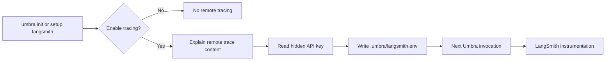

# ADR-021: Configure LangSmith through explicit local onboarding

**Category:** CLI observability and credential handling
**Author:** David Balladares (decision), Codex (implementation)
**Date:** 2026-08-28

## Status

Accepted

## Context

Umbra already enabled LangSmith's automatic LangChain instrumentation whenever
the required environment variables were present. That made tracing available to
experienced operators, but a consumer who installed the package had no guided
way to decide whether to enable it, understand what remote tracing can contain,
or store the API key without adding it to a tracked project configuration.

This distinction matters because Umbra's local turn telemetry is deliberately
privacy-safe, while a LangSmith trace can include prompts, model responses,
tool activity, and metadata. Treating the two as equivalent would be misleading.

## Decision

`umbra init` offers LangSmith only when the project has no local LangSmith
configuration. The default answer keeps tracing disabled. `umbra setup
langsmith` exposes the same flow later, so declining during initialization does
not require editing environment variables by hand.

Before accepting a key, the CLI explains that LangSmith receives remote trace
content. `askSecret` accepts the key without echoing it in the terminal.
`configureLangSmith` then creates `.umbra/langsmith.env` exactly once, with
`LANGSMITH_TRACING`, `LANGSMITH_API_KEY`, `LANGSMITH_PROJECT`, and an optional
`LANGSMITH_ENDPOINT`. It never writes the key to `.env`,
`.umbra/agent.config.json`, local telemetry, documentation examples, or logs.

The CLI loads the regular project environment and then `.umbra/langsmith.env`
before importing `langsmith/langchain`, so the existing automatic
instrumentation sees the opt-in configuration on the next Umbra invocation.
Dotenv does not override values already supplied by the operator's environment
or project `.env`.

## Alternatives considered

| Solution | Pros | Cons | Decision |
| --- | --- | --- | --- |
| Ask operators to edit `.env` manually | No new setup command | Easy to commit a credential and does not explain remote tracing | Rejected |
| Persist the key in `agent.config.json` | One configuration file | The policy is structured project state, not a secret store | Rejected |
| Store a local dotenv file below `.umbra/` | Reuses the SDK's standard variables and stays inside already-ignored local state | The key remains plaintext on the operator's machine | Chosen |

## Consequences

- A new consumer can make an informed, reversible tracing choice during setup.
- Declining has no effect; tracing remains available later through the explicit
  setup command.
- The local credential file is ignored by Git and created with owner-only mode
  where the operating system honours it, but it is still a local plaintext
  secret and must be protected by the machine's account controls.
- Tracing enabled during `umbra init` begins with the next CLI invocation,
  because auto-instrumentation is imported when the current process starts.
- This decision does not set LangSmith input/output hiding variables. The
  disclosure is therefore required; remote traces are not represented as having
  the same privacy boundary as Umbra's local telemetry.

## Verification Evidence

- `node node_modules/typescript/bin/tsc --noEmit --pretty false` passed.
- `node node_modules/jest/bin/jest.js --runInBand --no-cache src/core/observability/langsmith-config.spec.ts src/presentation/cli/prompts.spec.ts` passed: 2 suites, 25 tests.
- `node -r ts-node/register src/bin/cli.ts setup langsmith --help` displayed
  the exact nested command.
- The full suite was attempted but remains blocked by three pre-existing
  failures in `src/core/agent/delegation/subagent-registry.spec.ts`, which calls
  a missing `composeSubagentMiddleware`. This ADR does not claim a full-suite
  pass.

## Related Files

- `src/bin/cli.ts` — dotenv bootstrap, `setupLangSmith`, `setup` command, and
  `init` onboarding hook.
- `src/core/observability/langsmith-config.ts` — `configureLangSmith`,
  `getLangSmithConfigPath`, and `hasLangSmithConfiguration`.
- `src/core/observability/langsmith-config.spec.ts` — local-secret persistence
  and overwrite-boundary tests.
- `src/presentation/cli/prompts.ts` — `askSecret`.
- `src/presentation/cli/prompts.spec.ts` — hidden-secret prompt test.
- `src/core/observability/trace-flush.ts` — `isTracingEnabled` and the existing
  environment-variable tracing contract.
- `README.md` — consumer setup instructions.
