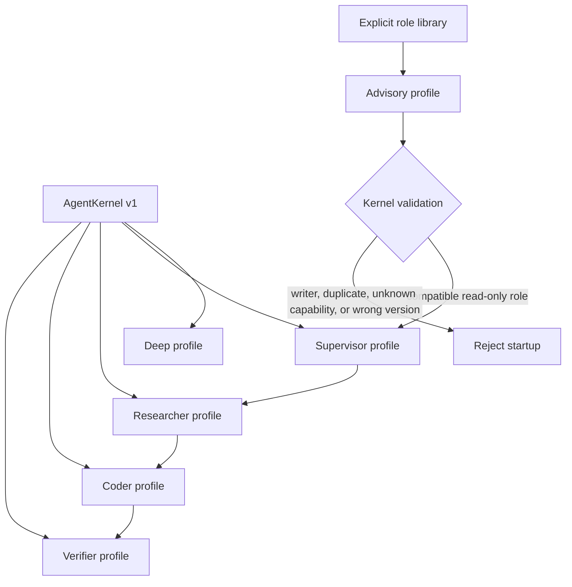

# ADR-022: Compose every role from a versioned kernel and safe profile

**Category:** Agent runtime, orchestration, and public extension boundary
**Author:** David Balladares (decision), Codex (implementation)
**Date:** 2026-08-28

## Status

Accepted

## Context

Umbra had one common prompt path for Deep and the Supervisor, while Researcher,
Coder, and Verifier each assembled their prompt, tools, and middleware in a
separate source file. That makes a new universal rule easy to add to one route
and easy to omit from another. It also made the existing three-role delegate
registry, tool schema, and readback graphs closed over literal role names.

The project needs two properties at once:

- Every role must receive the same safety, evidence, ADR, and handoff rules.
- A role must remain specialized: Researcher and Verifier cannot write, Coder
  remains the only delegated writer, and the Supervisor preserves the
  Researcher → Coder → Verifier lifecycle from ADR-001 and ADR-014.

A future library must be able to add a specialist through code without being
able to silently add a writer, a provider tool, or a second orchestration
lifecycle.

## Decision

`src/core/agent/agent-kernel.ts` owns `KERNEL_API_VERSION`, the shared prompt
fragment, `RoleProfile`, `AgentRoleExtension`, the capability registry, profile
validation, and privacy-safe runtime metadata.

`RoleProfile` separates a role's profession from its runtime education:

```text
kernel instructions + rolePrompt + mandate/task context + resolved capabilities
```

The capability registry is the only source that turns a capability into a tool.
The built-in roles now declare capability identifiers rather than manual tool
arrays. `buildSubagentFromProfile` composes the shared prompt and resolves those
tools before a delegate graph is compiled.

The first extension boundary is deliberately programmatic:

```ts
type AgentRoleExtension = {
  kernelApiVersion: 1;
  roles: readonly RoleProfile[];
};
```

`DeepAgentFactoryConfig#roleExtensions` accepts explicit extensions. An external
role must declare a compatible kernel version and model, use the `advisory`
workflow role, and request only the allowed read-only capabilities. It cannot
replace a core lifecycle role, write files, add a new tool, enlarge a budget, or
be auto-discovered from configuration or a remote package.

The delegate graph registry, readback registry, and delegation schema now accept
the roles registered for that factory invocation. The orchestration guard still
applies the full lifecycle only to Researcher, Coder, and Verifier; an explicitly
registered advisor can contribute focused read-only evidence but cannot authorize
implementation.

`registerAgentKernelTelemetry` attaches only kernel version, role identifiers,
capabilities, and workflow roles to a compiled graph through a `WeakMap`.
`TurnAudit` persists and forwards that safe metadata without prompts, arguments,
responses, credentials, or provider payloads.



## Alternatives considered

| Solution | Pros | Cons | Decision |
| --- | --- | --- | --- |
| Duplicate new universal rules into every role prompt | Small immediate patch | Guarantees future drift and cannot prove the roles stayed aligned | Rejected |
| Define arbitrary roles and tools from project JSON | Fast local customization | Lets configuration create unsafe permissions and requires a separate plugin security model | Rejected for v1 |
| Auto-discover remote or installed role packages | Convenient extensibility | Adds supply-chain, versioning, and authorization work before the kernel has a stable contract | Rejected for v1 |
| Versioned kernel with explicit code-owned advisory extensions | One common base, type-checked compatibility, no implicit privilege expansion | New writer or tool capability still requires an Umbra release | Chosen |

## Consequences

### Positive

- A universal instruction is composed once for Deep, Supervisor, and every
  specialist profile.
- Tool permission is structural: role prompts cannot grant a capability absent
  from the registry.
- A role library has a stable, exported contract without automatic loading.
- Local telemetry can distinguish the kernel and roles that were configured for
  a turn without recording sensitive content.

### Neutral

- Existing `createResearcherSubAgent`, `createCoderSubAgent`, and
  `createVerifierSubAgent` exports remain available as compatibility adapters.
- The CLI commands and `.umbra/agent.config.json` shape do not change.

### Negative

- External roles are intentionally read-only advisors in v1; a plugin cannot
  add a writer or a provider-backed tool yet.
- Advisory work draws from the existing turn pool and therefore can reduce the
  budget left for the core lifecycle. It never increases the total budget.
- Kernel metadata describes configured roles, not a claim that each role ran;
  executed tools remain the authoritative per-turn activity record.

## Verification Evidence

- `node node_modules/typescript/bin/tsc --noEmit --pretty false` — passed.
- `node node_modules/jest/bin/jest.js --runInBand --no-cache` — passed.
- Focused contract coverage verifies kernel composition, role capability
  resolution, extension rejection, delegate registration, guard enforcement,
  prompt/tool consistency, and privacy-safe telemetry fields.
- No live provider invocation was run for this change. The extension and
  delegation behavior is verified against local graph/tool fixtures only.

## Related Files

- `src/core/agent/agent-kernel.ts` — `KERNEL_API_VERSION`, `RoleProfile`,
  `AgentRoleExtension`, `CAPABILITY_REGISTRY`, `buildSubagentFromProfile`,
  `validateRoleExtensions`, `registerAgentKernelTelemetry`.
- `src/core/agent/deep-agent-factory.ts` — `DeepAgentFactoryConfig`,
  `DeepAgentFactory.create`, `DeepAgentFactory.createOrchestrator`,
  `DeepAgentFactory.buildSystemPrompt`.
- `src/core/subagents/researcher.subagent.ts` — `createResearcherRoleProfile`.
- `src/core/subagents/coder.subagent.ts` — `createCoderRoleProfile`.
- `src/core/subagents/verifier.subagent.ts` — `createVerifierRoleProfile`.
- `src/core/agent/delegation/subagent-registry.ts` — `SubagentGraphs`,
  `buildSubagentGraphs`.
- `src/core/agent/delegation/delegate.tool.ts` — `createDelegateTool`.
- `src/core/agent/orchestration-guard.middleware.ts` — `createOrchestrationGuard`.
- `src/presentation/cli/turn-audit.ts` — `TurnAuditRecord`, `TurnAudit`.
- `src/presentation/cli/chat-session.ts` — `ChatSession.sendMessage`.
