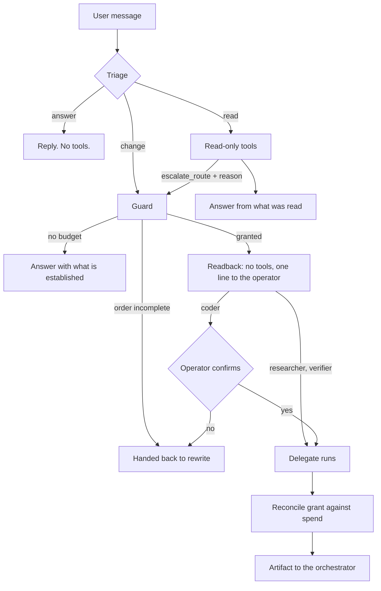

# ADR-023: Interlocking, triage, readback, and books that balance

Category: Orchestration and runtime behavior

Author: Claude, with David

Date: 2026-08-28

## Status

Accepted — 2026-08-28

## Context

[ADR-014](./ADR-014-delegation-mandate-shared-budget-and-question-channel.md)
gave a delegation a complete order. The order worked. Everything around it kept
failing, four times, and each repair was the same repair:

| Observed | Repair applied |
|---|---|
| A delegate received a bare instruction and swept the codebase | Add a completeness gate |
| The model flattened the order into the call and lost `subagent_type` | Add a tolerant parser |
| `"maestro"` was routed as an implementation task: 27 calls, 677.8k tokens, $0.0729, and a file written to disk | Add more vocabulary |
| The delegate that writes had never been asked whether it understood the order | — |

Three of those repairs are the same bet placed again. A parser that tolerates one
more shape will meet the next shape; a word list that learns one more word will
meet the next word. The list had, by then, already missed every Spanish
infinitive — `IMPLEMENTATION_PATTERN` carried `crea` and not `crear` — and nobody
had noticed, because every unrecognised message fell through to the
implementation route anyway.

That fall-through is the shape of all of it: **when the system was unsure, it
guessed, and it guessed toward the expensive, irreversible side.**

This record replaces the guessing with three mechanisms that already work
elsewhere, and adds the ceiling that should have been there.

## Decision

### 1. Interlocking — the schema is the order

*Railway interlocking, Saxby, 1856. Before it, a signalman had loose levers and a
list of rules — do not clear the signal while the points are set against it — and
trains still collided. Interlocking did not write a better rule: it bolted the
levers to each other, so an unsafe route stopped being something to detect and
became something that cannot be expressed.*

`deepagents`' `task` accepts only `description` and `subagent_type`, so an order
had nowhere to live and the model serialized it by hand into a string this
project parsed back. `delegate` (`src/core/agent/delegation/delegate.tool.ts`)
carries the order as typed arguments instead: `subagent`, `userRequest`,
`objective`, `knownContext`, `inScope`, `definitionOfDone` required;
`outOfScope` and `conventions` optional, because a model forced to fill a
boundary invents one and the delegate then obeys it.

Flattening stopped being a mistake, because flattened **is** the shape. A missing
subagent is refused by the provider at the function-calling layer, where a model
retries against a schema rather than being handed a diagnosis.

**Owning the schema means owning the dispatch**, since deepagents builds its
subagent graphs inside a closure and exposes them nowhere. So
`subagent-registry.ts` compiles the three delegates from the specifications that
already described them, and `state-bridge.ts` replaces what `createTaskTool` did
with the graph state, keeping its exclusion list identical on purpose.

That closes a defect recorded in `docs/deferred-work.md` and never fixed:
deepagents' filesystem middleware handed every subagent tools the harness profile
had excluded, and a Coder reaching for `read_file` instead of `safe_read_file`
ended a delegation. The exclusion never followed because the tool list was
assembled in two places and only one was verified. **A delegate now holds exactly
what its specification declares, and there is no second place.**

### 2. Triage — sort by what an error costs, and allow a second sort

*Dominique Larrey organised triage for Napoleon's field surgeons in 1793. A
surgeon at the door does not diagnose — there is no time and no information. He
sorts into a few classes by what happens if he is wrong, and an uncertain case
goes to the class where being wrong is survivable.*

`route-lane.ts` sorts each message into one of three lanes, ordered by the cost of
an error: `answer` calls nothing and a mistake costs a sentence; `read` observes
and a mistake costs tokens; `change` writes, and a mistake costs money and the
repository. **Anything the vocabulary does not recognise sorts down, never up.**

Sorting down is only honest if the low lane is not a dead end, so a turn can be
raised. `escalate_route` is the second sort: the door decides cheaply and
coarsely before anyone has read anything; the agent that has now read the code
revises it, with a reason, once. *"el login está roto"* matches no verb, starts in
`read`, discovers it needs an edit, and says so.

**That inversion is what makes the word lists stop mattering.** They became an
optimization — a recognised verb saves one tool call — instead of a decision. A
new language costs nothing; a gap costs a round trip.

Three rules keep promotion from becoming a way around the triage. Only upward and
only once, so a model cannot climb lane by lane. A reason is required, because the
reason is the audit trail. And **`answer` is not a floor to climb from**: a
message that asked for nothing cannot become a request to write. That is the rule
that keeps a greeting from ever reaching the disk, whatever chain of reasoning a
model assembles.

Promotions live in `lane-registry.ts`, apart from the delegation ledger, because
that ledger is opened at the moment of a delegation — exactly the moment a turn on
the reading lane never reaches.

### 3. Readback — a clearance is not given until it is heard back

*In aviation a clearance is given when the pilot reads it back and the controller
hears the readback; the loop closes or the channel is treated as broken. It is
graded, too: routine clearances are read back and acted on, while crossing a
runway waits for the controller to confirm before the aircraft moves.*

This project validated the *form* of an order and never that the delegate
understood it. The Researcher that swept the codebase had a well-formed order and
had read it as something else.

`readback.ts` compiles a reader per delegate — same model, same prompt, **no tools
at all** — which answers with the objective in its own words, what it believes is
out of scope, and the first concrete action it will take. The operator sees one
line before any budget is spent. The Coder writes to disk, so it waits for a yes.

Two details carry the weight. The reader holds no tools, so describing cannot
become doing — a structural guarantee rather than a request in a prompt. And
naming a *first concrete action* is what makes parroting expensive: copying words
is cheap, choosing the first move requires having read the scope. It is made
costly, not impossible, and this record does not claim otherwise.

### 4. Books that balance, and a ceiling that exists

*What Pacioli published in 1494 was not writing transactions down. It was writing
each one twice, in two places that must agree, so an error announces itself as an
imbalance instead of hiding.*

The pool already kept both halves: the grant written when a delegation is
authorized, the spend written by the delegate's middleware, one entry per attempt.
`reconcile` compares them at delegation close. Since the middleware refuses the
attempt that would overspend, **an imbalance cannot be a rounding difference** —
it means something consumed the turn's budget through a door this project did not
open, which is precisely the shape of the `read_file` defect above.

Separately: [ADR-019](./ADR-019-turn-cost-is-the-bound-not-tool-calls.md)
installed token, wall-clock and cost ceilings on the single-agent path and left
the orchestrated one out — the same omission
[ADR-008](./ADR-008-bounded-interactive-iteration-audit.md) had already made once
and had already been amended for. `umbra orchestrate` had no ceiling of any kind
until now. The governor runs before the guard, so a turn out of tokens stops
before any delegation bookkeeping begins.

## Flow

## Alternatives considered

| Solution | Pros | Cons | Decision |
| --- | --- | --- | --- |
| Keep widening the parser and the vocabulary | No architectural change | Each repair meets the next variant; the list had already silently missed every Spanish infinitive | Rejected |
| Route everything through the implementation lane, as before | Never refuses real work | Fail-open. A greeting cost $0.0729 and wrote a file | Rejected |
| Route everything unrecognised to read-only with no way up | Safe | A real request the vocabulary missed could never be carried out | Rejected in favour of promotion |
| Let the model set its own lane freely | Simple | The lane stops being a bound at all | Rejected: upward once, with a reason, and never from `answer` |
| Ask a model to classify intent at the door | Accurate | A model call per message, on the path ADR-020 built to avoid model calls | Rejected |
| Readback as an extra instruction to the delegate, in the same graph | No extra call | A delegate holding tools may simply begin instead of describing | Rejected: the reader holds no tools |
| Block every delegation on operator confirmation | Maximum safety | Unusable. Aviation grades it, and so does this | Rejected: only the delegate that writes waits |
| Keep the delegation budget in tool calls, as ADR-014 set it | No change | ADR-019 measured tool calls at 1.4% of elapsed time; two rulers for one turn is how they diverge | Superseded: the governor's ceilings now apply here too |

## Consequences

### Positive

- A malformed delegation cannot be written, rather than being detected and
  diagnosed after the fact.
- A message that asks for nothing cannot reach the disk by any path.
- A gap in the routing vocabulary costs one tool call instead of a wrong route.
- A misunderstood order is visible in one line before any budget is spent.
- `umbra orchestrate` has token, wall-clock and cost ceilings for the first time.
- A delegate holds exactly the tools its specification declares, closing an open
  entry in `docs/deferred-work.md`.

### Neutral

- Roughly 150 lines of parser and repair machinery were deleted:
  `parseMandateOrder`, `extractFirstObject`, `readFlattenedOrder`,
  `MANDATE_TEMPLATE`, `refuseSubagent`, and two helpers. The tests that
  documented each historical failure are kept, reaimed at the schema.
- `deepagents`' `task` is excluded from the orchestrator again. ADR-013 reversed
  that exclusion because the tool was withheld while three prompts ordered its
  use; the reason now is the opposite — the model has a better tool, and `task`
  would be a second way to do one thing.
- The routing envelope carries `lane=` and keeps `implementation=` beside it, so
  a checkpoint written before lanes existed is not misread.

### Negative

- A readback costs one model call per delegation. Cheap on a flash tier, and it
  buys seeing a misunderstanding before fourteen tool attempts are spent — but it
  is a real cost and it has not been measured across a working day.
- The Coder's confirmation interrupts the operator on every write delegation.
  Deliberate, and the gradient is where it should be loosened if it grates, not
  the mechanism.
- A parroted readback still passes. Naming a first action raises the price; it
  does not close the hole.
- Promotion depends on the model choosing to call `escalate_route`. A model that
  does not will answer from the reading lane instead of doing the work — a worse
  answer, never a wrong write, which is the trade this record chose.
- This project now owns subagent construction and will not inherit improvements
  `deepagents` makes there.

## Verification Evidence

- 64 suites, 616 tests, 5 skipped, measured on 2026-08-28 with the agent-kernel
  work of the same day present in the tree. New coverage: the delegate schema and its
  required fields, the state bridge in both directions, triage across every lane,
  promotion and its three refusals, readback parsing and rendering, the reader
  holding no tools, and reconciliation.
- The `delegate` schema was converted with `convertToOpenAITool` before shipping
  and carries no `anyOf`, the check that ADR-003 and ADR-006 made necessary. Its
  `required` list is exactly the six fields no amount of searching recovers.
- `node node_modules/typescript/bin/tsc --noEmit` clean; `npm run build` clean,
  which ADR-012 records as the point at which a CLI change is verified at all.

**Not yet verified in a live run.** The failures this record answers all appeared
in real sessions and not in tests, and the same is true of what remains: whether
a flash-tier model calls `escalate_route` when it should, whether readbacks are
substantive or parroted, and what the extra call costs across a working day. The
positive consequences above are reasoned and tested, not measured.

## Related Files

- `src/core/agent/delegation/delegate.tool.ts` — the typed order.
- `src/core/agent/delegation/subagent-registry.ts`, `state-bridge.ts` — the
  dispatch this project owns.
- `src/core/agent/route-lane.ts`, `lane-registry.ts`,
  `src/core/tools/interaction/escalate-route.tool.ts` — triage and promotion.
- `src/core/agent/delegation/readback.ts` — the reader with no tools.
- `src/core/agent/delegation/budget-pool.ts` — `reconcile`,
  `describeDiscrepancies`.
- `src/core/agent/orchestration-guard.middleware.ts` — policy, budget, outcome,
  and nothing else.
- `src/core/agent/task-classifier.ts` — the vocabulary, now an optimization.
- `src/core/agent/deep-agent-factory.ts` — `createOrchestrator`.
