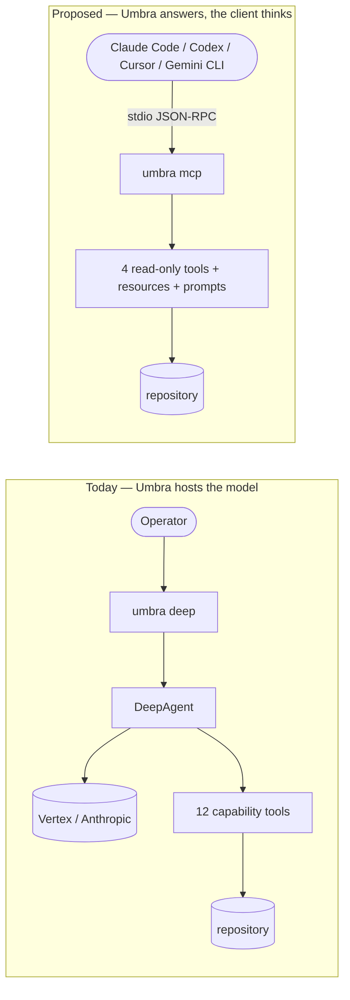

# ADR-024 — Umbra as a read-only MCP server

| | |
|---|---|
| **Category** | Architecture · Packaging · Integration |
| **Author** | David Balladares (decision) · Claude (record) |
| **Date** | 2026-09-02 |
| **Status** | ✅ **Accepted** — amended 7× 2026-09-03. Amendment 1 was **wrong** and is corrected in amendment 6 |

---

## Context

Umbra holds knowledge about a repository that no other tool on this machine has:
a semantic index of the code, a bounded ADR catalog (ADR-004), an AST-level
dependency graph, and a type-level integrity check. Today that knowledge is
reachable **only from inside Umbra's own agent loop**.

Two facts turn that from a design into a limitation.

**1. Umbra is hermetic.** `CAPABILITY_REGISTRY` in `src/core/agent/agent-kernel.ts`
grants twelve tools to a role. None of them reaches a database, a ticket, a
production log, a browser, or the network. `executeCommandTool` in
`src/core/tools/system-tools.ts` exists but is referenced only from
`src/core/agent/graph/coder.graph.ts` — the legacy graph ADR-011 deprecated — and
is absent from `CAPABILITY_REGISTRY`, so under `umbra deep` there is no shell.
This containment is deliberate and is not being reversed here.

**2. Four agents keep four different views of the same code.** The operator runs
Claude Code, Codex, Antigravity and Gemini CLI against the same repositories.
Their *instructions* were unified into one global constitution on 2026-08-21;
their *knowledge of the codebase* never was. Each rebuilds it with its own grep,
and each reaches its own conclusions.

`docs/improvements-analysis.md` §1 already proposed the opposite direction —
Umbra as an MCP **client**, consuming third-party servers to widen what the agent
can see. That idea is not dead; it was evaluated against this one and lost for
v1. The Trade-offs table records why.

---

## Decision

Expose Umbra's read-only knowledge over the Model Context Protocol as a **third
presentation adapter**, beside the two that already exist (`src/presentation/cli/`,
`src/presentation/http/`). **The domain does not move.**

In MCP server mode Umbra has **no model inside it**. It does not reason, does not
build prompts, does not call a provider, and runs no agent loop. It receives a
request and answers it by executing deterministic code. Everything ADR-006,
ADR-015, ADR-016 and ADR-019 govern — streaming, provider auth, reasoning
vocabulary, turn budget — is out of scope for this mode by construction.

### What is published

| MCP primitive | Umbra asset | Symbol |
|---|---|---|
| Tool | semantic code search | `askCodebaseTool` in `src/core/tools/rag-tools.ts` |
| Tool | bounded ADR catalog | `listAdrsTool` in `src/core/tools/system-tools.ts` |
| Tool | AST dependency graph | `queryDependencyGraphTool` in `src/core/tools/analysis-tools.ts` |
| Tool | type-level integrity | `integrityCheckTool` in `src/core/tools/testing-tools.ts` |
| Resource | ADR index, README index | the cached catalogs in `.umbra/` (ADR-003, ADR-004) |
| Prompt | the shipped skills | `skills/*.md`, already in `package.json#files` (ADR-012) |

### What is deliberately **not** published in v1

`safeWriteFileTool`, `deleteFileTool`, `executeTestsTool`, `executeCommandTool`,
and the delegation tools. Not withheld out of caution alone — see constraint 2,
which makes writes technically unavailable in this mode.

### The five constraints that are part of the decision

1. **No model.** The server never instantiates a chat model. The one exception is
   an embedding call inside `RetrieverService#query` — see Negative consequences.
2. **No writes.** `requestApproval` in `src/core/tools/utils/approval.ts` suspends
   by raising a LangGraph `interrupt()`, which only exists **inside a graph run**.
   MCP server mode has no graph, therefore no interrupt, therefore no human
   approval channel, therefore nothing that writes may be exposed. The future
   bridge is MCP *elicitation*, already identified as the same pattern in
   `docs/deferred-work.md` (§ *`ask_human` with multiple choice*). Separate work.
3. **The root is pinned at launch and never read from a tool argument.** Accepting
   a root from an argument would reopen the whole path-traversal surface of
   ADR-011 and hand it to a remote caller. This is the single security decision
   the mode depends on.
4. **`stdout` belongs to the protocol.** Over stdio, JSON-RPC travels on stdout.
   Any log written there corrupts the connection.
5. **The index must be warm.** `askCodebaseTool` reads from SQLite via `AgentDB`;
   with no index it returns nothing, silently. The server indexes at launch and
   reports a partial index rather than pretending, per ADR-017.

### Entry point

A subcommand of the existing binary — `umbra mcp --root <path>` — registered in
`src/bin/cli.ts` alongside `deep`, `orchestrate`, `analyze` and `init`.
**ADR-010's single-binary decision is preserved, not contradicted:** this is one
more `program.command()`, not a second executable.



---

## Trade-offs

Three directions were really on the table.

| Option | Pros | Cons | Decision |
|---|---|---|---|
| **A. MCP client first** (`docs/improvements-analysis.md` §1) — Umbra consumes third-party servers | Widens what the agent can *see*: DB schema, tickets, PRs, production logs | Imports the whole trust problem: a tool description is prompt text the model obeys, so a third party writes into Umbra's context. Also needs the security gate moved to middleware first, because the policy currently lives *inside* each tool body (`authorizeFileAction`, `requestApproval`) and a client-generated tool body calls none of it | ❌ Deferred. Not rejected as an idea — rejected as the *first* step |
| **B. MCP server, read-only** | Reuses the sound half of the codebase and avoids the fragile half. **No trust problem at all: Umbra writes its own tool descriptions.** No credentials to hand out, no third-party processes to supervise, reversible by deleting one config line | Publishes no new capability to Umbra itself — the operator's own agent gains nothing directly | ✅ **Chosen** |
| **C. MCP server with writes** | Would let a foreign client use Umbra to *change* code | Impossible in v1 without inventing a second approval channel, which constraint 2 explains. Also grants a remote caller write access to the repository, a much larger decision than this record | ❌ Rejected for v1 |

Option B also matches an existing precedent rather than inventing one: ADR-022
decided that explicitly external roles are **read-only advisors in v1**. Same
boundary, same reasoning, one layer out.

---

## DDD layer mapping

| Layer | Component | Impact |
|---|---|---|
| Domain | — | **Unchanged.** That is the point of the decision |
| Application | — | **Unchanged.** Existing tools are reused as they are |
| Infrastructure | `src/core/tools/utils/logger.ts` — `log` | Must write to `stderr` in MCP mode (constraint 4) |
| Infrastructure | `src/core/rag/retriever.ts` — `RetrieverService` | Its own `console.log` calls must move off stdout |
| Presentation | **new** `src/presentation/mcp/` | The MCP server: transport, capability advertisement, DTO boundary |
| Presentation | `src/bin/cli.ts` | Registers the `mcp` subcommand |

### The DTO boundary is not optional

Umbra's tools return strings shaped for **Umbra's own prompt**:
`formatAuthorizationFailure` in `src/core/tools/utils/authorize.ts` returns
`❌ DENIED: …`, and the system prompt that gives that vocabulary meaning
(`WRITER_PROTOCOL` in `src/core/agent/deep-agent-factory.ts`) will not be present
in a foreign client. A foreign model reads those strings without their context.

The rule is the one this project already follows everywhere else: **a presentation
layer returns DTOs, never internals.** New presentation, same law.

---

## Consequences

### Positive

- **One source of truth for four agents.** What the global constitution did for
  instructions, this does for knowledge of the code.
- **The cheapest possible surface.** No model, no credentials to distribute, no
  writes, no provider code paths. The whole security question reduces to
  constraint 3.
- **`skills/*.md` stop being Umbra-only.** As MCP prompts they become invocable by
  any client — one skill written once, four agents using it.
- **Adoption of `@dastbal/umbra` loses its main objection.** "Install a CLI and let
  an agent write to your repository" becomes "add one line, read-only".
- **Measured token economy.** Answering the three questions that produced this
  record took eleven tool calls to rediscover facts the repository already knows.
  Two MCP calls would have replaced most of them — and that saving repeats every
  session, for every agent.

### Neutral

- Umbra's own agent gains no new capability. This record widens who can *ask*, not
  what Umbra can *do*.
- MCP's `notifications/tools/list_changed` is not used: the published list is fixed
  at launch. A dynamic list would recreate the prompt/tool drift ADR-013
  documents, with an external process as the cause.
- MCP *sampling* (a server asking the client to run a model call) is advertised as
  unsupported. It would let a third party spend the client's budget on a prompt
  nobody audited.

### Negative — accepted honestly

- **`ask_codebase` is not free and needs Google credentials.** `RetrieverService#query`
  calls `embedQuery` on the model from `LLMProvider.getEmbeddingsModel`, which is
  `VertexAIEmbeddings` (`text-embedding-004`) and runs
  `LLMProvider.ensureVertexCredentials` first. So three of the four published
  tools cost nothing, and the fourth costs cents per query **and cannot run at all
  without ADC**. This directly limits the adoption argument above.
  → **Dependency:** the deferred item *"Umbra should not require Google to run at
  all"* in `docs/deferred-work.md`. Local embeddings (the Ollama stack is already a
  dependency) would make all four tools free and credential-free. This record is
  the use case that makes that item worth doing.
- **Retrieval is a full scan.** `RetrieverService#query` runs
  `SELECT * FROM code_chunks` and computes `cosineSimilarity` in JS over every row.
  Acceptable for one operator; it is the bottleneck the moment a server answers
  several clients over a large repository.
- **Two logging paths must be corrected before stdio works at all** (constraint 4).
- **A third presentation layer is a third thing to keep in sync.** ADR-012's six
  amendments are the standing evidence of what CLI drift costs.

---

## Verification Evidence

> **Amended 2026-09-02.** The paragraph below was accurate when written and is
> now stale in one respect: an implementation exists. It is kept because the
> constraint evidence it introduces is still what the design rests on. The
> implementation evidence is added in a second section further down, and the
> *Not verified* list is amended rather than rewritten.

Everything below was run on 2026-09-02 in this repository. **It verifies the
constraints this record depends on — it does not verify an implementation, because
none exists yet.**

**The tools a role can actually receive** — read `CAPABILITY_REGISTRY` in
`src/core/agent/agent-kernel.ts`: eleven capabilities resolving twelve tools, none
of them network, database, or shell.

**No shell under `umbra deep`:**

```
$ grep -rn "executeCommandTool" src --include=*.ts | grep -v "^src/core/tools/"
src/core/agent/graph/coder.graph.ts:10:  executeCommandTool, askHumanTool, deleteFileTool
src/core/agent/graph/coder.graph.ts:27:  const dangerousCodingTools = [deleteFileTool, executeCommandTool, askHumanTool];

$ grep -n "executeCommandTool" src/core/agent/agent-kernel.ts
(no output)
```

**`stdout` is contended, and the blast radius is small.** 125 `console.log` calls
in `src` (excluding specs), but only ~21 sit in the code paths a read-only server
would execute; the remaining ~104 are CLI presentation, which this mode never runs:

```
$ grep -rn "console\.log" src --include=*.ts | grep -v spec | awk -F: '{print $1}' | sort | uniq -c | sort -rn
     53 src/presentation/cli/model-menu.ts          <- not in MCP path
     33 src/bin/cli.ts                              <- not in MCP path
     16 src/presentation/cli/chat-session.ts        <- not in MCP path
      6 src/core/interaction/infrastructure/chalk-logger.adapter.ts
      5 src/core/tools/utils/logger.ts              <- used by every tool
      5 src/core/rag/retriever.ts
      4 src/core/rag/indexer.ts
      ...
```

`log` in `src/core/tools/utils/logger.ts` writes all five of its levels —
including `error` — with `console.log`, i.e. to stdout.

**The root is read from the process, inside a tool body.** `integrityCheckTool` in
`src/core/tools/testing-tools.ts` opens with `const rootDir = process.cwd();`.
A `--root` flag will not be honoured until that is injected rather than read — the
same one-value-one-constant lesson as ADR-018.

**`ask_codebase` spends and needs credentials.** `RetrieverService#query` in
`src/core/rag/retriever.ts` calls `embedQuery`; `LLMProvider.getEmbeddingsModel`
in `src/core/llm/provider.ts` constructs `VertexAIEmbeddings` after
`ensureVertexCredentials`.

**The presentation-layer precedent is real.** `ls src/presentation/` returns
exactly `cli` and `http`, and `src/index.ts` exports `./presentation/http`
alongside the core.

**The skills already ship.** `package.json#files` is
`["dist", "skills/*.md", "README.md"]` (ADR-012).

### Not verified

- No MCP server, transport, or handshake has been written or run.
- The MCP SDK is not a dependency of this project yet.
- The latency and context cost of publishing four tools to a foreign client have
  not been measured.

> **Amended 2026-09-02.** The first two items are closed and the third stands.
>
> - The server, the transport and the handshake are written and were run; see
>   *Implementation evidence* below.
> - The MCP SDK is **still not a dependency, and now never will be** — see
>   amendment 1. The item is closed by a decision, not by an installation.
> - Latency and context cost are still unmeasured. `tools/list` returns four
>   descriptors totalling roughly 700 tokens of schema and description; what
>   that costs a client across a session has not been observed.
>
> One item is **added**: `ask_codebase` has never been answered by local
> embeddings, because `nomic-embed-text` is not installed on this machine. See
> ADR-025's own *Not verified*.

---

## Implementation evidence — added 2026-09-02

Run against the built output (`npm run build`, then `node dist/bin/cli.js`), with
a script that spawns the server, speaks JSON-RPC over the pipe, and separates
`stdout` from `stderr`.

**A real handshake, and the tools answered.** `initialize` →
`notifications/initialized` → `tools/list` → `prompts/list` → `resources/list` →
`resources/read` → four `tools/call` → `ping` → a deliberately malformed line:

```
id=1  -> initialize ok, protocol 2025-06-18, caps tools+resources+prompts
id=2  -> tools: ask_codebase, list_adrs, query_dependency_graph, run_integrity_check
id=3  -> prompts (13): analyze-codebase, create-ddd-module, … write-tests
id=4  -> resources: umbra://adr-index, umbra://index-status
id=6  -> tool ok: "ADR catalog (cached; 26 decisions): - ADR-001 — …"
id=7  -> tool ok: "DEPENDENCY GRAPH (INBOUND) for src/core/rag/retriever.ts: - [import] src\core\tools\rag-tools.ts"
id=8  -> TOOL ERROR: Unknown tool "safe_write_file". This server publishes: …
id=10 -> tool ok: "[embeddings: vertex/text-embedding-004 · 19 files indexed · indexed 2026-09-02T21:13:20.219Z] …"
id=null -> ERROR -32700: Invalid JSON.
```

The notification was correctly **not** answered. The malformed line produced a
parse error and the connection survived it. `safe_write_file` — a real Umbra
tool — is not reachable, which is constraint 2 holding in practice.

**`stdout` was not pure, and the purity check is what found it.** The first run
reported:

```
lines on stdout: 13
valid JSON-RPC : 11
NON-JSON-RPC   : 2
--- offending lines ---
"◇ injected env (0) from .env // tip: ⌘ suppress logs { quiet: true }"
"◇ injected env (0) from .env.development // tip: ⌘ enable debugging { debug: true }"
```

`src/core/llm/provider.ts:65-66` called `dotenv.config` **without `quiet: true`**
at module import, and dotenv v17 prints a banner plus a usage tip to `stdout`.
`src/bin/cli.ts` had always passed `quiet` on its own two calls; these two, added
later and running at import time, did not. Fixed; the check now reports
`11 lines, 11 valid, 0 non-JSON-RPC`, and again with index warming enabled.

**The `process.stdout.write` leak this record's own evidence missed.**
`src/core/rag/indexer.ts:211` wrote a raw `.` per batch as progress — on the
exact path the server executes while warming the index at launch. The original
evidence above enumerated `console.log` sites and therefore could not see it.
Both leaks were found by machine, not by reading code, which is why the purity
assertion is now a spec rather than a one-off script.

**Diagnostics went to `stderr`, not nowhere.** With index warming on:

```
[umbra mcp] umbra mcp — serving C:\…\nestjs-ai-agent-lib
[umbra mcp] embeddings: vertex/text-embedding-004 (from config)
..
[umbra mcp] index ready
[umbra mcp] publishing 4 tools: ask_codebase, list_adrs, query_dependency_graph, run_integrity_check
⚙️  [SYS]: ADR catalog cached: 26 decisions
🔍 [RAG] Embedding Query: "where is the dependency graph queried?"...
```

Every one of those lines is on `stderr`, including the two progress dots.

**Conditional advertisement works, with a diagnosable reason.** Ollama was
running with four `gemma4` tags and no embedding model:

```
[umbra mcp] ask_codebase NOT published — Ollama is running but the model
            "nomic-embed-text" is not installed. Run: ollama pull nomic-embed-text
[umbra mcp] publishing 3 tools: list_adrs, query_dependency_graph, run_integrity_check
```

`tools/list` returned exactly three, and calling `ask_codebase` returned an error
naming what *is* published.

**No new dependencies.** `package.json` still declares 19 direct dependencies.

**The suite.** `685 passed, 5 skipped, 69 of 70 suites`, including 38 new
assertions. No existing spec was modified.

**A third presentation adapter exists.** `ls src/presentation/` now returns
`cli`, `http`, `mcp`.

---

## Amendments

### 1 — 2026-09-02 · The official MCP SDK is not used, and the transport is Umbra's own

> **This amendment was wrong. Corrected by amendment 6, the same day.** The
> premise below — that the SDK cannot be `require()`d from this project — is
> false, and the SDK is now used. The text is kept because the *dependency
> weight* half of the argument was sound and is what made the dependency
> optional rather than plain, and because the mistake itself is the point of
> amendment 6.

This record assumed an SDK and listed "the MCP SDK is not a dependency of this
project yet" as a gap to close. It is not a gap; it is a decision.

`@modelcontextprotocol/sdk@1.30.0` is `"type": "module"`. This project compiles
to CommonJS — `tsconfig.json` sets `"module": "CommonJS"` and `package.json`
declares no `"type"` — which is the same reason `chalk` is pinned to `^4`. The
SDK cannot be `require()`d from `dist/`. It also depends on `express`, `hono`,
`jose`, `cors`, `ajv`, `eventsource` and a dozen more: eighteen transitive
packages added to a library with nineteen direct dependencies, to serve nine
methods over a pipe.

MCP over stdio is newline-delimited JSON-RPC 2.0. What was actually required was
a line reader, `JSON.parse`, and a serializer — `jsonrpc-stdio.transport.ts`,
about 200 lines with no dependencies. Owning that is cheaper than owning the
packaging problem, and it is what gives the absolute control over `stdout` that
constraint 4 demands.

**The cost, recorded honestly:** the handshake is now Umbra's to maintain. If MCP
adds negotiation this server must implement it by hand. The mitigation is that
the surface is nine methods and the version advertised is this server's own,
never echoed back from the client, so the server can never claim support for a
revision nobody wrote.

### 2 — 2026-09-02 · `ask_codebase` is advertised conditionally, not unconditionally

The record published four tools unconditionally. It also recorded, as an accepted
negative consequence, that `ask_codebase` "cannot run at all without ADC".

Both cannot be true at once without reintroducing the ADR-013 defect: a tool
declared to a model that cannot answer. Worse here than in ADR-013, because the
tool list is fixed at launch and cannot be corrected mid-session.

So `probeEmbeddings` runs at startup — Vertex credentials, or Ollama reachable
**with the embedding model actually installed** — and `ask_codebase` is published
only when the answer is yes. When it is not, `stderr` states the reason and the
command that fixes it, and the other three tools are unaffected.

Reachability was deliberately not treated as availability. A daemon answering on
its port with the model absent would have produced exactly the failure this
amendment exists to prevent.

### 3 — 2026-09-02 · The README index resource is not published, and ADR-003 is owed an amendment

*What is published* lists "ADR index, README index — the cached catalogs in
`.umbra/` (ADR-003, ADR-004)". Only the ADR index exists.

`list_readmes`, the entire subject of
[ADR-003](./ADR-003-on-demand-readme-index.md) and recorded there as **Accepted**,
has no implementation in `src/`: no tool, no index builder, no cache writer.
Verified by grep across the tree.

It is therefore not published, because publishing a resource this repository
cannot produce is the same defect as advertising a tool that cannot answer. A
second resource was published in its place — `umbra://index-status`, the semantic
index's provenance — which is a real artifact.

**The disagreement is between the code and a record, so neither was silently
picked:** the code is authoritative for what the system does now, and ADR-003 is
owed an amendment saying whether `list_readmes` was reverted, never merged, or
lost. That amendment is not written here because it is not this record's to make.

### 4 — 2026-09-02 · The root is pinned in one constant, and three call sites now read it

Constraint 3 said the root must be pinned at launch and never read from a tool
argument. The evidence noted `integrityCheckTool` opening with
`const rootDir = process.cwd();` and predicted that "`--root` will not be honoured
until that is injected rather than read".

The prediction was right and incomplete. Three places read the working directory
on the published path, not one: `testing-tools.ts`, `system-tools.ts`, and —
the one that mattered most — `AgentDB.getInstance` in `src/core/state/db.ts`,
which fixes the workspace for the whole process on first use.

`src/core/config/runtime-root.ts` now holds `pinRuntimeRoot` / `runtimeRoot`,
defaulting to `process.cwd()` so no existing command changes behaviour, and
throwing on a conflicting re-pin rather than silently serving the wrong
repository. `run_integrity_check` keeps its empty schema, which is the point.

### 5 — 2026-09-02 · `query_dependency_graph` had no capability at all

The record published it as one of four tools. It was not in
`CAPABILITY_REGISTRY` — the file's own comment calls that registry "the single
source of truth for built-in capabilities and their concrete tools" — and no
capability resolved it. It was reachable only by direct import.

It is now registered as `read_dependency_graph`, risk `read`. Deliberately its
own capability rather than an addition to `search_codebase`, because that one
also grants `refreshIndexTool`, which writes.

---

## Related Files

- `src/core/agent/agent-kernel.ts` — `CAPABILITY_REGISTRY`, `resolveCapabilityTools`, `CapabilityRisk`, `KernelTool`
- `src/core/tools/rag-tools.ts` — `askCodebaseTool`, `refreshIndexTool`
- `src/core/tools/system-tools.ts` — `listAdrsTool`, `listFilesTool`, `executeCommandTool`
- `src/core/tools/analysis-tools.ts` — `analyzeCodeStructureTool`, `queryDependencyGraphTool`
- `src/core/tools/testing-tools.ts` — `integrityCheckTool` (reads `process.cwd()`), `executeTestsTool`
- `src/core/tools/utils/logger.ts` — `log` (all five levels write to stdout)
- `src/core/tools/utils/approval.ts` — `requestApproval`, `rethrowIfSuspension`
- `src/core/tools/utils/authorize.ts` — `formatAuthorizationFailure`, `evaluateFileAction`, `authorizeFileAction`
- `src/core/rag/retriever.ts` — `RetrieverService#query`, `RetrieverService#getContextForLLM`
- `src/core/rag/math.ts` — `cosineSimilarity`
- `src/core/rag/indexer.ts` — `IndexerService#indexProject`
- `src/core/state/db.ts` — `AgentDB`
- `src/core/llm/provider.ts` — `LLMProvider.getEmbeddingsModel`, `LLMProvider.ensureVertexCredentials`, `LLMProvider.vertexProjectField`
- `src/core/agent/deep-agent-factory.ts` — `WRITER_PROTOCOL`, `DeepAgentFactory.create`
- `src/core/agent/graph/coder.graph.ts` — `dangerousCodingTools` (legacy path, ADR-011)
- `src/bin/cli.ts` — the `program.command()` registrations the `mcp` subcommand joins
- `src/index.ts` — the public surface a new presentation adapter would extend
- `src/presentation/cli/`, `src/presentation/http/` — the two existing presentation adapters
- `package.json` — `files` (ships `skills/*.md`), `bin.umbra` (ADR-010)
- `docs/improvements-analysis.md` — §1, the MCP-client proposal this record defers
- `docs/deferred-work.md` — *"Umbra should not require Google to run at all"* (the local-embeddings dependency); *"`ask_human` with multiple choice"* (the elicitation mechanism to reuse)

---

### 6 — 2026-09-02 · The official SDK is adopted, because amendment 1's premise was false

Amendment 1 rejected `@modelcontextprotocol/sdk` as unusable from this CommonJS
project, on the grounds that it is `"type": "module"`. **That is not what
`type` means when a package ships a dual `exports` map**, and this one does:

```
exports['./server'] = { import: './dist/esm/server/index.js',
                        require: './dist/cjs/server/index.js' }

$ node -e "require('@modelcontextprotocol/sdk/server/mcp.js')"
McpServer: function     → REQUIRE FROM COMMONJS: WORKS
```

It is the same layout `@langchain/core` uses, which this project has always
consumed without trouble — eleven of its nineteen dependencies carry an ESM
manifest. A probe file compiled under the project's own `tsconfig.json` reported
only the deliberate type error placed in it, never a resolution failure.

**The root cause was in this repository, not in the SDK.** `tsconfig.json` had
`moduleResolution: "node"` — Node 10 resolution, which predates the `exports`
field and does not read it. Under that lens the SDK's `require` path does not
exist. The conclusion was drawn from reading `type: "module"` at the top of the
manifest and stopping there, and the tooling agreed because it was looking the
same wrong way. Fixed: the project now resolves at `Node16`, which immediately
surfaced a real portability bug in an unrelated dependency
([ADR-026](./ADR-026-vectors-are-numbers-and-the-database-can-count.md)).

**What survived from amendment 1** is the dependency-weight argument, measured:
5.7 MB for the SDK plus ~6.9 MB of transitive packages — `hono`, `ajv`, `jose`,
`express`, `cors`, `eventsource`. That is why the SDK is an **optional peer
dependency** rather than a plain one, so a consumer who installs
`@dastbal/umbra` for its NestJS module never downloads a protocol they do not
speak. `peerDependenciesMeta.optional`, not `optionalDependencies`, because the
latter installs.

`jsonrpc-stdio.transport.ts` and `umbra-mcp-server.ts` are retired — about 400
lines of framing, ids, notifications and error codes. The hand-written JSON
Schema in `tool-catalog.ts` is replaced by zod raw shapes the SDK converts
itself.

**What stayed ours**, because a protocol library cannot know it: the DTO
boundary, which tools exist at all, the descriptions rewritten for a foreign
reader, retrieval provenance, and the startup order with its pinned root and
pinned embedding provider.

**Three behaviours changed**, found by running the round-1 handshake script
unmodified and recorded rather than glossed:

| | Hand-written | SDK |
|---|---|---|
| A malformed line | answered `-32700`, stayed connected | dropped silently |
| Response order | strictly in request order | concurrent; ids may return out of order |
| Unknown tool | named what *is* published | `MCP error -32602: Tool X not found` |

The stdout purity assertion was carried into `sdk-server.spec.ts` verbatim and
still passes. It is the test that found both real leaks in the original
implementation, and if the SDK speaks the same protocol the same assertion has
to hold.

**What this unblocks**, still unbuilt: the HTTP/streamable transport (several
clients, remote), and **elicitation** — the channel constraint 2 named as the
prerequisite for anything that writes.

---

### 7 — 2026-09-03 · MCP onboarding is explicit, additive, and never an install hook

The first public MCP instructions required a developer to copy a JSON block into
`.mcp.json`. That is a small step, but it is easy to mistype and discourages
adoption of the read-only server this record introduced. The alternative proposed
was a package `postinstall` hook which would create or modify the file whenever
`npm install` runs.

**The hook is rejected.** A dependency installation must not silently change a
consumer repository's tool configuration or register a command a client might
later launch. This is not a distinction of convenience: the root pinning rule in
this decision means the generated entry grants access to a specific repository.
The operator must see and choose that change.

`umbra init` now asks, defaulting to **No**, whether to enable the project as a
read-only MCP server. On approval,
`ensureUmbraMcpConfiguration` in `src/core/config/mcp-config.ts` creates or
updates only `mcpServers.umbra`. It preserves other server entries, rejects
malformed JSON or a non-object `mcpServers` without writing, and pins `--root`
to the resolved current project directory. Re-running it is idempotent.

The generated absolute path is intentionally local. A team that wants a
portable, committed Claude Code entry continues to author it deliberately with
`${CLAUDE_PROJECT_DIR}`; an installer cannot know which client or substitution
syntax a team has chosen.

### Verification evidence

- `mcp-config.spec.ts` — 5 tests passed: creation, preserving another server,
  updating a stale Umbra entry, idempotence, and no overwrite of invalid JSON.
- `node node_modules/typescript/bin/tsc --noEmit --pretty false` — passed.
- `node node_modules/typescript/bin/tsc -p tsconfig.build.json` — passed;
  `npm run build` could not start on this Windows machine because the global npm
  installation is missing `npm-cli.js`.

### Related files added by this amendment

- `src/core/config/mcp-config.ts` — `ensureUmbraMcpConfiguration`.
- `src/core/config/mcp-config.spec.ts` — MCP configuration preservation and
  failure-boundary tests.
- `src/bin/cli.ts` — `init`'s explicit MCP opt-in.
- `README.md` — generated local configuration and portable team configuration.

---

## Next step, if this is accepted

The first move is **not** writing the server. It is deciding whether local
embeddings land first, because that answers whether `ask_codebase` can be
published to a user who has no Google account — and that answer changes what v1
is worth.

> **Answered 2026-09-02.** Local embeddings landed first, as this section
> proposed, and are recorded in
> [ADR-025](./ADR-025-embeddings-are-chosen-not-assumed.md): a provider port,
> one vector column per provider, and coexistence rather than migration, so
> switching is reversible and the pre-existing index needed no reindex.
>
> The answer to "what is v1 worth" turned out to be conditional rather than
> binary, and amendment 2 records the shape it took: `ask_codebase` is published
> when embeddings are available and withheld with a reason when they are not.
> Three tools are free and credential-free either way.
>
> **What is still open**, and is now the next step:
>
> 1. **Install `nomic-embed-text` and answer one `ask_codebase` call through
>    it.** Every component is exercised except the local embedding call itself.
>    Until that runs, "Umbra does not require Google" is designed, not proven.
> 2. **Register the server in the four clients and measure what `tools/list`
>    costs per session.** The token economy argument in *Positive* is still an
>    estimate.
> 3. **`ask_human` as MCP elicitation** — constraint 2's stated future bridge,
>    and the prerequisite for anything that writes. Unchanged and unstarted.
