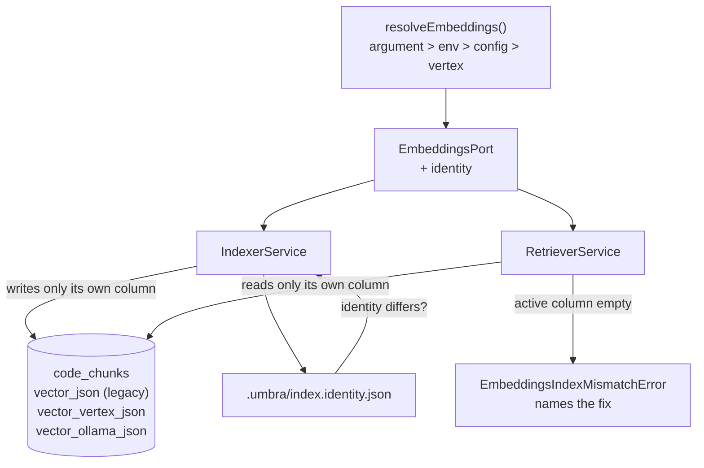

# ADR-025 — Embeddings are chosen, not assumed, and switching costs nothing

| | |
|---|---|
| **Category** | RAG · Providers · Storage · Portability |
| **Author** | David Balladares (decision) · Claude (record) |
| **Date** | 2026-09-02 |
| **Status** | ✅ **Accepted** — amended 2× 2026-09-02; §3 **superseded by [ADR-026](./ADR-026-vectors-are-numbers-and-the-database-can-count.md)** |
| **Superseded in part by** | [ADR-026](./ADR-026-vectors-are-numbers-and-the-database-can-count.md) — §3 only. Everything else in this record stands |

---

## Context

[ADR-024](./ADR-024-umbra-as-a-read-only-mcp-server.md) closed with a dependency
rather than a next task:

> The first move is **not** writing the server. It is deciding whether local
> embeddings land first, because that answers whether `ask_codebase` can be
> published to a user who has no Google account.

It had already recorded the reason, as an accepted negative consequence: three
of the four tools it publishes cost nothing, and the fourth "costs cents per
query **and cannot run at all without ADC**". A read-only server whose headline
capability requires a Google Cloud project is not the adoption story ADR-024
argued for.

`getEmbeddingsModel` in `src/core/llm/provider.ts` returned a
`VertexAIEmbeddings` on `text-embedding-004`, constructed after
`ensureVertexCredentials`. There was one provider, chosen at compile time, named
in one place, and read from two others.

### The hazard that shapes this record

Making embeddings pluggable is four lines. Making it **safe** is the decision,
because two embedding models produce vectors that are not comparable and
**nothing errors when you compare them anyway**.

`nomic-embed-text` (Ollama) and `text-embedding-004` (Vertex) both return **768
dimensions**. So a cosine similarity computed across them does not throw, does
not warn, and does not return an empty result. It returns a plausible score, and
ranks the wrong code first.

That is ADR-017's third failure arriving by a new route:

> After fourteen failed batches the run printed `💾 Vectors Saved.` and
> `✅ Indexing Complete.` Worse than the visible crash: the operator reads a
> green line and trusts an index that is missing content.

Under ADR-024 it would be worse still, because the reader of that lie is another
agent with no terminal to inspect.

### The second hazard: a migration nobody performs

The obvious implementation stores one vector per chunk and overwrites it on a
provider switch. That makes every switch a full reindex, and a full reindex of a
large repository is a cost an operator pays once and then never switches again.
An option that is technically available and practically prohibitive is not an
option.

---

## Decision

Embeddings are selected at runtime through a port, every stored vector is
stamped with the identity that produced it, and **the providers coexist** rather
than replace each other.

### 1. A port, not a conditional

`src/core/rag/embeddings/`:

| Component | Role |
|---|---|
| `embeddings.port.ts` | `EmbeddingsPort`, and `EmbeddingsIdentity` — `{ provider, model, dimensions, column }` |
| `vertex-embeddings.adapter.ts` | Wraps `LLMProvider.getEmbeddingsModel()`, **unmodified** |
| `ollama-embeddings.adapter.ts` | `OllamaEmbeddings` from `@langchain/ollama` — already a dependency, so **zero new packages** |
| `embeddings-resolver.ts` | The selection ladder |
| `embeddings-availability.ts` | `probeEmbeddings`, which answers *can this actually respond?* |

The identity travels **with** the port, not beside it. A vector is not
self-describing, so the thing that produces one has to say what it is.

### 2. The selection ladder, reused rather than invented

Explicit argument → `UMBRA_EMBEDDINGS` → `.umbra/agent.config.json` → `vertex`.

The same order [ADR-002](./ADR-002-model-routing-and-bounded-analysis.md) fixed
for model resolution. The load-bearing rung is the last: **the default is still
Vertex**, so an installation that changes nothing behaves exactly as it did.

> **Amended 2026-09-03 by [ADR-027](./ADR-027-the-default-is-the-one-that-costs-nothing.md).**
> The last rung is now `ollama`, so a fresh install has semantic search that
> costs nothing and needs no Google Cloud project. The reasoning above was right
> for its moment and is kept: protecting existing installs was the correct
> priority before local embeddings had ever been verified end to end. What
> changed is that they have been, and that ADR-026 makes querying the wrong
> identity a loud, recoverable error instead of a silent one.
>
> ADR-027 also records a defect this section created: the config schema
> defaulted this field *as well*, so the `default` rung was unreachable and the
> ladder reported `source: 'config'` for a choice nobody had made.

An unrecognised value is *reported and ignored*, never silently defaulted. A
typo that quietly changes which vector space is used is the exact class of
failure ADR-017 was written about.

### 3. One column per provider — coexistence instead of migration

> **Superseded 2026-09-02 by [ADR-026](./ADR-026-vectors-are-numbers-and-the-database-can-count.md).**
> Vectors now live in `chunk_vectors`, keyed by `(chunk_id, provider, model)`
> and stored as float32 BLOBs. The columns below are no longer written or read;
> they were migrated into that table and are kept as the rollback.
>
> **The decision was not reversed, it was generalised.** The property David
> chose this design for — no cell where two vector spaces can meet — is
> preserved by construction, because the provider is part of the primary key. It
> now also covers the **model**, which the columns could not: moving from
> `text-embedding-004` to a newer Vertex model would have reused
> `vector_vertex_json` and mixed two unrelated spaces, the exact failure these
> columns existed to prevent, arriving from inside one provider.
>
> This section is kept in full rather than rewritten, because the reasoning below
> is what a future reader needs before proposing a shared column again.

`code_chunks` gains `vector_vertex_json` and `vector_ollama_json`. The
pre-existing `vector_json` is **not touched and not dropped**.

This was David's call, and the reason it is right is that it makes the dangerous
mistake unrepresentable rather than merely discouraged: there is no shared column
in which two vector spaces could ever meet.

- **The migration is additive and idempotent.** `AgentDB.initSchema` reads
  `PRAGMA table_info(code_chunks)` and issues `ALTER TABLE … ADD COLUMN` only
  for columns that are absent. Running it on a migrated database performs no
  writes.
- **No reindex is required to upgrade.** Every value ever written to
  `vector_json` came from Vertex, because Vertex was the only provider. So the
  Vertex read path is `COALESCE(vector_vertex_json, vector_json)`, and an index
  built before this record keeps answering after it.
- **Switching back is free.** Switching to Ollama does not delete the Vertex
  column; it fills a second one. Switch back and the first index is still there,
  still warm. The cost is disk. The cost of the alternative is that nobody
  switches.
- **`INSERT OR REPLACE` was replaced by an upsert.** `INSERT OR REPLACE` deletes
  and reinserts the row, which would blank the *other* provider's vector for
  that chunk — reintroducing the forced migration this design exists to avoid.
  `ON CONFLICT(id) DO UPDATE` touches only the active provider's column.
  > **Amended 2026-09-02.** Correct, and by itself insufficient: chunk ids are
  > `uuidv4()` per run, so this conflict clause never fires on a re-index. The
  > upsert protects a row that is written twice in one run; it cannot protect one
  > written across two runs. Amendment 1 has the measurement and the actual fix.

- **The index row is never re-created on a provider switch.** The switch path
  fills the empty column with `UPDATE`, on rows that already exist
  (`backfillMissingVectors`). This is the bullet that makes coexistence real —
  see amendment 1 for why the four above were not enough on their own.
- **The column list lives in one constant.** `EMBEDDING_VECTOR_COLUMNS` in
  `embeddings.port.ts` is what the schema migration reads, so the provider set
  and the schema cannot drift. ADR-018's rule applied to a set instead of a
  single value.

### 4. A mismatch is detected, not suffered

`RetrieverService#query` reads **only** the active provider's column. When that
column is empty it raises `EmbeddingsIndexMismatchError`, carrying both the
active identity and the providers that actually hold vectors, and the message
names the command to run.

Two details matter more than they look:

- **It throws rather than returning zero rows.** Zero rows is a quieter lie: "no
  results" is indistinguishable from "nothing matched your question".
- **The check happens before `embedQuery`.** The old order embedded first and
  queried after. Checking first means an unusable index costs no money and needs
  no credentials to diagnose.

### 5. A provider switch re-embeds the chunks that exist — it does not re-chunk

`FileRegistry` tracks **content hashes**. On its own it would report `✨ Project
is up to date` immediately after a switch to a provider whose column is empty:
the new column would never be written, retrieval would keep failing, and running
the indexer again would change nothing. A closed loop.

So `indexProject` compares the previous stamp's identity against the active one
and, when they differ, embeds the chunks already in the database for the new
provider — reading their stored text and filling one column in place, with
`IndexerService#backfillMissingVectors`.

**A provider switch is not a content change.** That sentence is the whole
mechanism, and getting it wrong is what amendment 1 records: the first version
treated a switch as though every file had changed, re-ran the chunker, and
destroyed the previous provider's index.

> **Corrected 2026-09-02.** This section originally read *"treats every file as
> needing work"*. That was the implementation, it was wrong, and it is replaced
> above rather than annotated in place because leaving the wrong instruction
> readable as current guidance would invite it back. Amendment 1 carries the
> full account and the measurements.

### 6. The index is stamped, and the stamp is honest

`.umbra/index.identity.json` records provider, model, dimensions, timestamp,
file count, and `status: 'complete' | 'partial'`.

Deliberately **not** `index.meta.json`: that file is owned by
`DeepAgentFactory.ensureIndexFresh`, which writes `{ indexedAt }` and reads it
back as a five-minute TTL. Writing identity into it would be silently destroyed
by that write, and changing what the factory writes would alter the freshness
behaviour of every existing command.

`status` is recorded from the same value that is printed, so the stamp on disk
and the line on screen cannot disagree.



---

## Trade-offs

| Option | Pros | Cons | Decision |
|---|---|---|---|
| **A. One shared `vector_json`, overwritten on switch** | No schema change; smallest diff | Every switch is a forced full reindex, so nobody switches twice. Worse: a half-switched index mixes two vector spaces in one column and cosine similarity cannot tell — confident nonsense with no error | ❌ Rejected |
| **B. One column per provider** | The mixing mistake is unrepresentable. Providers coexist, so switching back is free and the legacy column makes the upgrade reindex-free | A third provider needs an `ALTER TABLE`. The row carries a vector the active query does not use | ✅ **Chosen** (David's call) |
| **C. Normalized `chunk_vectors(chunk_id, provider, model, vector)`** | Open-ended: a new provider needs no schema change. No unused columns in a row | A join on every query, on a path that is already a full scan. More machinery than two providers justify, and the `ALTER TABLE` it avoids is one idempotent line | ❌ Deferred, not rejected — the right shape if a third and fourth provider ever arrive |

On option B's cost: `ALTER TABLE … ADD COLUMN` is additive and already automated,
and the unused vector is not read off disk, because the query names its columns
and puts the vector last. A 768-float JSON string is ~15 KB and lives in SQLite
overflow pages, so column order decides whether the other provider's vectors are
paged in for nothing.

---

## DDD layer mapping

| Layer | Component | Impact |
|---|---|---|
| Domain | `src/core/rag/embeddings/embeddings.port.ts` | **New.** The port, the identity, the typed mismatch error. Declares its own interface rather than depending on LangChain's `Embeddings` |
| Application | `src/core/rag/retriever.ts`, `indexer.ts` | Accept an injected port; default to the resolver so no existing call site changed |
| Infrastructure | `vertex-embeddings.adapter.ts`, `ollama-embeddings.adapter.ts` | The two adapters. The framework stays here |
| Infrastructure | `src/core/state/db.ts` | Additive column migration |
| Infrastructure | `src/core/rag/index-stamp.ts` | **New.** Provenance persistence |
| Infrastructure | `src/core/config/agent-config.ts` | New `rag` key, defaulted so existing files still parse under `.strict()` |

---

## Consequences

### Positive

- **`ask_codebase` becomes publishable without Google.** This is the dependency
  ADR-024 named, and it is now closed.
- **Free and offline.** Ollama embeddings cost nothing per query and work with no
  network.
- **Zero new dependencies.** `@langchain/ollama` was already here for chat.
- **Zero-cost upgrade.** No reindex, because the legacy column is read as Vertex.
- **Switching is reversible**, which is the only reason it will actually be used.
- **Every answer carries provenance**, so a consuming agent is told rather than
  asked to trust.

### Neutral

- Vertex remains the default. Nothing changes for anyone who changes nothing.
- `dimensions` is recorded even though both current models return 768. It costs
  nothing and is the field that will diagnose a model that changes shape.

### Negative — accepted honestly

- **Retrieval is still a full scan.** `RetrieverService#query` computes
  `cosineSimilarity` in JS over every stored row. Filtering by provider column
  reduces the rows read but does not change the shape. This remains the
  bottleneck ADR-024 recorded, and it is untouched here.
  > **Amended 2026-09-02.** Measured and largely closed by
  > [ADR-026](./ADR-026-vectors-are-numbers-and-the-database-can-count.md).
  > What this bullet did not say is how large it was: 772 MB read and parsed per
  > query on a 50,000-chunk repository, and JSON text accounted for 5.3× of the
  > bytes and a thousand-fold of the decode cost. It is **still** a linear scan;
  > what changed is that the constant fell and only `k` rows now cross into
  > JavaScript.
- **A third provider needs a schema line.** Option C is the answer if that
  happens; the constant that drives the migration is already in one place.
  > **Closed 2026-09-02.** Option C was taken, in ADR-026. A provider is rows
  > now, not schema.
- **Embedding quality is not compared.** No benchmark was run between
  `text-embedding-004` and `nomic-embed-text` on this codebase. The claim in this
  record is that switching is *safe and reversible*, **not** that the two are
  equally good. An operator who switches may get worse retrieval, and the design
  deliberately makes switching back cheap for exactly that reason.
- **`provider.ts` still reads `process.cwd()` at module import** to locate `.env`
  files. Under `umbra mcp` the root is pinned after module load, so a served
  repository's `.env` is not read. Not fixed here: changing module-load semantics
  is a wider change than this record covers.

---

## Verification Evidence

Run on 2026-09-02 in this repository, against the built output.

**The migration is additive, and the legacy column survived.** After the first
`umbra mcp` run on this repository:

```
$ node -e "…PRAGMA table_info(code_chunks)…"
id, file_path, chunk_type, content, vector_json, metadata, vector_vertex_json, vector_ollama_json

vector_json          232 rows
vector_vertex_json    45 rows
vector_ollama_json     0 rows
total chunks: 277
```

232 pre-existing vectors were preserved untouched; the run wrote 45 new ones into
the Vertex column. `ask_codebase` answered over all 277, which is the
`COALESCE(vector_vertex_json, vector_json)` path doing what it was added for —
**an index built before this record answered after it, with no reindex.**

**The availability probe refuses to advertise what cannot answer.** Ollama was
running on this machine with `gemma4:26b`, `gemma4:e2b`, `gemma4:e4b` and
`gemma4:latest` — and no embedding model:

```
$ node dist/bin/cli.js mcp --root . --embeddings ollama
[umbra mcp] embeddings: ollama/nomic-embed-text (from argument)
[umbra mcp] ask_codebase NOT published — Ollama is running but the model
            "nomic-embed-text" is not installed. Run: ollama pull nomic-embed-text
[umbra mcp] The other three tools need no credentials and are unaffected.
[umbra mcp] publishing 3 tools: list_adrs, query_dependency_graph, run_integrity_check
```

`tools/list` returned exactly those three, and `tools/call` on `ask_codebase`
returned an error naming what *is* published. Reachability alone was not treated
as availability, which is the ADR-013 lesson: the model has to be present, not
just the daemon.

**Default resolution is unchanged.** With no flag and no environment variable,
`resolveEmbeddings()` selects Vertex and reports its source
(`from config` on this repository, whose `.umbra/agent.config.json` now carries
the defaulted `rag` key).

**The unit suite.** `685 passed, 5 skipped, 69 suites` — including 38 new
assertions across the embeddings ladder, the mismatch error, the pinned root and
the MCP adapter. No existing spec was modified.

### Not verified

- **`ask_codebase` has never been answered by Ollama embeddings**, because
  `nomic-embed-text` is not installed on this machine. The adapter, the resolver,
  the column, the migration and the probe are all exercised; the end-to-end local
  embedding call is not. That is the one claim in this record with no run behind
  it.
- The mismatch error is verified by unit test, not by a live cross-provider
  query, for the same reason.
- No retrieval-quality comparison between the two providers.

> **Amended 2026-09-02, hours later.** `nomic-embed-text` was installed and the
> two gaps above were closed by running them. Closing them is also what exposed
> the defect in amendment 1 — the model was pulled specifically to test the one
> unproven claim, and the test failed in a way no unit test could have shown.
> The third item stands: no retrieval-quality comparison has been made.
>
> See *Amendment 1* for what the live runs proved and disproved.

---

## Amendments

### 1 — 2026-09-02 · Coexistence was broken as first implemented, and two mechanisms caused it

**This record claimed switching providers was non-destructive. As first
implemented, it destroyed the previous provider's index.** Found by running the
switch on this repository, immediately after `nomic-embed-text` was installed.

Measured, before and after one `umbra mcp --root . --embeddings ollama`:

| Column | Before | After |
|---|---|---|
| `vector_json` (legacy) | 232 | **5** |
| `vector_vertex_json` | 45 | **0** |
| `vector_ollama_json` | 0 | 252 |
| total rows | 277 | 257 |

The Vertex index was gone. Every unit test passed throughout, because they inject
a port and never exercise the storage path.

**Cause 1 — the parent cascade.** `FileRegistry#updateFile` issues
`INSERT OR REPLACE INTO file_registry`, under a comment calling it an UPSERT. It
is not one: `REPLACE` deletes the row before reinserting it, and `code_chunks`
declares `FOREIGN KEY(file_path) REFERENCES file_registry(path) ON DELETE
CASCADE`. Every chunk of a re-indexed file is therefore cascade-deleted. Proven
directly on a scratch database, with `PRAGMA foreign_keys` reported as `1`, which
is better-sqlite3's default:

```
chunks before:                            1
chunks after INSERT OR REPLACE on parent: 0
chunks after true UPSERT on parent:       1
```

This is a **pre-existing defect**, older than this record. It was invisible with
one provider, because the chunks it deleted were rewritten in the same run. A
second provider's vectors are what it had to destroy to become visible.

**Cause 2 — chunk ids are not stable.** `NestChunker` assigns `uuidv4()` to every
chunk on every run. So section 3's `ON CONFLICT(id) DO UPDATE` could never fire
on a re-index: the same logical chunk arrives with a new identity, and one row
could never accumulate two providers' vectors. The upsert was correct and
unreachable.

**The fix defeats neither mechanism, because both are right for what they were
written for.** Cascade-on-content-change is *correct*: when a file's text really
changed, its old chunks are stale for every provider and removing them is the
right outcome. Stable chunk ids would be a change to chunk identity semantics
that this record has no need to make.

What was wrong was the premise. **A provider switch is not a content change.**
The chunks are already on disk with their text; what is missing is one column. So
`IndexerService#backfillMissingVectors` reads that text back and fills the column
in place — no re-chunk, no new ids, no parent write, therefore no cascade, no
duplicated content, and nothing to go stale. `indexProject` no longer marks files
as changed on a provider switch.

**Verified end-to-end afterwards**, cycling both directions on this repository:

```
after re-indexing with vertex:
  vector_vertex_json   258 rows
  vector_ollama_json   244 rows
  BOTH providers on the same row: 244

after switching back to ollama:
  vector_vertex_json   258
  vector_ollama_json   258
  both on same row:    258        ← 0 files indexed, nothing re-chunked
```

258 rows carrying two vector spaces at once is the claim this record makes, now
measured rather than asserted. Switching back reported `0 files indexed` and
answered immediately, which is "switching back is free" actually happening.

`src/core/rag/embeddings/vector-coexistence.spec.ts` pins both causes and the
backfill path at the SQL level — where the defect lived — so neither can return
quietly. It asserts, among other things, that `PRAGMA foreign_keys` is on, that
`INSERT OR REPLACE` on the parent takes the children, and that a true upsert does
not.

### 2 — 2026-09-02 · A launch flag did not reach the query, and the provenance header lied about it

Found in the same session, one run earlier, and worse in kind than amendment 1
because the output was confidently wrong rather than merely missing.

`umbra mcp --root . --embeddings ollama --no-index` on an index containing no
Ollama vectors **answered successfully**, with a header reading
`[embeddings: ollama/nomic-embed-text]`. It should have raised
`EmbeddingsIndexMismatchError`.

Both halves had the same root cause. `askCodebaseTool` constructs its retriever
as `new RetrieverService()` — a LangChain tool body, with no access to anything
the CLI parsed. So `resolveEmbeddings()` ran with no explicit argument, fell
through to the project config, and selected **Vertex**. The query really did
answer, correctly, from the Vertex column. Meanwhile the provenance header had
been built at startup from the *selected* provider, so it named Ollama over an
answer computed from Vertex vectors.

An answer from the wrong provider is a bug. An answer from the wrong provider
carrying a confident, incorrect statement of its own origin is the failure this
subsystem exists to prevent, produced by the mechanism meant to prevent it.

Two fixes:

- **`pinEmbeddingsProvider`** in `embeddings-resolver.ts`, set by
  `startMcpServer` before anything can construct a retriever, ranking below an
  explicit call-site argument and above the environment. Same problem and same
  shape as the pinned runtime root: a launch-time decision has to reach code that
  takes no parameters.
- **Provenance is read at call time from the stamp on disk**, not from the launch
  selection, and when the stamp's provider and the active provider disagree the
  header says `WARNING: queried with … — provider mismatch` instead of quietly
  choosing one.

Re-run after the fix, same command:

```
id=10 -> TOOL ERROR: "❌ Error querying codebase: The code index holds vectors
         from vertex, but this query uses ollama/nomic-embed-text. Vectors from
         different embedding models are not comparable…"
```

**The lesson worth keeping**, because it applies to the whole of ADR-024 and
ADR-025: the unit tests passed through both of these defects. They inject a port
directly, so they never take the path a launch flag takes, and they never touch
the storage. Both bugs were found by running the real binary and comparing what
came back against the database. Neither would have been found by reading the code
or by adding more of the same kind of test.

---

## Related Files

- `src/core/rag/embeddings/embeddings.port.ts` — `EmbeddingsPort`, `EmbeddingsIdentity`, `EMBEDDING_VECTOR_COLUMNS`, `LEGACY_VECTOR_COLUMN`, `EmbeddingsIndexMismatchError`
- `src/core/rag/embeddings/embeddings-resolver.ts` — `resolveEmbeddings`, `EMBEDDINGS_ENV_VAR`
- `src/core/rag/embeddings/embeddings-availability.ts` — `probeEmbeddings`
- `src/core/rag/embeddings/vertex-embeddings.adapter.ts`, `ollama-embeddings.adapter.ts`
- `src/core/rag/embeddings/embeddings.spec.ts`
- `src/core/rag/index-stamp.ts` — `writeIndexStamp`, `readIndexStamp`, `INDEX_STAMP_FILE`
- `src/core/rag/retriever.ts` — `RetrieverService#query`, `populatedProviders`, `RetrievalProvenance`
- `src/core/rag/indexer.ts` — `indexProject` (provider-change detection), `embedAndSaveBatches` (the upsert)
- `src/core/state/db.ts` — `initSchema`, `migrateEmbeddingColumns`
- `src/core/config/agent-config.ts` — the `rag` key
- `src/core/llm/provider.ts` — `getEmbeddingsModel` (unmodified), the `dotenv` `quiet` fix
- `docs/adr/ADR-024-umbra-as-a-read-only-mcp-server.md` — the record that required this one
- `docs/adr/ADR-017-prerequisites-resolved-not-guessed.md` — the failure this record is shaped by
