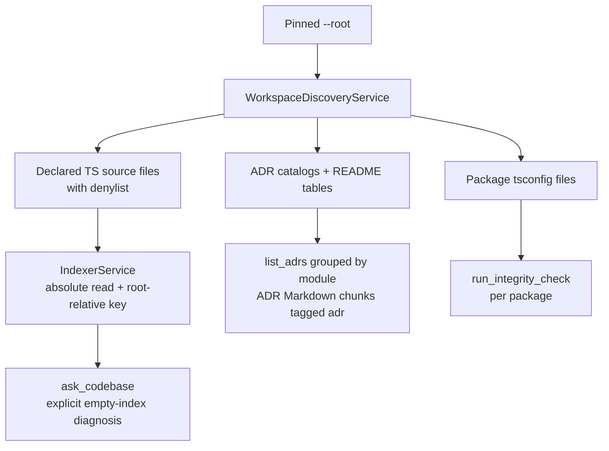

# ADR-030 — Discovery-based indexing and decision catalogs

| | |
|---|---|
| **Category** | RAG · MCP · Workspace discovery |
| **Author** | David Balladares (problem evidence) · Codex (proposed design and record) |
| **Date** | 2026-09-04 |
| **Status** | ✅ **Accepted** — amended 2026-09-04 |
| **Refines** | ADR-004, ADR-017, ADR-018, ADR-024, ADR-029 |

---

## Context

Umbra 2.2.1 assumes a single-package repository in two places that are exposed
through its read-only MCP server.

`IndexerService#indexProject` in `src/core/rag/indexer.ts` defaults to `src`.
All current callers omit its argument. Therefore `umbra mcp --root <repo>` can
only scan `<repo>/src`, even when the launched repository declares several
packages elsewhere. This was reproduced on 2026-09-04 against LONDONUW-ONE: its
root has no `src`, index warming fails with `scandir <root>/src`, and the
database has no indexed files, chunks, vectors, or dependency edges.

Widening that scan without a design would add four correctness defects: it
walks generated and dependency directories, excludes `.tsx`, stores paths
relative to the server process rather than the pinned repository root, and
persists Windows separators. The same unstable path identity makes an MCP
`query_dependency_graph` request unable to match a graph row under `--root`.
The current process-wide `IndexerService.isIndexing` also drops a concurrent
request instead of allowing it to await the active warm-up.

`buildAdrIndex` in `src/core/tools/adr-index.ts` similarly assumes only
`docs/adr`. LONDONUW-ONE instead has five module catalogs under
`docs/<module>/adr`, uses `ADR_001_NAME.md`, and maintains a `README.md` table
with status, tags, and summary. Returning “no decision records found in
docs/adr” loses curated, cheaper, more accurate discovery data. ADR-004's
bounded catalog remains the right boundary; its fixed location does not.

Finally, `run_integrity_check` invokes one root `tsc --noEmit`. A monorepo may
have no root `tsconfig.json`, so that result is neither an honest verification
nor useful package-level feedback.

## Decision

### One read-only workspace discovery service

Add `WorkspaceDiscoveryService` under `src/core/config/`. It receives only
`runtimeRoot()`; it never accepts a tool-supplied root. It returns normalized,
repository-relative paths using `/` and rejects any resolved path outside that
root. The same service supplies indexable source files, ADR catalogs, and
TypeScript projects so the three tools cannot slowly invent incompatible
monorepo rules.

Source roots resolve in this order:

1. `umbra.json` at the pinned root, with `indexing.sources: string[]`, is the
   explicit override. Its values are root-contained glob patterns, are
   deduplicated deterministically, and replace automatic source-root discovery.
   This version-controlled file makes a deliberate shared indexing boundary
   reviewable; an environment variable is machine-specific and a repeatable
   CLI flag would not cover background re-indexes or a long-lived MCP server.
2. Without that override, inspect declarations already owned by the repository:
   `pnpm-workspace.yaml`, `package.json#workspaces`, `.gitmodules`, and the
   root/package `tsconfig.json` files. Each package `tsconfig` is parsed through
   the TypeScript configuration API; its `files`, `include`, `exclude`, and
   `compilerOptions.rootDir` decide what its TypeScript project considers
   source. A root `tsconfig` is a normal single-package project.
3. If no project declaration yields files, preserve the legacy single-package
   fallback only when `<root>/src` exists. If it does not, produce a typed
   “no indexable source roots discovered” result that names the declarations
   checked and the `umbra.json` override.

The walker applies its denylist before recursion: `node_modules`, `.git`,
`dist`, `.next`, `.pnpm-store`, and `.umbra`. It accepts `.ts` and `.tsx`, while
excluding `.d.ts`, `.spec.ts`, `.test.ts`, `.stories.ts`, and `.stories.tsx`.
The ignore policy also applies to configured glob expansion, so an override
cannot accidentally make dependency or build trees semantic source.

Every persistence and lookup boundary uses the same repository-relative,
forward-slash identity. The indexer reads from an absolute discovered path but
passes the normalized relative path to `FileRegistry`, chunk metadata, and the
dependency graph. `NestChunker` receives the pinned root for relative-import
resolution rather than consulting `process.cwd()`.

`IndexerService#isIndexing` becomes one shared `Promise<IndexRunResult>`.
The first caller creates it; every concurrent caller awaits it; a `finally`
clears it only after settlement. A run that finds no source files writes an
`empty` index stamp with its discovery diagnostic and throws a typed error.
`ask_codebase` reads that stamp before testing provider vectors and returns the
source-discovery diagnostic. It must never tell an operator to switch embedding
providers when the actual failure is zero scanned files.

### ADR catalogs are discovered and curated indexes are preferred

`WorkspaceDiscoveryService` resolves ADR directories in this order:

1. Explicit `umbra.json` `adr.catalogs: string[]` root-contained directories.
2. Otherwise existing directories matched by `docs/**/adr/`, `docs/adr/`,
   `adr/`, `decisions/`, and `docs/decisions/`, deduplicated in that precedence
   order.
3. Nothing found is a successful empty catalog with an honest discovery message.

Both `ADR-001-name.md` and `ADR_001_NAME.md` are ADR records. For a catalog
with `README.md`, parse its Markdown table and use its link, status, tags, and
summary as the entry metadata. Match table links to the actual ADR filenames;
report (do not hide) a table link with no record and a record omitted from the
table. Only a catalog without a curated index falls back to parsing ADR bodies.
This preserves ADR-004's bounded-context goal while treating human-maintained
catalogs as the declared summary of a module's decisions.

The cached entry gains `module`, derived from the catalog's repository-relative
parent (for example `coi-generator` for `docs/coi-generator/adr`).
`list_adrs` gains an optional `module` filter; an unknown module returns an
explicit error including available module names. Output is grouped by module,
not flattened. Cache invalidation includes catalog directory, README, and ADR
metadata so a changed table cannot leave a stale answer.

ADR body indexing is **deferred**. `list_adrs` now exposes the curated catalog,
which is the cheap, deterministic way to locate a decision. A later ADR may add
Markdown chunks labelled `kind: 'adr'` only after it provides a document chunker,
schema migration, retrieval rendering, and evidence that arbitrary Markdown is
still excluded. `ask_codebase` must not imply that ADR bodies are semantic code
evidence before those conditions exist.

### Monorepo integrity and local state

`run_integrity_check` discovers the same TypeScript projects and runs the
checkout-local `tsc --noEmit --project <tsconfig>` once for each. Its DTO reports
one result per package/configuration and a final aggregate. When no `tsconfig`
is discovered, it returns `UNSUPPORTED` with the discovered-workspace diagnostic;
it does not pretend the root was checked. This changes no MCP capability and
does not accept any path input.

`.umbra/memory.db` remains intentionally inside the served repository's local
`.umbra/` workspace: it binds cached knowledge to the root pinned at launch and
is already ignored by `umbra init`. The README and MCP startup diagnostics must
say that it is local, safe to delete and should be gitignored, including when a
consumer starts MCP without first running `umbra init`.

## Trade-offs

| Solution | Pros | Cons | Decision |
|---|---|---|---|
| Keep a hardcoded `src` / `docs/adr` | No new discovery code | Incorrect for declared monorepos; hides 104 real ADRs and can create an empty semantic index | Rejected |
| Scan all files below root | Finds unconventional layouts | Walks dependency/build directories, indexes noise, and creates an unbounded privacy/cost surface | Rejected |
| Environment variable or per-command `--source` override | Quick for one operator | Drifts between launch, background indexing, and MCP; not reviewable with the repository | Rejected |
| `umbra.json` explicit override plus declaration-driven discovery | Deterministic escape hatch; defaults work for single packages and monorepos | Adds a small public configuration contract and manifest parsing | Chosen |
| Reparse every ADR body | One parser and no table grammar | Throws away human-maintained status/tags/summary and spends more I/O/context | Rejected |
| Catalog README first, body fallback only without README | Preserves curated module knowledge and reports drift | Requires table-link validation and diagnostics | Chosen |
| Keep ADRs outside semantic retrieval | Avoids a document chunker | `ask_codebase` cannot cite the strongest “why” evidence it advertises | Rejected |
| Index all Markdown | Broad documentation recall | Turns arbitrary prose into semantic code evidence | Rejected |
| Index only discovered ADR Markdown with `kind: 'adr'` | Answers architectural questions with labelled evidence | Adds document-chunk/storage/retrieval behavior | Deferred |

## Consequences

### Positive

- A no-root-`src` monorepo indexes its declared packages without changing MCP's
  pinned-root security boundary.
- Stored paths are portable across Windows and POSIX, so dependency queries use
  the repository-relative names their schema documents.
- An indexer request during MCP warm-up is truthful: it waits or reports an
  explicit empty-scope cause.
- ADR discovery keeps human curated status/tags/summary and exposes module scope.
- Integrity output tells a monorepo exactly which project passed or failed.

### Negative

- Manifest and Markdown-table parsing expand the fixture matrix and require
  deterministic diagnostics for malformed declarations.
- Semantic ADR body retrieval remains unavailable; callers use the curated
  catalog and then read the selected record directly.
- A version-controlled `umbra.json` is a new documented consumer contract.

## Implementation plan

1. Add `src/core/config/workspace-discovery.ts` and its spec. Define the
   validated `umbra.json` schema; parse workspace/package/submodule declarations;
   parse `tsconfig` through TypeScript; expand root-contained globs with the
   pre-recursion denylist; return absolute locations plus `/`-normalised root
   keys, source kind, ADR catalogs, and project `tsconfig` paths. Add direct
   runtime dependencies only if required for YAML/glob parsing; do not rely on
   transitive packages.
2. Refactor `src/core/rag/indexer.ts` (`IndexerService#indexProject`,
   `getAllFiles`, `processSingleFile`) to consume discovery results, introduce
   `IndexRunResult` and shared active promise, and fail typed/explicitly for an
   empty scope. Replace the legacy recursive walker. Pass repository root to
   `NestChunker`.
3. Refactor `src/core/tools/ast/chunker.ts` (`NestChunker#extractDependencies`,
   `resolveModulePath`) to resolve imports from the pinned root and normalize
   every graph edge. Keep ADR body chunking deferred; do not attempt TypeScript
   AST processing on Markdown.
4. Update `src/core/state/file-registry.ts` and `src/core/state/db.ts` so
   registry reads/writes accept an absolute disk path separately from the stable
   repository key, and persist/retrieve the document kind without losing
   existing code chunks. Make the schema migration additive.
5. Update `src/core/rag/index-stamp.ts`, `src/core/rag/retriever.ts`, and
   `src/core/tools/rag-tools.ts` to record `empty` runs and surface the
   discovery diagnostic before provider-mismatch handling. Render ADR evidence
   distinctly and do not attach code dependency/skeleton context to it.
6. Refactor `src/core/tools/adr-index.ts` (`discoverAdrs`, `buildAdrIndex`,
   `formatAdrIndex`) around discovered catalogs, curated README parsing,
   underscore/hyphen filename support, module grouping/filtering, and drift
   warnings. Update `src/core/tools/system-tools.ts`,
   `src/presentation/mcp/tool-catalog.ts`, and
   `src/presentation/mcp/resource-catalog.ts` for the optional module argument
   and DTO/resource output.
7. Update `src/core/tools/testing-tools.ts` (`integrityCheckTool`) to compile
   discovered projects independently and return a package result matrix. Keep
   its schema empty and preserve MCP's fixed root.
8. Update all `IndexerService#indexProject` callers only as required by the new
   result/error contract: `src/bin/cli.ts`,
   `src/presentation/mcp/start-mcp-server.ts#warmIndex`,
   `src/core/agent/deep-agent-factory.ts#ensureIndexFresh`,
   `src/core/agent/graph-factory.ts`, `src/core/tools/rag-tools.ts`,
   `src/core/tools/file-tools.ts`, and `src/presentation/cli/model-menu.ts`.
   MCP startup must report the discovered scope or the precise empty-scope
   error, and must not publish a misleading ready state.
9. Update `src/core/config/workspace-scaffold.ts` and `README.md` to document
   `.umbra/` as root-bound local state, add the `umbra.json` reference/config
   examples, and state source/ADR/integrity discovery behavior.

## Test plan

- `workspace-discovery.spec.ts`: a monorepo fixture without root `src`, with
  pnpm/workspaces/submodule declarations, package tsconfigs, TS/TSX sources,
  excluded declarations/tests/stories, and nested ignored directories. Assert
  only declared `.ts`/`.tsx` sources and stable `/` keys. Cover the legacy
  single-package `<root>/src` fallback, explicit `umbra.json` replacement, and
  no-source diagnostic.
- `indexer.spec.ts`: index that fixture from a working directory different from
  `runtimeRoot()`. Assert no `..` keys, no backslashes, `.tsx` chunks exist,
  ignored files are absent, graph queries use repository-relative keys, and two
  concurrent calls await one embedding/index run. Assert an empty scope yields
  the discovery error rather than a provider error.
- `adr-index.spec.ts`: five `docs/<module>/adr/ADR_001_NAME.md` catalogs with
  README tables. Assert module grouping/filtering, hyphen and underscore
  recognition, README metadata precedence, body fallback only for a catalog
  without README, stale-link/orphan-record diagnostics, cache invalidation, and
  an unknown module's available-module error.
- Future ADR-body retrieval specs must assert that only discovered ADR Markdown
  is stored with `kind: 'adr'`, decision evidence is labelled, and normal
  Markdown remains absent.
- `testing-tools.spec.ts` plus MCP catalog/server specs: assert one
  `tsc --noEmit --project` invocation/result per discovered package, an honest
  unsupported result without a tsconfig, no root path argument appears in any
  published schema, and warm-up's empty scope produces the actionable message.
- Run focused Jest suites, `npm run type-check`, `npm test`, `git diff --check`,
  then a built MCP smoke against the no-root-`src` fixture. Do not claim the
  last validation until a real consumer launch has completed.

## Verification evidence

- Read-only source inspection on 2026-09-04 confirmed the default `src` path,
  all current parameterless call sites, the unguarded recursive walker, and
  `process.cwd()`-relative persistence.
- Read-only source inspection confirmed `buildAdrIndex` searches only
  `docs/adr`, while its tests cover only that layout and the current MCP schema
  exposes no module filter.
- Read-only source inspection confirmed `integrityCheckTool` runs one root
  `tsc --noEmit`, and `.umbra/` is the existing root-bound, gitignored state
  directory.
- Implemented 2026-09-04: `WorkspaceDiscoveryService`, discovery-backed
  `IndexerService`, module-aware ADR catalog, scoped MCP input, per-tsconfig
  integrity checks, README documentation, and regression fixtures.
- `node node_modules/typescript/bin/tsc --noEmit` passed.
- Focused Jest suites passed: 33 tests across workspace discovery, ADR index,
  tool contracts, and MCP catalog. Jest emitted its existing open-handle warning
  after completion; it did not fail those suites.
- `git diff --check` passed. A built consumer MCP smoke and semantic ADR body
  retrieval remain unverified because the latter is deliberately deferred.

## Amendment — 2026-09-04

The original proposed record included semantic indexing of discovered ADR bodies.
That is not part of the accepted 2.2.2 implementation: the required document
chunker, schema migration and retrieval presentation were not built. The
module-aware curated catalog is accepted independently, and the body-indexing
idea remains deferred rather than being presented as shipped behavior.

## Amendment — 2026-09-04 · One root owns one durable index

The discovery result is still one served root even when it finds several
TypeScript projects. Its `.umbra/memory.db` is the sole workspace database for
that root; packages contribute source paths but do not create sibling `.umbra`
directories. Index persistence now commits each file registry row, its chunks,
the active identity's `chunk_vectors` rows, and dependency edges in one SQLite
transaction after embeddings succeed. A failed file retains its previous hash
or no registry row, so discovery retries it rather than reporting a complete
index with no vectors. `umbra doctor --index` inspects these tables read-only.

## Amendment — 2026-09-06 · Activation creates state only in a declared root

Global MCP activation now requires the serving root to be declared by a
manifest, TypeScript configuration, Umbra configuration, or Git metadata; a
directory named `src` does not qualify. Once accepted, it owns the single
`.umbra/` workspace described by this record and its `.gitignore` protection is
established before the directory is created. Discovery rules for source roots
are unchanged: a declared monorepo still contributes many source projects to
that one root-owned workspace.

## Amendment — 2026-09-06 · A complete index is durable coverage, not a finished loop

One source file now has one explicit durable outcome in `file_registry`:
`indexed` after its chunks, active `(provider, model)` vector rows, and
dependency edges commit together; or `skipped` with a reason only when its
content is intentionally empty or whitespace. A nonempty source file that
produces zero chunks is not recorded as fresh. Provider failures, malformed
embedding batches, and interrupted writes leave the prior hash (or no row), so
the next index run discovers and retries the path.

`index_lease` is a SQLite single-writer lease with a heartbeat. A second MCP
process serving the same root does not duplicate embeddings; it reports that a
live owner is warming the shared index. A stale lease can be recovered safely,
and release deletes only the owning row.

`umbra doctor --index`, `get_index_status`, and `umbra://index-status` inspect
the same durable evidence without calling an embedding provider: declared
source coverage, file outcomes, chunks, vector identities and dimensions,
missing vectors, zero-chunk indexed files, stale hashes, stamp consistency, and
the lease. A `complete` stamp is healthy only when those facts agree.

### Verification evidence

- `indexer.spec.ts` covers a failed provider call, nonempty zero-chunk input,
  and intentional empty-source omission; none can become a false fresh file.
- `index-run-lease.spec.ts` covers one live writer, heartbeat, stale recovery,
  and ownership-safe release.
- `index-integrity.spec.ts` covers selected-provider gaps, chunkless files,
  stale source content, and absent databases.
- Focused index/MCP suites: 14 tests passed. `tsc --noEmit` and
  `git diff --check` passed.

## Amendment — 2026-09-08 · Classless modules are source, not empty index work

`NestChunker#processLogicFile` originally emitted chunks only for classes and
their methods. Valid infrastructure modules such as CLI entry points, MCP root
resolvers, and configuration adapters commonly export top-level functions and
constants instead. They were discovered as source, but produced zero chunks;
the durable-index rule correctly left them pending, which made every retry fail
without reaching the embedding provider.

`NestChunker#analyze` now emits one `file` chunk for any nonempty source that
the class/atomic strategies did not cover. `splitChunksForEmbedding` remains
the size boundary, so a large module is split before embedding rather than
being dropped or stored as an oversized vector input. Empty or whitespace-only
sources remain chunkless and retain their explicit `skipped` outcome.

`IndexerService#failure` keeps repeated file failures in its repaintable TTY
row. It writes individual messages only to noninteractive logs, then one final
partial-index summary. This preserves the diagnosis outside a terminal without
turning an interactive run into one permanent line per file.

### Verification evidence

- `chunker.spec.ts` covers a classless module fallback and whitespace source.
- `indexer.spec.ts` proves a classless module commits chunks and vectors under
  the existing per-file transaction.
- `indexer-progress.spec.ts` proves two TTY failures repaint the same row and
  append no per-file console line.
- Focused suites: 3 suites and 7 tests passed; `tsc --noEmit` passed.

### Related files

- `src/core/tools/ast/chunker.ts` — `NestChunker#analyze`.
- `src/core/tools/ast/chunker.spec.ts` — module fallback coverage.
- `src/core/rag/indexer.ts` — `IndexerService#failure` and
  `IndexerService#indexDiscoveredProject`.
- `src/core/rag/indexer.spec.ts` — durable classless-module vectors.
- `src/core/rag/indexer-progress.spec.ts` — repaint contract.
- `src/core/observability/console-sink.ts` — `isInteractiveTerminal`.

## Related files

- `src/core/config/workspace-discovery.ts` — proposed `WorkspaceDiscoveryService`.
- `src/core/rag/indexer.ts` — `IndexerService#indexProject`, `getAllFiles`, `processSingleFile`.
- `src/core/tools/ast/chunker.ts` — `NestChunker#extractDependencies`, `resolveModulePath`.
- `src/core/state/file-registry.ts` — `FileRegistry#isFileChanged`, `updateFile`.
- `src/core/state/db.ts` — `AgentDB#initialize` schema migrations.
- `src/core/rag/index-stamp.ts` — `IndexStamp`, `writeIndexStamp`.
- `src/core/rag/index-integrity.ts` — `inspectIndexIntegrity`, `formatIndexIntegrity`.
- `src/core/rag/retriever.ts` — `RetrieverService#query`, `getContextForLLM`.
- `src/core/tools/rag-tools.ts` — `askCodebaseTool`, `refreshIndexTool`.
- `src/core/tools/adr-index.ts` — `buildAdrIndex`, `discoverAdrs`, `formatAdrIndex`.
- `src/core/tools/system-tools.ts` — `listAdrsTool`.
- `src/core/tools/testing-tools.ts` — `integrityCheckTool`.
- `src/presentation/mcp/start-mcp-server.ts` — `warmIndex`.
- `src/presentation/mcp/tool-catalog.ts` — `publishListAdrs`, `publishIntegrityCheck`.
- `src/presentation/mcp/resource-catalog.ts` — `buildResourceCatalog`.
- `src/core/config/workspace-scaffold.ts` — `ensureAgentStateIgnored`.
- `README.md` — MCP and local workspace documentation.

## Amendment — 2026-09-10 · The discovery scope is a decision; its consequence for the published graph tool is not recorded

An external audit of the published 2.2.5 package reported the test-file exclusion
as a defect. It is not: the rule is in this record's Decision, in
*One read-only workspace discovery service*, and it is implemented as one shared
predicate, `isIndexableSource` in `src/core/config/workspace-discovery.ts`.

What the audit found that this record genuinely does not carry is the
**consequence**. No row of `## Trade-offs` weighs including or excluding test
files, and no item under `### Negative` names what follows for a tool this
project has since published.

### What follows, and why a consumer needs it stated

A `.spec.ts` file is never enumerated, so it is never chunked, so it never
becomes a `source` row in `dependency_graph`. `query_dependency_graph` with
`direction: inbound` reads `WHERE target = ?`. Spec importers are therefore
**structurally absent** rather than filtered at query time — the tool is not
hiding them, it never knew about them.

The tool answers *what breaks if I change this*. Tests are the first thing that
breaks. So the answer comes back tidy, short, and quietly incomplete, which for a
refactor is worse than a slow answer. Verified twice against `grep` on a consumer
repository during the audit, both times finding a spec importer the tool omitted.

The precedent for the fix is already in this project: ADR-031's `query_nest_graph`
evaluation named the thirteen wiring shapes the tool can go blind to and declared
two as limitations rather than pretending to cover them. The same treatment is
owed here.

### Three adjacent gaps in the same predicate, none of them decisions

- **`__tests__` is not in `IGNORED_DIRECTORIES`.** A file at `__tests__/helper.ts`
  carries no `.spec`/`.test` suffix, so it is indexed and does receive graph
  edges. The scope rule and its implementation disagree for that layout.
- **The suffix pattern anchors on `.ts` only.** `foo.spec.tsx` and `foo.test.tsx`
  clear the extension gate and are indexed in full, while `foo.spec.ts` is
  dropped. Whichever behaviour is intended, both cannot be.
- **`resolveModulePath` never probes `.tsx`.** It tries the exact path, the path
  plus `.ts`, and the path plus `/index.ts`. Discovery admits `.tsx` as
  indexable source, so in any TSX repository an `import './Component'` that
  resolves to `Component.tsx` produces **zero edges** and the importer vanishes
  from the graph entirely. For a Next.js consumer this hole is larger than the
  test one.

### Four import forms the graph does not capture at all

`extractDependencies` in `src/core/tools/ast/chunker.ts` keeps only specifiers
that start with `.`, and visits only `ImportDeclaration` nodes. So tsconfig path
aliases (`@/…`), dynamic `import()`, `require()`, and re-exports
(`export * from`, `export { x } from`) contribute no edges. `import type` is
captured, being an ordinary import declaration.

None of that is wrong as an implementation choice; all of it is invisible to a
consumer reading the tool's output as an answer about their code.

### What this amendment does and does not change

It changes nothing in the Decision. The scope rule may well be right, and this
record is not the place to relitigate it — the proposal to index test files is
recorded as a candidate in `docs/deferred-work.md`, in the sharper form David
proposed: index the sentences in `it(...)` rather than the test code.

What it adds is the consequence, so the next reader of `query_dependency_graph`
output knows what the tool cannot see before trusting it for a demolition.

### Verification evidence

- Tarball/`dist` equality established first: `dastbal-umbra-2.2.5.tgz` extracted
  and compared tree-wide against the local `dist/` at a clean tree — zero
  differing files. The audited binary and the source read here are the same code.
- Spec-importer omission: observed twice on a consumer repository, both against
  `grep` as the reference.
- The three predicate gaps and the four uncaptured import forms are read from
  source, not observed at runtime, and are labelled accordingly.

### Measured 2026-09-10 — the amendment above, with numbers

`npm run bench:graph` rebuilds the dependency graph independently and diffs it
against the table `query_dependency_graph` reads. On this repository, 276 source
files of which 170 are indexed:

| Construct | Total | In graph | Recall | Out of scope | Gap |
| --- | --- | --- | --- | --- | --- |
| `import` | 537 | 369 | 68.7% | 168 | **0** |
| `export * from` | 48 | 0 | **0.0%** | 0 | **48** |
| `import type` | 29 | 23 | 79.3% | 6 | **0** |
| `export { x } from` | 7 | 2 | 28.6% | 0 | **5** |
| `require` | 1 | 0 | 0.0% | 1 | 0 |
| **edges** | **622** | **394** | **63.3%** | 175 | **53** |

The distinction this record needed is in the last two columns. *Out of scope* is
this decision working as written: the importing file is a spec, it has no chunks,
it cannot be a `source` row. *Gap* is a construct the indexer walked past inside
a file it did index.

**The scope is not the problem; the re-exports are.** Ordinary imports inside an
indexed file are captured perfectly — zero gap across 369 edges — so nothing here
argues against the exclusion. All 53 genuine misses are re-exports, and
`export * from` is missing at 48 of 48. `src/index.ts` is the published package's
barrel and re-exports everything, so it carries **no outbound edges at all**:
"what breaks if I change `factory.ts`" never names the entry point a consumer
imports.

Inbound, which is the question the tool is actually asked: **24 of 164 indexed
files report every importer; 140 report an incomplete list.**

Of the three adjacent gaps named above, only the suffix asymmetry is observable
here. This tree holds no `.tsx` file, so `resolveModulePath`'s missing `.tsx`
probe is unmeasurable rather than absent, and the repository declares no
`compilerOptions.paths`. Both need a Next.js consumer to observe, and the runner
reports them as `unmeasurable-here` rather than as passing.

One correction to the amendment above: it lists dynamic `import()` among the
uncaptured constructs, which is true of the indexer and irrelevant to this
repository — there are **zero** such calls here. A grep suggests two; one is a
`typeof import('fs')` type position and the other is inside a TSDoc comment.

## Amendment — 2026-09-18 · Incomplete derived scans name the affected source

The durable status already distinguished an indexed file from an intentionally
skipped one, but MCP and the GraphRAG readiness receipt exposed only counts for
some omissions. That left an operator with “one file lacks a current NestJS
scan” and no way to know which source should be refreshed or inspected.

`inspectIndexIntegrity` now returns a bounded list of skipped paths with each
stored reason. `GraphProjectionReadiness` likewise carries bounded
`affectedPaths` for stale dependency or NestJS projections, and its human-safe
reason names those paths. The status remains read-only; this adds diagnosis, not
an implicit reindex or a broader discovery scope.

GraphRAG reserves one small context slot when traversal has accepted a graph
file, so seed chunks cannot consume the entire answer while a valid routed file
is silently omitted. The reserve is bounded by the existing chunk and token
ceilings.

Verification on 2026-09-18: focused GraphRAG, index-integrity, MCP catalog and
SDK server suites passed, alongside strict TypeScript compilation. The full
suite was started but its environment model-discovery step did not return a
conclusive completion receipt, so no full-suite result is claimed here.
