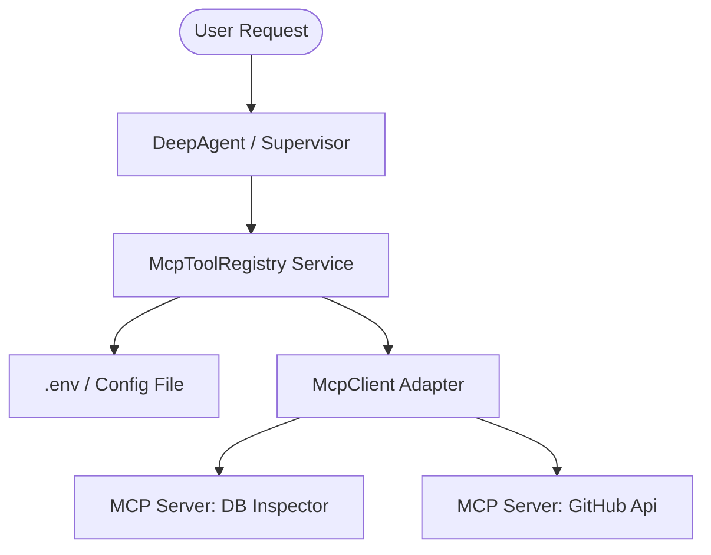
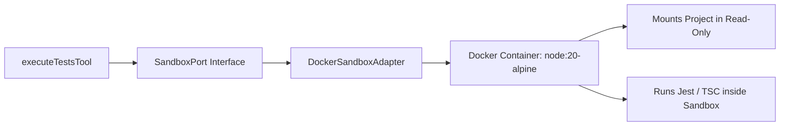
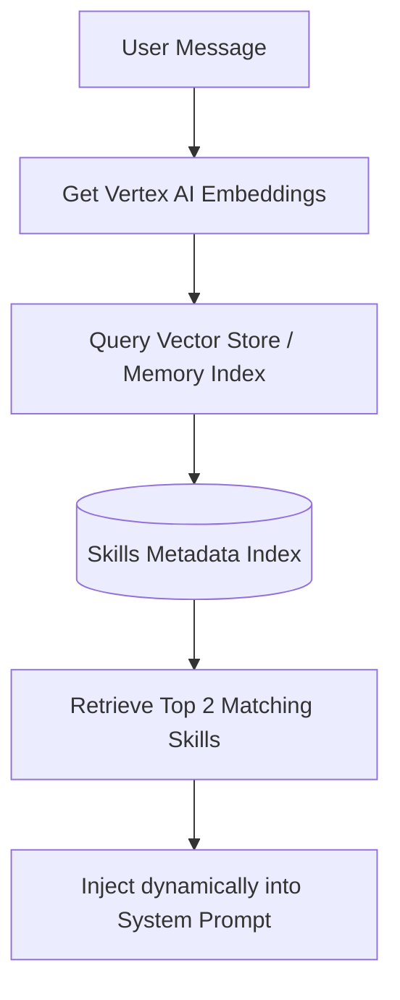

# 🚀 Architectural Improvements Proposal (LangChain Spec Alignment)

This document presents a deep analysis of potential architectural enhancements for `@dastbal/nestjs-ai-agent` based on LangChain's latest specifications and the **Managed Deep Agents** design patterns (e.g. sandboxing, MCP tools, semantic skill dispatch, and telemetry).

---

## 1. Model Context Protocol (MCP) Tool Integration

### The Proposal
Integrate the **Model Context Protocol (MCP)**, an open standard designed by Anthropic and adopted by LangChain/LangGraph, to dynamically register third-party tool servers. Instead of hardcoding tools in the backend library, the agent will query local or remote MCP servers for tools at runtime.

### Architectural Blueprint (DDD Integration)

* **Domain Layer:** Define an `McpPort` interface describing tool discovery and call execution.
* **Infrastructure Layer:** Create `McpClientAdapter` that implements `McpPort` by opening `stdio` (StdIO process client) or `sse` (Server-Sent Events HTTP client) connections to external MCP servers.
* **Application Layer:** Create an `McpToolRegistry` that reads MCP server paths/URLs from configuration, connects to them, and maps their schemas to LangChain `DynamicStructuredTool` wrappers.

### Rationale & Benefits
* **Infinite Extensibility:** Developers can extend the agent's capabilities instantly by pointing to any existing MCP server (Jira, Slack, PostgreSQL, Memory servers, etc.) without writing any NestJS tool adapters.
* **De-cluttered Core:** The core codebase remains focused on DDD/agentic loops, delegating specific integration logic to external servers.

### Trade-offs
* **Latency:** Communication over processes/HTTP introduces microsecond delays.
* **Process Management:** The backend library must safely handle spawning and terminating child processes for stdio-based MCP servers.

---

## 2. Local Sandbox Code Execution (Docker-Based)

### The Proposal
Isolate code compilation, validation, and test runs (`npm test`, `npm run type-check`) inside ephemeral, restricted containers (Docker-based) instead of executing them directly on the host machine.

### Architectural Blueprint (DDD Integration)

* **Domain Layer:** Define a `SandboxPort` interface containing methods like `executeCommandInSandbox(cmd: string, files: FileChange[]): Promise<CommandResult>`.
* **Infrastructure Layer:** Implement `DockerSandboxAdapter` using the `dockerode` library or shell commands:
  1. Spawns a lightweight Docker container (e.g., `node:20-alpine`).
  2. Mounts the project folder in read-only mode, mapping a temp directory for writes.
  3. Executes `npm test` or compilation checks inside the container.
  4. Returns stdout, stderr, and exit codes, then terminates the container.

### Rationale & Benefits
* **Host System Protection:** Prevents the agent from executing malicious or runaway code on the user's main environment.
* **Clean State:** Tests run in a pristine container environment without caching or locked file conflicts.

### Trade-offs
* **Environment Dependency:** Requires Docker to be installed on the machine running the library.
* **Performance:** Spawning a Docker container adds 1-3 seconds of overhead per tool call.

---

## 3. Semantic Skills Hub (RAG-Driven Skills Load)

### The Proposal
Currently, the system prompt uses a hardcoded keyword map (ADR-016) to load `skills/*.md` files. This does not scale. We propose a dynamic, semantic, vector-based dispatch system.

### Architectural Blueprint (DDD Integration)

* **Application Layer:** Build a `SkillsRegistry` service.
* **Execution flow:**
  1. During initialization, the registry reads all `skills/*.md` files, parses their YAML frontmatter description, and indexes them into our local vector store.
  2. On every user turn, the system queries the vector index with the user's message embeddings.
  3. It retrieves the top 2 matching skills (e.g., `write-tests` and `debug-typescript`) and injects their instructions directly into the LLM system prompt.

### Rationale & Benefits
* **Scalable System Prompt:** The system prompt remains tiny (~500 tokens) regardless of how many skills (10 or 100) are added to the system.
* **Context Budget Savings:** Decreases token consumption and improves agent precision by removing irrelevant rules.

### Trade-offs
* **Pre-flight Call:** Adds one embedding vector generation call at the start of each message exchange.

---

## 4. Advanced Observability (NestJS Tracing Service)

### The Proposal
Wrap the basic LangSmith auto-patching into a structured telemetry service integrated with the NestJS application container, enabling developers to obtain trace links programmatically.

### Architectural Blueprint (DDD Integration)

* **Infrastructure Layer:** Create `LangSmithTelemetryService` implementing a domain-level `TelemetryPort`.
* **Application Layer:** 
  * The service exposes runtime configurations to dynamically toggle tracing per agent session.
  * Captures the exact run ID from LangGraph runs and builds a clickable URL (`https://smith.langchain.com/o/.../runs/...`).
  * Returns the trace URL in the API streaming responses or logs.

### Rationale & Benefits
* **Production Observability:** Allows developers to inspect and audit agent actions, model calls, and subagent state changes in production directly via the LangSmith dashboard.
* **Easy Debugging:** Displays trace links in CLI outputs or API responses for immediate click-through debug.

### Trade-offs
* **API Key Management:** Requires API keys to be configured securely across different environments.
